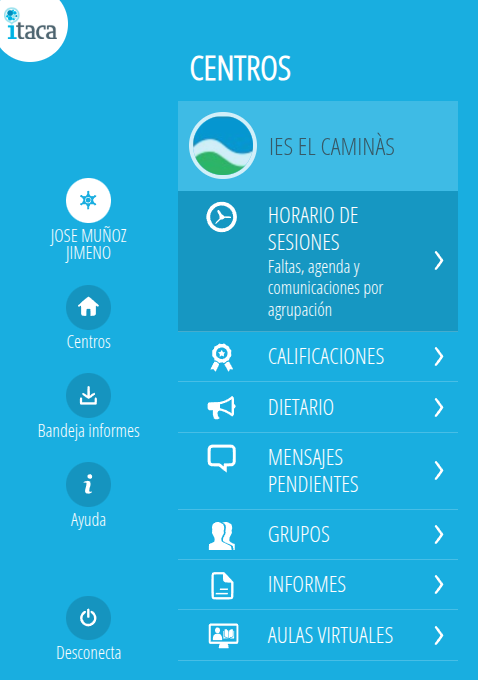
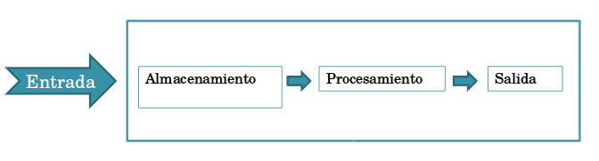
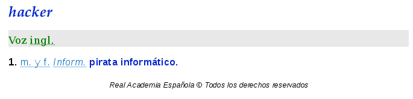
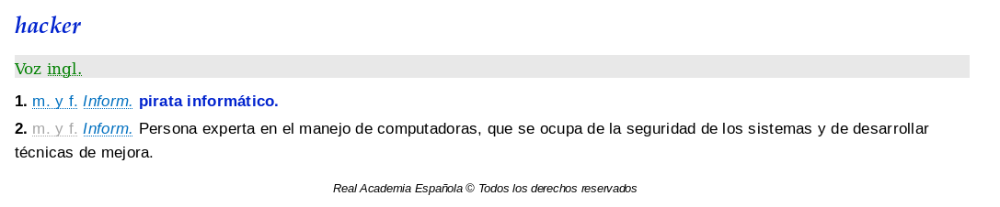
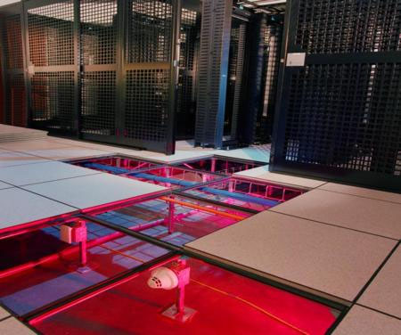
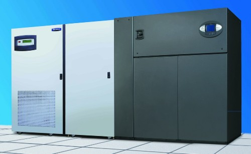
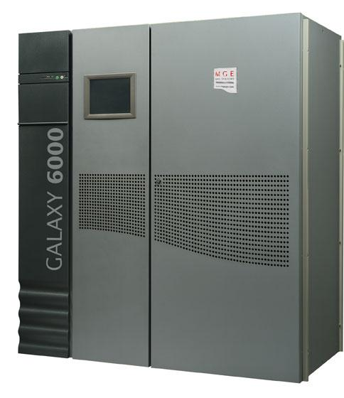

# UD1. Fundamentos de Seguridad Informática

!!! note "Objetivos de la Unidad"
    * Diferenciar con precisión la seguridad informática y la seguridad de la información.
    * Conocer los principios básicos de la seguridad de la información (Tríada CIA).
    * Identificar y clasificar los conceptos elementales en seguridad informática.
    * Comprender y catalogar los distintos tipos de amenazas y atacantes.
    * Dominar la clasificación de las medidas de seguridad (Física/Lógica, Activa/Pasiva).
    * Comprender el impacto del factor humano y las técnicas de ingeniería social.

---

## 1. La sociedad de la información en que vivimos

Actualmente vivimos en lo que se conoce como la **Sociedad de la Información**. Para cualquier organización —ya sea con ánimo de lucro o sin él, privada o pública— el activo más valioso es la **información**. Incluso cualquiera de nosotros, en nuestro ámbito particular, dependemos enormemente de la información que manejamos a diario para nuestras actividades cotidianas.

Esta información lleva sufriendo un proceso de digitalización desde hace años, eliminando poco a poco el soporte en papel. Hoy en día es habitual recibir recibos en formato electrónico, realizar la declaración de la renta de forma telemática y salvaguardarla en formato PDF, almacenar nuestras fotos familiares en un disco duro o en la nube, o adquirir entradas, libros y servicios de manera totalmente digital a través de pasarelas de pago.


En el ámbito educativo, disponemos de aplicaciones centralizadas de gestión donde se gestionan las asistencias, expedientes y calificaciones de los alumnos, además de entornos de aprendizaje electrónico (*e-learning*) como Moodle, donde se publican contenidos, tareas, exámenes y soluciones.

!!! info "Gestión Docente Autonómica"
    Un ejemplo de esto es la aplicación **ITACA3** de gestión docente empleada en la Comunitat Valenciana para centralizar toda la información administrativa y académica del alumnado.
    

Es por ello que para todos nosotros es fundamental adquirir unas nociones básicas para aprender a proteger la información con la que trabajamos diariamente. El uso masivo de redes locales, conexiones inalámbricas, dispositivos móviles e Internet abre un escenario constante de nuevas amenazas que atentan contra la seguridad de nuestros datos.

Es un grave error pensar que nuestros datos o nuestro ordenador personal no son importantes para un cibercriminal. Desde un equipo infectado con software malicioso (*malware*), controlado remotamente desde un centro de mando y control (Command & Control, C&C), los atacantes pueden realizar ataques DDoS coordinados a sitios web globales, enviar correo basura (*spam*) de forma masiva o alojar contenidos ilícitos de forma oculta.

!!! danger "Caso Real: Infección Silenciosa"
    Se han documentado casos reales de usuarios cuyos ordenadores personales funcionaban con lentitud y, tras un análisis con software antivirus específico, se descubrió que habían sido comprometidos e infectados para actuar de manera silenciosa como servidores de intercambio de archivos P2P cifrados con contenido ilegal en Internet.

Gran parte de los incidentes de seguridad que nos ocurren son debidos a fallos en la capa más vulnerable de todo el sistema: **el factor humano**. Muchas veces es mucho más efectivo aplicar el sentido común que comenzar a implementar medidas técnicas de forma descontrolada. De la misma manera que en la vida cotidiana no nos fiamos de un desconocido que llama a nuestra puerta haciéndose pasar por un revisor técnico del que no hemos sido informados previamente, en el ámbito digital no deberíamos abrir archivos adjuntos de correos electrónicos sospechosos, aceptar contactos desconocidos en redes sociales o conectarnos a redes Wi-Fi públicas abiertas sin protección adicional.

### Internet de las cosas (IoT) y Big Data: Nuevos retos de seguridad

En la actualidad, la revolución tecnológica gira en torno a dos conceptos clave: el **IoT** (*Internet of Things* / Internet de las cosas) o **IoE** (*Internet of Everything*), y el **Big Data**. El IoT hace referencia a un futuro inmediato (ya presente en muchos casos) en el que miles de millones de dispositivos de uso diario, procesos y personas de todo el mundo estarán interconectados a través de Internet. El Big Data se centra en la capacidad de almacenamiento, tratamiento y procesamiento masivo de la ingente cantidad de información digital que generan, entre otros, estos mismos dispositivos IoT.

!!! warning "El Internet de las Amenazas"
    Debido a su rápido despliegue y a la falta de estándares iniciales de seguridad, en los círculos de ciberseguridad se ha bautizado informalmente al IoT como el *"Internet of Threats"* (Internet de las Amenazas). Ya se han realizado múltiples pruebas de concepto donde investigadores han logrado tomar el control de vehículos en marcha, manipular ascensores inteligentes o secuestrar televisores Smart TV conectados explotando vulnerabilidades de fábrica.

Un ejemplo crítico de estos riesgos fue el [ciberataque global del **21 de octubre de 2016**](https://es.wikipedia.org/wiki/Ciberataque_a_Dyn_de_octubre_de_2016){target="_blank"}, que utilizó millones de dispositivos IoT domésticos infectados (cámaras IP, routers domésticos, monitores de bebés) con el malware **Mirai** para lanzar un ataque de denegación de servicio (DDoS) masivo contra el proveedor DNS Dyn, dejando temporalmente sin acceso a servicios como Amazon, Spotify, Twitter, Netflix y HBO. Asimismo, el concepto de *Smart Cities* (Ciudades Inteligentes) expone la infraestructura urbana a posibles acciones de ciberterrorismo, como el ataque de malware que llegó a dejar sin suministro eléctrico a cientos de miles de hogares en Ucrania.

---

## 2. Seguridad informática y seguridad de la información

Para estructurar correctamente nuestra materia, es imprescindible definir y delimitar conceptualmente ambos términos:

### Seguridad de la Información
Es el conjunto de medidas, procedimientos, políticas y controles —tanto humanos como técnicos— que permiten proteger y preservar la **integridad, confidencialidad y disponibilidad** de la información. 

!!! info "Concepto Amplio"
    Se trata de un concepto amplio que engloba la protección de la información de forma global, independientemente de su naturaleza, el soporte físico en el que esté almacenada (papel, soporte digital, transmisión oral) o el canal por el que se transmita.

### Seguridad Informática
Es una rama específica de la seguridad de la información que se encarga exclusivamente de proteger la información que es procesada, almacenada o transmitida utilizando una **infraestructura informática y de telecomunicaciones**.

!!! success "Relación de Inclusión"
    Por lo tanto, la seguridad de la información es el concepto global, mientras que la seguridad informática es la disciplina técnica que se encarga de proteger los **sistemas informáticos** que sirven de soporte técnico a dicho sistema de información.

Para comprenderlo mejor, analicemos la estructura de un **Sistema de Información**, el cual es un conjunto de elementos coordinados para alcanzar los objetivos de una organización:

*   **Recursos:** Físicos (hardware, periféricos) y lógicos (sistemas operativos, bases de datos, aplicaciones).
*   **Equipo Humano:** Usuarios, operadores, administradores de sistemas.
*   **Información:** Datos organizados con significado y valor para la entidad.
*   **Procesos:** Flujos de trabajo y metodologías de tratamiento de datos.

Un **Sistema Informático**, por su parte, es el conjunto de componentes de hardware, software y canales de red que permiten automatizar la creación, almacenamiento y procesamiento de estos datos dentro del sistema global de información.

{target="_blank"}

!!! note "Para saber más: Criptored"
    Puedes visualizar el siguiente recurso audiovisual de Criptored para profundizar en la diferencia de ambos conceptos:
    
    *   **Enlace de interés:** [Vídeo conceptual: Seguridad de la Información vs Seguridad Informática](https://www.youtube.com/embed/7MqTpfEreJ0){target="_blank"}


## 3. Citas sobre seguridad informática

Antes de profundizar en conceptos técnicos, es enriquecedor reflexionar sobre las aportaciones y citas célebres de algunos de los profesionales e investigadores más influyentes de la historia de la ciberseguridad:

### "No existe el sistema seguro al 100%..."
!!! quote "Gene Spafford (Profesor y experto en ciberseguridad)"
    "El único sistema verdaderamente seguro es el que está apagado y desenchufado, encerrado en una caja fuerte de titanio revestido, enterrado en un búnker de hormigón, y rodeado por gas nervioso y guardias armados muy bien remunerados. Incluso entonces, no apostaría mi vida por él."

### "Es más fácil atacar los puntos débiles de la comunicación..."
!!! quote "Gene Spafford"
    "El uso de encriptación en Internet es el equivalente a usar un vehículo blindado para entregar la información de una tarjeta de crédito de alguien que vive en una caja de cartón a alguien que vive en un banco del parque."

### "El usuario es el eslabón más débil de la cadena..."
!!! quote "Kevin Mitnick (Consultor de seguridad y ex-hacker)"
    "Las organizaciones gastan millones de dólares en firewalls y dispositivos de seguridad, pero tiran el dinero porque ninguna de estas medidas cubre el eslabón más débil de la cadena de seguridad: la gente que usa y administra los ordenadores."

### "Sobre el descuido de las contraseñas..."
!!! quote "Chris Pirillo (Divulgador tecnológico)"
    "Las contraseñas son como la ropa interior. No puedes dejar que nadie la vea, debes cambiarla regularmente y no debes compartirla con extraños."

### "La sobreconfianza en las soluciones puramente técnicas..."
!!! quote "Bruce Schneier (Criptógrafo y experto en ciberseguridad)"
    "Si piensas que la tecnología puede solucionar tus problemas de seguridad, está claro que ni entiendes los problemas ni entiendes la tecnología."

!!! example "Análisis y Reflexión de las Citas"
    *   **La primera cita** de Spafford recuerda que la seguridad absoluta es una quimera utópica; siempre existirá un vector de ataque imprevisto, ya sea tecnológico o humano.
    *   **La segunda cita** ilustra el concepto de seguridad de extremo a extremo: es inútil cifrar un canal de comunicación si el origen o el destino se encuentran en sistemas comprometidos o desprotegidos.
    *   **La tercera cita** de Kevin Mitnick destaca la necesidad de priorizar la concienciación y formación en ciberseguridad para los empleados por encima de la mera adquisición de hardware defensivo.
    *   **La cuarta cita** de Chris Pirillo retrata en tono humorístico las malas prácticas cotidianas con las credenciales de acceso (anotadas en post-its, compartidas o mantenidas de forma indefinida).
    *   **La quinta cita** de Bruce Schneier combate el mito de que instalar un software de seguridad (un firewall o antivirus) soluciona automáticamente los riesgos de una organización sin un análisis organizativo previo.

---

## 4. Principios básicos de la seguridad de la información

La norma internacional **ISO/IEC 27001** define la seguridad de la información sobre la base de tres principios fundamentales, conocidos tradicionalmente como la **Tríada CIA**:

```
             [ Confidencialidad ]
                     /\
                    /  \
                   /____\
[ Disponibilidad ]        [ Integridad ]
```

### Principios Fundamentales (Tríada CIA)

*   **Confidencialidad:** Garantiza que la información solo sea accesible para aquellos usuarios, procesos o entidades debidamente autorizados, impidiendo cualquier divulgación no autorizada.
*   **Integridad:** Garantiza la exactitud y totalidad de la información y de sus métodos de procesamiento, previniendo cualquier alteración o modificación no autorizada o accidental de los datos.
*   **Disponibilidad:** Asegura que los usuarios autorizados tengan acceso a la información y a los recursos asociados en el momento en que lo requieran.

### Principios Adicionales

*   **Autenticación:** Proceso que permite verificar de forma inequívoca la identidad de un usuario o emisor que interactúa con el sistema de información.
*   **Control de Acceso:** Mecanismo técnico u organizativo que restringe los accesos a los recursos del sistema en función de los permisos y privilegios asignados a cada identidad verificada.
*   **No Repudio:** Garantía de que ninguna de las partes intervinientes en una comunicación o transacción comercial puede negar su participación en la misma. Se divide en:
    *   **No repudio en origen:** El emisor de un mensaje no puede negar haberlo enviado, al existir pruebas técnicas de su autoría (ej. firma electrónica).
    *   **No repudio en destino:** El receptor de un mensaje no puede negar haberlo recibido, al poseer el emisor un justificante técnico de la recepción.
*   **Trazabilidad (o Auditabilidad):** Capacidad de registrar y auditar de forma continua todas las operaciones realizadas sobre un sistema informático, permitiendo rastrear un evento o incidente hasta su origen exacto para realizar análisis forenses posteriores.

!!! note "Recurso Audiovisual"
    *   **Enlace de interés:** [Vídeo explicativo: La Tríada CIA y los Principios de Seguridad](https://www.youtube.com/embed/KWAfVhy_GQ8){target="_blank"}

---

## 5. Conceptos clave en seguridad de la información

Para realizar un correcto análisis de seguridad, es indispensable dominar los siguientes términos técnicos estandarizados:

*   **Activo:** Cualquier recurso (físico, lógico, de datos, humano o procedimental) que forma parte del sistema de información y que posee un valor estimado para el correcto funcionamiento y continuidad de la organización.
*   **Amenaza:** Cualquier evento o acción potencial que puede desencadenar un incidente de seguridad en la organización, provocando daños materiales, lógicos o pérdidas inmateriales en sus activos.
*   **Vulnerabilidad:** Debilidad, fallo o brecha de seguridad inherente a un activo o a un control de seguridad que puede ser aprovechada o explotada por una amenaza para causar daños.
*   **Riesgo:** Estimación ponderada que mide la probabilidad de que se materialice una amenaza aprovechando una vulnerabilidad sobre un activo, evaluando el impacto potencial que causaría sobre el negocio.
*   **Impacto:** Medida que valora cuantitativa o cualitativamente las consecuencias y perjuicios sufridos por la organización en caso de que una amenaza se materialice con éxito sobre un activo.
*   **Ataque:** Acción deliberada e intencionada, exitosa o no, encaminada a vulnerar la seguridad, el rendimiento o el correcto funcionamiento de un sistema informático.
*   **Desastre o Contingencia:** Interrupción súbita y crítica de la capacidad de procesamiento y acceso a la información necesaria para el desarrollo de la actividad normal de la organización, obligando a activar planes de recuperación.

!!! note "Análisis de Riesgos"
    Antes de implantar un Sistema de Gestión de la Seguridad de la Información (SGSI), es obligatorio realizar un **Análisis de Riesgos** previo para identificar qué activos tenemos, a qué amenazas están expuestos y qué salvaguardas (medidas protectoras) son prioritarias y coste-efectivas para la organización.
    
    *   **Enlace de interés:** [Vídeo explicativo de Intypedia: Introducción al Análisis de Riesgos](https://www.youtube.com/embed/EgiYIIJ8WnU){target="_blank"}

---

## 6. Tipos de amenazas y atacantes

### Origen de las Vulnerabilidades
Las vulnerabilidades o fallos de seguridad suelen tener tres causas principales de origen:

1.  **Tecnológicas:** Errores de diseño o bugs de programación inherentes al propio hardware o software utilizado (ej. fallos en microprocesadores o vulnerabilidades *Zero-Day* en sistemas operativos).
2.  **De configuración:** Dispositivos, servidores o servicios desplegados con valores inseguros de fábrica o mal configurados por el administrador de sistemas (ej. contraseñas por defecto de administrador activas o puertos innecesarios abiertos al exterior).
3.  **Políticas de seguridad:** Inexistencia de normativas internas de seguridad o directivas desactualizadas que no contemplan los nuevos escenarios de riesgos reales de la organización.

### Clasificación de las Amenazas

*   **Físicas y Ambientales:** Afectan directamente a la infraestructura de hardware y a las instalaciones del sistema (incendios, inundaciones, robos físicos, cortes en el suministro eléctrico, picos de tensión o desastres naturales). Constituyen el primer perímetro de protección.
*   **Lógicas:** Afectan al software, bases de datos, protocolos y flujos lógicos de datos. La inmensa mayoría de ellas están asociadas al **malware** (*software malicioso*): virus, troyanos, gusanos, ransomware, rootkits, rogueware, puertas traseras (*backdoors*), spyware y keyloggers.
*   **Pasivas:** Atentados contra el principio de **confidencialidad**. Consisten en técnicas de escucha y monitorización pasiva para obtener información de un flujo de comunicación sin alterar los datos (ej. realizar un análisis de tráfico de red utilizando un sniffer como Wireshark en un canal no cifrado).
*   **Activas:** Atentados contra los principios de **integridad y disponibilidad**. El atacante altera de forma activa los datos transmitidos, suplanta identidades o destruye el canal (ej. ataques Man-in-the-Middle o inyección de tráfico falso).


### Taxonomía de los Atacantes

Detrás de muchas de estas amenazas - obviamente excepto los desastres naturales - se encuentra toda una taxonomía de atacantes, con fines lucrativos, de chantaje, activistas o simplemente de ego personal por el impacto del ataque realizado. Algunos de ellos son:

*   **Hacker (Sombrero Blanco / White Hat):** Profesional y experto técnico en seguridad informática que utiliza sus amplios conocimientos con fines de investigación, fortificación, auditoría técnica (*pentesting*) y defensa responsable de sistemas bajo autorización expresa.
*   **Cracker (Sombrero Negro / Black Hat):** Individuo con conocimientos técnicos avanzados que accede ilegalmente a sistemas informáticos de forma no autorizada con fines lucrativos, de espionaje industrial, chantaje o sabotaje.
*   **Grey Hat (Sombrero Gris):** Perfil híbrido que, si bien accede a sistemas sin autorización explícita para buscar vulnerabilidades, lo suele hacer de manera no destructiva, ofreciendo posteriormente corregir el fallo de seguridad, a menudo solicitando una recompensa a cambio.
*   **Lamer y Script Kiddies:** Aficionados con escasa formación técnica o nulos conocimientos de programación que utilizan de forma indiscriminada exploits y herramientas automáticas programadas por terceros disponibles en Internet para atacar sistemas desprotegidos.
*   **Phreaker:** Atacante especializado en la investigación, manipulación y explotación de vulnerabilidades en las redes de telecomunicaciones y sistemas telefónicos.
*   **Spammer, Phisher y Scammer:** Perfiles especializados en ataques masivos por correo electrónico y plataformas digitales. El *Spammer* satura con publicidad no solicitada; el *Phisher* diseña las plantillas de suplantación de identidad; y el *Scammer* ejecuta fraudes económicos en línea.
*   **Ciberterroristas y Actores Estatales (APTs):** Grupos altamente organizados y financiados con el objetivo de sabotear infraestructuras críticas nacionales, desestabilizar gobiernos u obtener información gubernamental clasificada.

Hay que destacar que en los medios, siempre se utiliza el término hacker de forma despectiva, incluyendo en este concepto a todos los ciberdelincuentes con fines maliciosos y que realmente encajan dentro de la definición de cracker. De hecho, la propia RAE definía hasta hace poco al hacker como:



A finales de 2017, la RAE añadió una segunda acepción al término, gracias a una iniciativa dentro del propio movimiento hacker para cambiar esta definición por una más correcta en que se defina al hacker como persona experta en alguna o varias ramas de la tecnología informática y electrónica (redes, programación, sistemas operativos, dispositivos móviles, etc) y que se dedica a intervenir y/o realizar alteraciones técnicas (to hack, del inglés) sobre un producto o dispositivo.

De esta manera la definición de hacker queda así:



!!! note "Película sobre la vida de Kevin Mitnick"
    Existe una película sobre la vida de [Kevin Mitnick](https://es.wikipedia.org/wiki/Kevin_Mitnick){target:"_blank"}, hacker para algunos, cracker para otros, muy recomendable de ver. Su nombre es  [Takedown](https://youtu.be/NbgDMYy9mzM){target:"_blank"}, aunque es España se tradujo como **Asalto final**. Actualmente, tras haber estado en prisión varios años a finales de los 90, es un reconocido experto en seguridad y fundador de varias empresas de seguridad informática.

---

## 7. El factor humano y la ingeniería social

Como se ha analizado, el ser humano constituye la capa de seguridad más compleja de proteger. Los atacantes se han percatado de que a menudo resulta infinitamente más rápido y barato manipular psicológicamente a un usuario legítimo para que revele información de acceso que diseñar un exploit complejo capaz de saltarse un cifrado robusto de última generación.

La **ingeniería social** es el conjunto de técnicas de persuasión, manipulación y engaño utilizadas para explotar los sesgos de la conducta humana, tales como la buena fe de cooperar, el respeto natural ante una figura de autoridad jerárquica, la curiosidad o el pánico ante consecuencias negativas.

### Vectores de Ataque de Ingeniería Social Críticos

#### A) Phishing (Pesca de credenciales)
Es el ataque más masivo en la actualidad. Consiste en el envío de correos electrónicos, SMS (*Smishing*) o mensajes directos que suplantan con total fidelidad la identidad visual y los logotipos de corporaciones o entidades de confianza (ej. bancos, agencias tributarias, servicios en la nube o empresas de mensajería).

!!! danger "Mecánica del Phishing"
    El mensaje se redacta con un tono de urgencia crítica (ej. *"Acceso sospechoso detectado: verifique su cuenta en menos de 24 horas para evitar su bloqueo definitivo"*). Se facilita un enlace que dirige a una página web falsa idéntica a la legítima. En cuanto el usuario introduce sus credenciales, estas son capturadas en tiempo real por el atacante.

#### B) Vishing (Phishing por voz)
El **vishing** traslada el engaño al canal telefónico directo. Es un método sumamente efectivo y peligroso porque la voz humana permite transmitir sensaciones de autoridad, urgencia y familiaridad mucho más difíciles de simular en un texto escrito.

!!! danger "Mecánica del Vishing"
    El atacante llama haciéndose pasar por un miembro del departamento de soporte informático de la organización, un administrador de red de la Conselleria o un gestor de seguridad bancaria. Alega una incidencia crítica y apremiante en el equipo de trabajo de la víctima y la persuade para que le dicte su contraseña de acceso o le facilite un código de doble factor (MFA) recibido en su teléfono.

#### C) Baiting (Señuelo físico)
El **baiting** aprovecha la curiosidad y la imprudencia física del usuario con dispositivos de almacenamiento portátiles externos.

!!! danger "Mecánica del Baiting"
    El atacante deposita deliberadamente un pendrive USB de forma "descuidada" en un espacio muy concurrido del centro de trabajo (recepción, aseos, aparcamiento). Para despertar el interés del personal, rotula el pendrive con un texto sugerente como *"Salarios Dirección 2026"*, *"Evaluaciones Finales"* o *"Presupuestos"*. En cuanto un usuario lo recoge y lo conecta a un ordenador corporativo para ver qué contiene, se ejecuta en segundo plano un script malicioso que abre una puerta trasera en el sistema.

---

## 8. Clasificación de medidas de seguridad

Para proteger eficazmente un sistema de información, no basta con instalar herramientas técnicas de manera aislada. Es necesario estructurar y clasificar las diferentes medidas de protección (también denominadas **salvaguardas** o **controles**) para entender cómo interactúan y qué tipo de amenazas mitigan. 

Las medidas de seguridad informática se estructuran habitualmente bajo una **doble clasificación**, atendiendo a dos criterios fundamentales: el **activo a proteger** (seguridad física o lógica) y el **momento de actuación** de la medida (seguridad activa o pasiva).

---

### 8.1. Criterios de Clasificación

#### A) Atendiendo al activo que se desea proteger

*   **Seguridad Física:** Es el conjunto de medidas destinadas a proteger los activos tangibles, el hardware de los sistemas y las instalaciones del centro (servidores, cableado, CPD, equipos) frente a amenazas físicas y ambientales (robos, incendios, fallos de suministro, desastres naturales). Constituye el primer perímetro de defensa de cualquier organización.
*   **Seguridad Lógica:** Es el conjunto de medidas destinadas a proteger los activos intangibles de la organización, como el software base, las aplicaciones de gestión, los procesos y, especialmente, la información y los datos lógicos frente a accesos no autorizados, alteraciones o pérdidas.

#### B) Atendiendo al momento en que actúa la medida

*   **Seguridad Activa:** Comprende todas aquellas medidas de carácter **preventivo** destinadas a evitar de forma directa que un incidente de seguridad llegue a materializarse. Su objetivo es proteger el sistema antes de que ocurra cualquier ataque o fallo.
*   **Seguridad Pasiva:** Comprende todas aquellas medidas de carácter **corrector o paliativo** que entran en juego una vez que el incidente de seguridad ya ha ocurrido de forma inevitable. Su objetivo no es evitar el fallo, sino minimizar el impacto del daño y permitir la recuperación del sistema a su estado operativo seguro anterior.

!!! tip "La analogía del automóvil"
    Para comprenderlo fácilmente en clase, piensa en la seguridad de un coche:
    
    *   **Seguridad Activa:** Los sistemas de frenado ABS o el control de estabilidad ESP (evitan que ocurra el accidente de forma preventiva).
    *   **Seguridad Pasiva:** El cinturón de seguridad, el airbag o el chasis deformable (no evitan la colisión, pero minimizan los daños físicos y salvan vidas una vez que el accidente ya ha ocurrido).

---

### 8.2. Matriz de doble entrada de medidas de seguridad

Combinando ambos criterios, cualquier control implantado en la organización se ubica de forma unívoca en alguno de los cuadrantes de la siguiente matriz:

| Dimensión | **Seguridad Activa** <br>*(Prevención del incidente)* | **Seguridad Pasiva** <br>*(Mitigación y recuperación)* |
| :--- | :--- | :--- |
| **Seguridad Física** <br>*(Activos tangibles)* | - Control de accesos físicos (RFID, teclados, biometría)<br>- Vigilantes y sistemas de videovigilancia (CCTV)<br>- Mobiliario ignífugo y climatización perimetral<br>- Apantallamiento y cableado protegido (interferencias)<br>- Impermeabilización de recintos | - Sistemas de Alimentación Ininterrumpida (SAI/UPS)<br>- Grupos electrógenos y estabilizadores de tensión<br>- Extintores automáticos y muros cortafuegos físicos<br>- Centros de Procesamiento de Datos (CPD) de respaldo |
| **Seguridad Lógica** <br>*(Software y datos)* | - Contraseñas seguras y políticas de complejidad<br>- Autenticación de múltiples factores (MFA/2FA)<br>- Listas de Control de Acceso (permisos y privilegios ACL)<br>- Cifrado activo de almacenamiento (BitLocker, VeraCrypt)<br>- Antimalware (antivirus, antirootkit) y Firewalls<br>- Cuotas de asignación de disco y borrado seguro | - Copias de seguridad (Backups) e imágenes de respaldo<br>- Sistemas de almacenamiento tolerantes a fallos (RAID)<br>- Sistemas de archivos con tolerancia a fallos (*journaling*)<br>- Firma digital y chequeos lógicos de integridad (Hashes)<br>- Instantáneas de software (*snapshots*) y virtualización |

!!! info "Medidas de carácter híbrido"
    Algunas salvaguardas actúan simultáneamente en varios cuadrantes. Por ejemplo, un sistema de vigilantes con cámaras con grabación continua actúa como **seguridad física activa** (su presencia disuade y evita intrusiones) y como **seguridad física pasiva** (las grabaciones permiten investigar, identificar intrusos y mitigar el daño tras el incidente).

---

### 8.3. Descripción detallada de las técnicas y medidas

A continuación, se describen de forma técnica las características de las principales tecnologías y metodologías que componen la matriz de seguridad:

#### 8.3.1. Medidas de Seguridad Física Activa

Orientadas a blindar de forma tangible el hardware de la organización para impedir que se produzcan intrusiones físicas o averías mecánicas provocadas por el entorno:

*   **Sistemas de Control de Accesos Físicos:** Restringen la entrada física a zonas críticas como el CPD o despachos mediante cerraduras inteligentes, tarjetas magnéticas, RFID o sistemas biométricos de huella dactilar, lectura de iris o patrones de venas de la mano.
*   **Vigilancia y Monitorización Continua:** Uso de guardias de seguridad física coordinados con cámaras de circuito cerrado (CCTV) con analítica de detección de intrusiones perimetrales.
*   **Mobiliario e Instalaciones Resistentes:** Uso de racks cerrados con llave, mobiliario ignífugo, canalizaciones de cableado blindado para evitar la interceptación física y atenuación de interferencias electromagnéticas mediante jaulas de Faraday.
*   **Impermeabilización y Diseño Ambiental:** Evitar ubicar los sistemas centrales de red en sótanos o plantas bajas para prevenir inundaciones, aislando paredes y techos frente a filtraciones de líquidos.

En las siguientes imágenes, se pueden observar algunas de las medidas en los centros de datos, como los suelos técnicos, falsos techos, los sistemas de acondicionamiento ambiental para controlar, la humedad, el calor o el polvo o los SAI y grupos electrógenos para proporcionar electricidad ante un fallo del suministro eléctrico:

| Elemento | Ilustración |
| :--- | :--- |
| **Suelo técnico** | { width="250" height="160" style="object-fit: cover;" } |
| **Falso techo** | { width="250" height="160" style="object-fit: cover;" } |
| **Control de temperatura y humedad** | { width="250" height="160" style="object-fit: cover;" } |
| **Sistema de alimentación ininterrumpida** | { width="250" height="160" style="object-fit: cover;" } |
| **Grupo electrógeno** | { width="250" height="160" style="object-fit: cover;" } |

!!! tip "Para sabaer más"
    Observa el siguiente vídeo (en inglés) sobre los CPD's de Google: [Google container data center tour](https://youtu.be/zRwPSFpLX8I?si=W8RLlCviVhGX2orN).

    Si deseas ampliar más información sobre los centros de datos de Google, lo puedes hacer en este enlace: [Centros de datos de Google](https://datacenters.google/)


#### 8.3.2. Medidas de Seguridad Física Pasiva

Destinadas a responder ante cortes en los suministros, sobrecargas en la red eléctrica o siniestros catastróficos que afecten de manera directa a la infraestructura del sistema de información:

*   **Sistemas de Alimentación Ininterrumpida (SAI/UPS) y Grupos Electrógenos:** Suministran energía eléctrica de forma inmediata y automática cuando se produce una caída en la red eléctrica general. Los SAI profesionales incorporan filtros que eliminan picos de tensión y sobrecargas de energía, estabilizando la señal antes de suministrarla a los equipos informáticos críticos.
*   **Sistemas Automáticos de Extinción de Incendios:** Sensores de humo integrados con sistemas de descarga de gases limpios (como el gas Inergen) o agua nebulizada que mitigan y extinguen con rapidez los conatos de fuego en el CPD sin dañar físicamente la electrónica de red de los servidores.
*   **Centros de Datos de Respaldo (Centros de Contingencia):** Replicación completa de la infraestructura informática crítica de la organización en una ubicación geográfica diferente para poder derivar los flujos lógicos en caso de que ocurra una catástrofe natural destructiva que inutilice el centro principal.

#### 8.3.3. Medidas de Seguridad Lógica Activa

Mecanismos de software y configuraciones del sistema operativo orientados a impedir accesos autorizados ilegítimos o infecciones lógicas que pongan en jaque los datos:

*   **Directivas de Contraseñas y Gestión de Acceso:** Forzar políticas estrictas que impidan el uso de claves triviales mediante comprobación de diccionarios, exigir longitudes mínimas utilizando frases de contraseña (*passphrases*) y limitar temporalmente la validez de las claves obligando a renovarlas.
*   **Autenticación Multifactor (MFA/2FA):** Refuerza el control básico de accesos exigiendo la validación simultánea de múltiples factores independientes: algo que el usuario sabe (contraseña), algo que posee (un token físico o código OTP recibido en su dispositivo móvil) y algo que es (biometría).
*   **Listas de Control de Acceso (ACL):** Asignación estricta de permisos y privilegios lógicos de lectura, escritura y ejecución sobre el sistema de archivos a nivel de usuario individual o grupo de usuarios, limitándolos al mínimo necesario para el desempeño de sus tareas (*mínimo privilegio*).
*   **Cifrado Activo de Datos:** Conversión de la información en texto ilegible mediante algoritmos criptográficos simétricos rápidos (como AES) para proteger la confidencialidad de discos enteros o carpetas específicas. Si un intruso arranca un sistema operativo alternativo o roba el soporte de almacenamiento físico, no podrá interpretar los datos sin la contraseña.
*   **Herramientas de Defensa Lógica Activa (Antimalware y Cortafuegos):** Instalación de antivirus dedicados para detectar y neutralizar malware (virus, gusanos, troyanos, ransomware) en tiempo real, combinados con firewalls de filtrado de paquetes y proxies para impedir conexiones de red sospechosas por puertos específicos.
*   **Borrado Seguro de Datos (Destrucción Lógica):** Aplicación de algoritmos específicos de sobreescritura aleatoria de datos de disco (como el Método Gutmann o el estándar DOD 5220.22-M con herramientas como Eraser o SDelete) para impedir que se recupere información confidencial de un soporte que va a ser desechado o reutilizado.

#### 8.3.4. Medidas de Seguridad Lógica Pasiva

Mecanismos de protección y restauración de datos orientados a solventar fallos físicos de disco duro, pérdidas masivas de información por secuestros cibernéticos o manipulaciones de los datos:

*   **Planes de Copias de Seguridad (Backups) e Imágenes de Respaldo:** Copiado sistemático y programado de toda la información lógica (copias totales o incrementales) y creación de imágenes completas de los servidores de producción para garantizar una restauración limpia en caso de desastres lógicos o ataques destructivos de malware.
*   **Sistemas de Almacenamiento Redundante RAID:** Configuración lógica de agrupaciones de discos físicos redundantes (como RAID 1 o RAID 5 por software o hardware) que distribuyen y replican la información, permitiendo la continuidad de servicio y la restauración automática de los datos en caliente si se avería físicamente uno de los discos del sistema.
*   **Sistemas de Archivos con Tolerancia a Fallos (*Journaling*):** Registro de transacciones en disco que previene y repara la corrupción lógica del sistema de archivos en caso de caídas abruptas de tensión eléctrica.
*   **Firma Digital y Funciones Hash de Integridad:** Algoritmos matemáticos complejos e irreversibles (como las familias SHA-2) que generan resúmenes o firmas únicas de un archivo. Al comparar el hash actual del archivo con su hash original firmado de confianza, se detecta de forma pasiva si ha habido alguna alteración o manipulación maliciosa de los datos en tránsito.
*   **Virtualización de Sistemas y Snapshots:** Ejecución de servidores y sistemas de trabajo sobre entornos virtualizados controlados por un hipervisor. Facilita la toma instantánea de copias lógicas de estado (*snapshots*) que permiten volver al punto anterior de funcionamiento seguro de una máquina virtual en cuestión de segundos en caso de infección masiva o desastre lógico.
