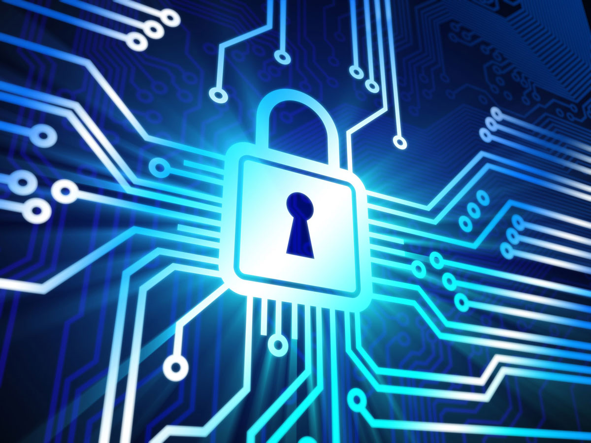
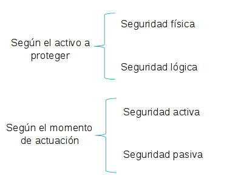

# UD1. Fundamentos de Seguridad Informática

# Objetivos

-   Diferenciar la seguridad informática y la seguridad de la información
-   Aprender los conceptos básicos relacionados con la seguridad informática
-   Identificar los servicios que nos ofrece la seguridad informática
-   Comprender los distintos tipos de amenazas
-   Conocer el ciclo de vida de la seguridad informática
-   Aprender los criterios de clasificación de las medidas de seguridad de la información
-   Clasificar las medidas de seguridad según dichos criterios

# Contenidos

1.  La sociedad de la información en que vivimos
2.  Seguridad informática y seguridad de la información
3.  Citas sobre seguridad informática
4.  Principios básicos de la seguridad de la información
5.  Conceptos básicos en seguridad de la información
6.  Tipos de amenazas y atacantes
8.  Clasificación de medidas de seguridad
9.  Seguridad física
10.  Seguridad lógica
11.  Seguridad activa
12.  Seguridad pasiva

# 1\. La sociedad de la información en que vivimos

Actualmente vivimos en lo que se conoce como la **Sociedad de la Información.** Para cualquier organización - ya sea con ánimo de lucro o sin él, privada o pública - el activo más valioso es la **información**. Incluso cualquiera de nosotros, en nuestro ámbito particular, dependemos enormemente de la información que manejamos a diario para nuestras actividades.

Esta información lleva sufriendo un proceso de **digitalización** desde hace años y se está eliminando poco a poco el soporte papel, de forma que casi todos tenemos recibos en formato electrónico, hacemos la declaración de la renta de forma telemática y guardándola en pdf, tenemos nuestras fotos familiares en un disco duro o en la nube, o compramos entradas, libros o servicios a través de una pasarela de pago. Todo de manera **digital**.

_**Internet nos ofrece todo un mundo de servicios a nuestras manos**_

Esto son pequeños ejemplos de nuestra vida cotidiana, pero las organizaciones y empresas van más allá. Muchos de sus canales de compra y venta, y por tanto, sus beneficios, son a través de Internet. Internet abre nuevas posibilidades de negocio para muchas empresas, que pueden globalizarse y llegar a vender sus productos y servicios a rincones del mundo donde no podrían llegar de otra forma.

En el caso de educación disponemos de aplicaciones donde podemos pasar falta y calificar a los alumnos en las evaluaciones, o disponer de entornos de elearning como el Moodle donde publicamos los contenidos de nuestras asignaturas, así como actividades, exámenes o las soluciones de los ejercicios.

_**Aplicación ITACA de gestión docente en la Comunidad Valenciana
**_

Es por ello que para todos nosotros, ya seamos empresas, docentes o particulares, es fundamental tener unas nociones básicas para aprender a proteger la información con la que trabajamos diariamente y que debido al uso de las redes locales, redes inalámbricas, dispositivos móviles e Internet, abre un mundo de nuevas amenazas que atentan contra la seguridad de nuestros datos.

Es un grave error pensar que nuestros datos o nuestro ordenador o nuestra wifi no es importante para un cibercriminal. Todo lo contrario. Desde nuestro ordenador infectado con malware y siendo manipulado por un ciberdelincuente desde su centro de mando y control (Command & Control), pueden usar nuestro ordenador para realizar ataques a sitios web, enviar spam o incluso guardar fotos de pornografía infantil.

## Caso real

Respecto a la pornografía mencionada anteriormente, voy a contar un caso verídico que le pasó a un amigo. Esta persona hace años me solicitó ayuda porque su ordenador le iba lento: tras analizar el ordenador, pasarle otros antivirus (el que tenía no lo detectó), le habían infectado con un malware (software malicioso) que estaba usando su ordenador como un servidor de intercambio p2p de imágenes y vídeos cifrados pornográficos.

De esta forma, si el Grupo de Delitos Telemáticos de la Guardia Civil seguía la pista del delito, iría a parar a la casa de la persona infectada con este malware. Obviamente, tras un análisis forense del caso, se descubriría que la persona infectada ha sido una víctima más del incidente.

[Peligroso troyano instala pornografía infantil y chantajea a los usuarios](https://www.adslzone.net/article11506-peligroso-troyano-instala-pornografia-infantil-y-chantajea-a-los-usuarios.html)

Por tanto la **seguridad informática** no es algo que debamos tomar a la ligera y todo el mundo deberíamos tener un mínimo de formación en este campo, de la misma forma que nadie se lanza a una autopista con un coche deportivo sin saber conducir. Bueno, seguro que hay algún loco que lo hace...

**_Nunca deberiamos dejar conducir a nuestro perro.._**

Muchas veces, es mejor aplicar el **sentido común**, que comenzar a aplicar medidas técnicas a lo loco (cortafuegos, antivirus, antiadware, etc.) pensando que la tecnología nos puede proteger por sí sola. Gran parte de los incidentes de seguridad que nos ocurren, son debidos a fallos en la capa más vulnerable de todo el sistema: el **factor humano**.

De la misma manera que en la vida real no nos fiamos de algún desconocido que llame a la puerta haciéndose pasar por una inspección de gas de la que no nos han informado, tampoco deberíamos abrir correos electrónicos de extraños, aceptar desconocidos en redes sociales o conectarnos a wifi abiertas, por citar algunos ejemplos.

## Internet de las cosas y la revolución digital que está por venir

Hay dos conceptos que hoy en día están en boca de todo el mundo, como son el **IoT** (Internet of Things) o **IoE** (Internet of Everything) y el **Big Data**. Los dos primeros hacen referencia a un futuro Internet muy próximo en que los dispositivos, procesos y personas de todo el mundo estarán interconectados en Internet, suponiendo una nueva revolución digital en la sociedad. El segundo concepto, Big Data o datos masivos, hace referencia al almacenamiento, tratamiento y procesamiento de la ingente información digital que reciben las organizaciones día a día, como por ejemplo, la generada por los dispositivos IoT.

Se estima que para 2025, haya unos [100.000 millones](https://www.uoc.edu/portal/es/news/actualitat/2017/257-tecnologia-5g.html) de dispositivos interconectados a Internet, generando muchísima información digital que hay que procesar.

Esta nueva revolución va a suponer nuevas oportunidades para las organizaciones y la sociedad en general, pero a su vez, nuevos retos relacionados con la seguridad. Estas tecnologías hará que surjan nuevos vectores de ataques en áreas de nuestra vida cotidiana que no podíamos imaginar anteriormente. Ya se han hecho demostraciones y pruebas de concepto donde se podía manipular un coche, parar un ascensor o bloquear el funcionamiento de una SmartTV conectada a Internet, simplemente con vulnerabilidades inherentes a la propia tecnología.

Algunas noticias como las siguientes, de confirmarse, pueden hacer estremecer a cualquiera:

[Según Wikileaks, la CIA planea hackear coches para cometer asesinatos "indetectables"](https://hipertextual.com/2017/03/segun-wikileaks-la-cia-planea-hackear-coches-asesinar-personas-forma-indetectable)

[¿Mató la CIA a un periodista a través de un accidente de coche remoto?](https://mundooculto.es/2020/01/mato-la-cia-a-un-periodista-a-traves-de-un-accidente-de-coche-remoto/)

[IoT: el lado "inseguro" de las cosas](https://www.incibe.es/protege-tu-empresa/blog/internet-of-things-ciberseguridad)

En los círculos de seguridad informática, ya se le denomina al IoT como el **Internet of Threats** (Internet de las amenazas). Un ejemplo de los graves problemas de seguridad, fue el **[ciberataque realizado el 21 de octubre de 2016](https://es.wikipedia.org/wiki/Ciberataque_a_Dyn_de_octubre_de_2016)** usando millones dispositivos (cámaras, routers, impresoras, monitores de bebé) vulnerables conectados a Internet infectados con el malware Mirai, y que afectó a muchos sitios web como Amazon, Spotify, Twitter, Netflix, HBO, etc.

Mención especial en este punto tienen también las [**Smart Cities**](https://es.wikipedia.org/wiki/Ciudad_inteligente), concepto que está implantándose en las ciudades más importantes del mundo y que también supone una oportunidad para los ciberterroristas, como la noticia siguiente:

[Cientos de miles de ucranianos sin electricidad por culpa de un malware](http://unaaldia.hispasec.com/2016/01/cientos-de-miles-de-ucranianos-sin.html)

## Frases célebres de Bruce Schneier

Algunas célebres frases de Bruce Schneier, reputado criptógrafo e investigador de seguridad, son:

_"Si piensas que la tecnología puede solucionar tus problemas de seguridad, está claro que ni entiendes los problemas ni entiendes la tecnología"_

_"Me preguntan con regularidad lo que el usuario medio de Internet puede hacer para asegurar su seguridad. Mi primera respuesta suele ser 'Nada, estás jodido'."_

A Bruce, creador del algoritmo Blowfish entre otros, se le conoce de forma informal como el Chuck Norris de la criptografía. De hecho, tiene su propia página de "facts":

[https://www.schneierfacts.com/](https://www.schneierfacts.com/)

Por ejemplo, en clave de humor, citamos éste:

_"Bruce Schneier can decrypt your PKI message with the public key"_

# 2\. Seguridad informática y seguridad de la información

A continuación, definiremos los conceptos de seguridad de la información y seguridad informática:

## Seguridad de la información

Por seguridad de la información entendemos el conjunto de medidas y procedimientos, tanto humanos como técnicos, que permiten proteger la integridad, confidencialidad y disponibilidad de la información.

Este término, por tanto, es un concepto amplio que engloba medidas de seguridad que afectan a la información independientemente del tipo de ésta, soporte en el que se almacene, forma en que se transmita, etc.

## Seguridad informática

La seguridad informática, por su parte, es una rama de la seguridad de la información que trata de proteger la información que utiliza una infraestructura informática y de telecomunicaciones para ser almacenada, procesada o transmitida.

Mira este vídeo de Criptored (Red Temática Iberoamericana de Criptografía y Seguridad de la Información) donde se explican ambos conceptos claramente:

**Video incrustado:** [https://www.youtube.com/embed/7MqTpfEreJ0](https://www.youtube.com/embed/7MqTpfEreJ0)

Por tanto, podemos decir que la seguridad de la información es un concepto mucho más amplio, que engloba a la seguridad informática. O dicho de otra forma, la seguridad de la información se encarga de proteger el **sistema de información** de una organización y la seguridad informática, se encarga de proteger los **sistemas informáticos**, que son el soporte o infraestructura de ese sistema de información.

Un **sistema de información** es el conjunto de elementos organizados, relacionados y coordinados, para ayudar a una empresa u organización a conseguir sus objetivos. Dichos elementos pueden clasificarse en:

-   **Recursos**: pueden ser físicos (ordenadores, periféricos, recursos no informáticos) y lógicos (S.O., aplicaciones…)
-   **Equipo humano**
-   **Información**: datos organizados que tienen significado para la organización
-   **Procesos**

Por otra parte, un **sistema informático** está formado por un conjunto de elementos físicos (hardware, dispositivos, periféricos…), lógicos (sistema operativo., aplicaciones, protocolos…) y con frecuencia también elementos humanos y que permite a la organización crear, almacenar o procesar la información.

**_Esquema simplificado de un sistema informático_**

# 3\. Citas sobre seguridad informática

Antes de avanzar en materia, siempre me gusta citar a algunas personalidades influyentes en el mundo de la seguridad informática, ya que hay frases célebres que merecen la pena enmarcarse:

## No existe sistema seguro 100%...

" El único sistema verdaderamente seguro es el que está apagado y desenchufado encerrado en una caja fuerte de titanio revestido, enterrado en un búnker de hormigón, y rodeado por gas nervioso y guardias armados muy bien remunerados. Incluso entonces, no apostaría mi vida por él."  

**Gene Spafford**

## Es más fácil atacar los puntos vulnerables en una comunicación segura...

" El uso de encriptación en Internet es el equivalente a usar un vehículo blindado para entregar la información de una tarjeta de crédito de alguien que vive en una caja de cartón a alguien que vive en un banco del parque."  

**Gene Spafford**

## La seguridad es como una cadena y el usuario es el eslabón más débil...

" Las organizaciones gastan millones de dólares en firewalls y dispositivos de seguridad, pero tiran el dinero porque ninguna de estas medidas cubre el eslabón más débil de la cadena de seguridad: la gente que usa y administra los ordenadores."  

**Kevin Mitnick**

## Sobre la debilidad de las contraseñas por parte de los usuarios...

" Las contraseñas son como la ropa interior. No puedes dejar que nadie la vea, debes cambiarla regularmente y no debes compartirla con extraños."

**Chris Pirillo**

## Sobre la excesiva confianza en la tecnología...

“Si piensas que la tecnología puede solucionar tus problemas de seguridad, está claro que ni entiendes los problemas ni entiendes la tecnología”

**Bruce Schneier**

## Reflexion

Reflexiona un momento y piensa que es lo que quiere decir cada una de estas citas.

La primera cita refleja claramente la poca confianza que tiene Gene Spafford, profesor y experto en seguridad informática, en cualquier sistema informático puesto que no hay sistema 100% seguro y siempre existe alguna vulnerabilidad o algún vector de ataque, por causas tecnológicas, de configuración o humanas.

La segunda cita, del mismo autor, nos dice que por muchas medidas de encriptación seguras usemos en una transacción, ambos extremos de la misma pueden ser vulnerables y más fáciles de atacar que la propia transmisión cifrada. Por ejemplo, atacar la web de un banco por alguna vulnerabilidad o infectar a un usuario con un malware que registra sus claves de acceso al banco.

La tercera cita, de Kevin Mitnick, que fue el hacker más buscado en los años 90 por el FBI y que incluso tiene una película y un libro de su vida (Takedown), nos dice que las empresas deben invertir más en formar a sus empleados en seguridad informática.

La cuarta cita, de Chris Pirillo, conocido blogger y divulgador de tecnología, refleja el mal uso que hacen los usuarios con las contraseñas, como usar la misma para todo, ser demasiado fáciles, o apuntarlas en el sitio más inverosímil a la vista de cualquiera.

Y por último, la cita de Bruce Schneier, conocido criptógrafo, nos dice que muchas organizaciones y muchas personas, piensan que instalando un antivirus, un detector de intrusos, un cortafuegos, etc, están protegidos ante cualquier amenaza de seguridad informática.

# 4\. Principios básicos de la seguridad de la información

La organización **ISO/IEC**, en su norma **27000** define lo que son los tres principios básicos de la seguridad de la información, o lo que se conoce también como triada CIA. Enel siguiente vídeo de criptored, se definen claramente esos tres principios básicos:

**Video incrustado:** [https://www.youtube.com/embed/KWAfVhy\_GQ8](https://www.youtube.com/embed/KWAfVhy_GQ8)

Además de estos tres principios básicos que son la **confidencialidad**, **integridad** y **disponibiidad**, existen otros adicionales como son:

-   **Autenticación**: consiste en verificar la identidad del usuario de la información como la de su creador
-   **Control de acceso**:  permite restringir los accesos a los recursos en función de los permisos asignados a cada usuario
-   **No repudio**: relacionado con la autenticación, prueba la participación de ambas partes en una comunicación o transacción de tal forma que no se puede negar haber participado en ella. Puede ser:
    -   En **origen**: el emisor no puede negar el envío. P.ej: presentación telemática del IRPF con el programa PADRE
-   -   En **destino**: el receptor no puede negar haber recibido la información pues el emisor tiene pruebas de la recepción
-   **Trazabilidad**: es la  capacidad de registro de las operaciones de un sistema informático, de manera que cualquier operación pueda ser rastreada hasta su origen. Nos va a permitir poder realizar un [análisis forense](https://es.wikipedia.org/wiki/C%C3%B3mputo_forense) de un incidente de seguridad

# 5\. Conceptos básicos en seguridad de la información

En el campo de la seguridad de la información, se trabaja con una serie de términos y conceptos que conviene conocer. Destacamos los más importantes:

-   **Activo**: recurso del sistema de información o relacionado con éste, necesario para que la organización funcione correctamente y alcance los objetivos propuestos.
-   **Amenaza**: es un evento que puede desencadenar un incidente en la organización, produciendo daños materiales o pérdidas inmateriales en sus activos.
-   **Impacto**: mide la consecuencia al materializarse una amenaza.
-   **Riesgo**: mide la probabilidad de que produzca un incidente de seguridad en un activo, en un dominio o en toda la organización. El riesgo se relaciona con el impacto. El impacto mide lo que puede pasar. El riesgo lo que probablemente pase.
-   **Vulnerabilidad**: debilidad inherente en cualquier sistema informático. La vulnerabilidad se relaciona con la amenaza ya que un sistema puede ser más o menos vulnerable respecto a una amenaza.
-   **Ataque**: evento, exitoso o no, que atenta sobre el buen funcionamiento del sistema.
-   **Desastre** o **Contingencia**: interrupción de la capacidad de acceso a información y procesamiento de la misma a través de computadoras necesarias para la operación normal de un negocio.

En las empresas y organizaciones concienciadas con la seguridad de la información, antes de implantar un **sistema de gestión de la seguridad de la información** (SGSI), hay que realizar un **análisis de riesgos** e **impactos** previo. En el siguiente vídeo de Intypedia, proyecto educativo de Criptored, queda bien claro:

**Video incrustado:** [https://www.youtube.com/embed/EgiYIIJ8WnU](https://www.youtube.com/embed/EgiYIIJ8WnU)

# 6\. Tipos de amenazas y atacantes

Una **amenaza** es un evento que puede desencadenar un incidente en la organización a consecuencia de una vulnerabilidad existente. Las vulnerabilidades suelen ocurrir por causas:

-   **Tecnológicas**, debido a fallos inherentes en la tecnología.
-   **De configuración**, debido a que los dispositivos, servidores, aplicaciones, etc., vienen con configuraciones inseguras por defecto o no han sido bien configurados por el administrador.
-   **Políticas de seguridad**, porque la organización carece de ninguna política de seguridad o bien porque no son correctas o no se han actualizado con las nuevas amenazas que aparecen.

Los tipos de amenazas pueden ser:

-   **Físicas**
-   **Lógicas**
-   **Pasivas**
-   **Activas**

Las amenazas **físicas** y **ambientales** afectan a la parte física del sistema de información: instalaciones, hardware, control de acceso, etc. Son el **primer nivel** de seguridad a proteger.

Piensa en ejemplos de amenazas físicas o ambientales.

Robos, accesos a recintos no autorizados, sabotajes.
Problemas en suministro eléctrico.
Condiciones atmosféricas: temperatura, humedad, etc.
Interferencias electromagnéticas.
Desastres naturales.

Las amenazas **lógicas** afectan a la parte lógica: sistemas operativos (S.O.'s), aplicaciones y datos.

Piensa en ejemplos de amenazas lógicas.

La mayoría están relacionadas con el malware (software malicioso):

Virus
Gusanos
Troyanos y botnets
Rootkits
Exploits
Rogueware y ransomware
Puertas traseras
Keyloggers, etc

Las amenazas **pasivas** o **escuchas**, suponen un intento de un atacante para obtener información relativa a una comunicación.
P. ej: capturar datos con un analizador de redes o sniffer como [wireshark](https://www.wireshark.org/)

Las amenazas **activas** son más peligrosas y su objetivo es la modificación de los datos transmitidos o la creación de trasmisiones falsas.
P. ej: un ataque Man In The Middle (hombre en el medio, MITM) como el que podemos sufrir al conectarnos a una wifi abierta en un estación o aeropuerto. En un ataque MITM, el atacante generalmente suplanta al router de forma que el tráfico de la víctima pasa por el ordenador del atacante, pudiendo robar credenciales de acceso a servicios, como redes sociales o banca electrónica.

Detrás de muchas de estas amenazas - obviamente excepto los desastres naturales - se encuentra toda una taxonomía de atacantes, con fines lucrativos, de chantaje, activistas o simplemente de ego personal por el impacto del ataque realizado. Algunos de ellos son:

-   **Hacker** (White hat)
-   **Cracker** (Black Hat)
-   **Grey Hat**
-   **Lamer** y **Script Kiddies**
-   **Phreaker**
-   **Spammer**
-   **Phisher**
-   **Scammer**
-   **Ciberterroristas**

## Actividad

Busca en Internet la definición de cada uno de ellos y participa voluntariamente en el foro de debate de tema, comentando los resultados de tu búsqueda.

Hay que destacar que en los medios, siempre se utiliza el término hacker de forma **despectiva**, incluyendo en este concepto a todos los ciberdelincuentes con fines maliciosos y que realmente encajan dentro de la definición de cracker. De hecho, la propia **RAE** definía hasta hace poco al hacker como:

A finales de 2017, la RAE añadió una segunda acepción al término, gracias a una iniciativa dentro del propio movimiento hacker para cambiar esta definición por una más correcta en que se defina al hacker como persona experta en alguna o varias ramas de la tecnología informática y electrónica (redes, programación, sistemas operativos, dispositivos móviles, etc) y que se dedica a intervenir y/o realizar alteraciones técnicas (to hack, del inglés) sobre un producto o dispositivo.

De esta manera la definición de hacker queda así:

quella persona experta en alguna rama de la tecnología, a menudo informática, que se dedica a intervenir y/o realizar alteraciones técnicas con buenas o malas intenciones sobre un producto o dispositivo.

... via Definicion ABC http://www.definicionabc.com/tecnologia/hacker-2.php

## Película sobre la vida de Kevin Mitnick

Existe una película sobre la vida de [Kevin Mitnick](https://es.wikipedia.org/wiki/Kevin_Mitnick), hacker para algunos, cracker para otros, muy recomendable de ver. Su nombre es _Takedown_, aunque es España se tradujo como _Asalto final (Hackers 2: Operación Takedown)_. Actualmente, tras haber estado en prisión varios años a finales de los 90, es un reconocido experto en seguridad y fundador de varias empresas de seguridad informática.

# 8\. Clasificación de medidas de seguridad

En esta unidad se estudiará la clasificación más habitual de las medidas que podemos aplicar en la seguridad de la información, como son la seguridad **física**, **lógica**, **activa** y **pasiva**.

Esta clasificación se hace atendiendo a dos criterios que se muestran en el siguiente esquema:

Todas las medidas de seguridad informática pueden clasificarse atendiendo a estos dos criterios. Por tanto tendremos medidas de seguridad física activa, física pasiva, lógica activa y lógica pasiva, como ya se verá. Incluso puede darse el caso que en un mismo criterio de clasificación, haya medidas de ambos tipos simultáneamente, como por ejemplo activa y pasiva a la vez.

## 9\. Seguridad física

Las medidas de **seguridad física** tratan de proteger los **activos tangibles** y **físicos** de la organización, así como a las personas. Así pues, en la seguridad física podemos tener medidas para protegernos o minimizar el impacto ante las siguientes amenazas:

EXE\_MD\_TABLE\_0\_g83mqbxy

Además, en las medidas de seguridad física y sobre todo, en las grandes organizaciones, entrarían todas las medidas de diseño, ubicación y acondicionamiento de lo que se conoce como **Centros de Procesamiento de Datos** (CPD), **Centros de Cálculo** o **Centros de Datos** (Data Centers), que son salas o edificios donde se ubican todos recursos físicos, lógicos y humanos necesarios para la organización, realización y control de las actividades informáticas de una empresa.

En las siguientes imágenes, se pueden observar algunas de las medidas en los centros de datos, como los **suelos técnicos**, **falsos techos**, los sistemas de **acondicionamiento ambiental** para controlar, la humedad, el calor o el polvo o los **SAI** y **grupos electrógenos** para proporcionar electricidad ante un fallo del suministro eléctrico:

Observa el siguiente vídeo (en inglés) sobre los CPD's de Google:

**Video incrustado:** [https://www.youtube.com/embed/zRwPSFpLX8I](https://www.youtube.com/embed/zRwPSFpLX8I)

### Para ampliar

Si deseas ampliar más información sobre los centros de datos de Google, lo puedes hacer en este enlace:

**[Centros de datos de Google](https://www.google.com/about/datacenters/)**

## 10\. Seguridad lógica

La **seguridad lógica** protege los activos **intangibles** de la organización, como son el **software**, los **datos** o los **procesos**, así como de los **accesos no autorizados** a los sistemas informáticos. Por tanto, en la seguridad lógica podemos tener medidas para protegernos o minimizar el impacto ante las siguientes amenazas:

EXE\_MD\_TABLE\_0\_h0q11kbd

La seguridad lógica es la rama más importante de la seguridad informática porque es la que se centra en proteger principalmente los datos y por tanto, la información que es el activo más importante de una organización. Por tanto, la mayoría de aplicaciones prácticas que veremos en este curso, entran dentro de esta categoría.

### Reflexion

Un sistema con discos redundantes RAID, que recuperan el sistema ante el fallo hardware de un disco duro, ¿es seguridad física o lógica?

Aunque pueda parecer que el recuperar un sistema informático ante el fallo de un disco - que es un componente físico - sea seguridad física, realmente es lógica. El objetivo del RAID es proteger los datos que contienen, no los discos en sí. Muy importante tener en cuenta que tener un sistema RAID no es suficiente para proteger los datos. será necesario pues, contar con un buen sistema de copias de seguridad para tener salvaguardados los datos de la organización en el caso de un borrado accidental de los discos RAID, por citar un ejemplo de incidente de seguridad. En este caso, el RAID no nos protege de la pérdida de datos.

## 11\. Seguridad activa

Por **seguridad activa** se entienden aquellas medidas que **previenen** e intentan evitar los daños en los sistemas informáticos. Son **medidas preventivas**. Para saber si una medida es seguridad activa o pasiva, hay que pensar si el incidente de seguridad ha ocurrido o no. Si se ha prevenido el incidente y no ha ocurrido gracias a las medidas de seguridad implantadas, se trata de seguridad activa. Si el incidente ya ha ocurrido y la medida minimiza el impacto del incidente o permite recuperar al sistema del fallo, se trata de seguridad pasiva.

Esta clasificación es comparable a las medidas de seguridad en los vehículos. Por ejemplo un ABS o ESP son ejemplos de medidas de seguridad activa pues intentan evitar el accidente, mientras que un arco de seguridad, un airbag o un cinturón de seguridad son medidas de seguridad pasiva pues intentan minimizar los daños una vez producido el accdidente.

Como medidas o técnicas de seguridad activa en seguridad informática podemos citar los siguientes ejemplos:

EXE\_MD\_TABLE\_0\_bfk46jdf

## 12\. Seguridad pasiva

Por **seguridad pasiva**, se entienden aquellas medidas que se aplican **después** de ocurrir un incidente de seguridad e intenta **minimizar** el impacto del mismo. Son medidas **correctoras** o **paliativas**. Por tanto el objetivo de esta medida no es evitar el incidente o la amenaza, que en algunos casos es imposible hacerlos, pero sí poder recuperar el sistema a su estado de funcionamiento anterior.

En la seguridad pasiva cabe destacar todas las medidas de **redundancia** y **alta disponibilidad** (HA, High Availability) sobre todo en centros de datos críticos, como pueden ser:

-   Suministro eléctrico o conexión a Internet con más de un proveedor
-   Fuentes de alimentación dobles
-   Conmutadores y routers redundantes
-   Cableado y tarjetas de red redundantes

Otros ejemplos de medidas de seguridad pasiva más habituales pueden ser:

EXE\_MD\_TABLE\_0\_rcsjwkr9

### Reflexiona

¿Un sistema de vigilantes de seguridad con cámaras que graban, es seguridad activa o pasiva?

Analizándolo bien, este sistema es de seguridad activa y pasiva. De seguridad activa, porque la presencia de los vigilantes y las cámaras puede evitar que un intruso entre en el recinto protegido. De seguridad pasiva, porque en caso que los intrusos burlen el sistema de seguridad tras un despiste de los vigilantes, usando la información de las cámaras de seguridad y una vez ocurrido el incidente, se podría identificar a los delincuentes, detenerlos y recuperar el botín, siendo bajo ese punto de vista una medida paliativa.

## 13\. Medidas de seguridad y sus aplicaciones en centros docentes

En este apartado se darán algunas recomendaciones de seguridad para poder aplicar en los centros docentes. Algunas de ellas se estudiarán con más profundidad en otras unidades didácticas, como la unidad de software malicioso o la de vulnerabilidades y ataques en redes, y por tanto no se comentarán aquí. En estas unidades se aplicarán las medidas específicas más relevantes en ese campo concreto.

Se intenta ubicar cada una de las técnicas atendiendo a alguno de los criterios de clasificación de medidas de seguridad, teniendo en cuenta que todas las medidas se clasifican atendiendo a la doble clasificación. Esto quiere decir, que si una medida se estudia como seguridad lógica, también podría ser activa o pasiva, según el otro criterio. Por tanto, se indicará en cada medida, cuál sería su clasificación atendiendo al otro criterio.

## Conocimiento previo

Para algunas de las aplicaciones prácticas que se van a comentar en este apartado, es necesario que el docente tenga ciertos conocimientos básicos de instalación, configuración y administración de sistemas operativos y redes, como Windows o GNU/Linux. En caso de duda, está disponible el foro del curso para que el alumno plantee las cuestiones necesarias.

## 13.1. Medidas de seguridad física

En los centros educativos, generalmente se dispone de las siguientes medidas de protección física:

-   Plan de emergencia ante incendios
-   Extintores
-   Puertas y/o muros cortafuegos
-   Control de acceso a las instalaciones (puerta cerrada con acceso controlado, conserjes, personal de seguridad)

En los Centros de Procesamiento de Datos (conocidos como CPD, Data Center, etc.) es habitual que existan medidas de seguridad física como:

-   Acceso con tarjetas magnéticas/RFID/NFC
-   Puertas con teclado numérico
-   Sistemas de autenticación biométrica usando alguna característica de nuestro cuerpo: huella dactilar, reconocimiento de iris, voz o entramado de las venas (Palm Secure de Fujitsu)
-   Alarmas con control centralizado y vigilantes
-   Extinción de fuegos con agua nebulizada o gas inergen (sustituto del halón)
-   Sistemas de control de temperatura, polvo y humedad

Además las medidas citadas en centros educativos, en cuanto a la protección de los sistemas informáticos es conveniente disponer de **sistemas de alimentación ininterrumpida** (SAI o UPS) para proteger los equipos informáticos críticos dentro del centro, como pueden ser servidores, ordenadores con información crítica o dispositivos de red como enrutadores o conmutadores, que en muchas ocasiones se han visto afectados por una subida de la tensión eléctrica generada por una tormenta.

_Imagen_

_**SAI modelos APC SmartUPS 1500 enviado a los centros como dotación**_

El SAI o UPS mejora la calidad del suministro eléctrico minimizando problemas como:

-   Pequeños cortes de energía
-   Sobretensión o disminuciones de tensión
-   Ruido eléctrico
-   Distorsión armónica

La potencia del SAI se mide en **VA** (voltiamperios) generalmente, aunque también es habitual en **W** (watios) y hay que seleccionar un SAI que permita soportar la carga (número de equipos informáticos) que le vamos a conectar. Por ejemplo, un SAI de 1500W, no puede soportar teóricamente la conexión de 4 servidores si cada uno de ellos tiene una potencia de 500W en su fuente de alimentación, suponiendo que está funcionando a plena potencia. Para estos cálculos siempre es conveniente irse al peor caso y además, debido a posibles picos de consumo de los aparatos conectados, se recomienda siempre elegir un SAI con una capacidad de suministro un **20% mayor** que el consumo que vamos a proteger.

También hay que indicar que la función de un SAI **no es proporcionar alimentación continua** cuando cae el suministro, sino permitir un apagado correcto de los equipos cuando queda poca batería. Para proporcionar energía permanente se usan generadores o grupos electrógenos, pero son más habituales en instalaciones críticas como hospitales, data centers, etc.

Los SAI suelen llevar un **agente software** que hay que instalar en los servidores que se conectan al SAI y que se comunican con el SAI por puerto COM o USB, avisando por red del nivel de batería y estado del SAI al resto de servidores. Generalmente un servidor hace de maestro estando conectado al SAI por puerto COM/USB y avisa al resto de agentes por red para que se apaguen si queda poca batería, normalmente en un umbral definido por el administrador cuando instala y configura el agente.

### Debes saber

Aunque los SAI/UPS y grupos electrógenos se han clasificado como seguridad física, también son seguridad pasiva tendiendo al criterio del momento en que actuan. Estas medidas actúan después del incidente, que en este caso es el corte o una fluctuación en el suministro eléctrico.

### Caso real en centro educativo

El estado de la instalación eléctrica en algunos centros educativos públicos, sobre todo los más antiguos, es muy deficiente. En mis años como docente en el CIPFP de Cheste, debido a su ubicación elevada en una monte, era frecuente que muchos equipos como puntos de acceso o enrutadores en aulas, se estropearan debidos a picos de tensión generados por la caída de rayos en los días de tormenta. Si no se protegen adecuadamente con algún SAI o algún regulador/estabilizador de la tensión (muchos SAI y regletas de alimentación lo llevan incorporado), un aumento elevado de la tensión puede estropear una fuente de alimentación o un puerto de ADSL (RJ11) o de red de datos (RJ45 - 8p8c)

**Tipos de SAI**

* * *

Existen  varios tipos:

-   **Standby** (offline): En funcionamiento normal, la carga crítica se alimenta directamente de la tensión de la red. Cuando hay un fallo de suministro, éste pasa a funcionar con sus baterías. Se usa para entornos domésticos. Precio bajo
-   **Interactivo**: Proporciona alimentación de su batería en cuanto la energía de la red baja, haciendo funciones de regulador de voltaje (AVR). Tiene un tiempo de conmutación a batería menor que los offline. Precio medio
-   **On-line de doble conversión**: Continuamente alimenta a los equipos conectados mediante la tensión que proporciona el inversor, totalmente aislada de la tensión de la red. Se llama de doble conversión porque convierte de corriente alterna (AC) a corriente continua (CC) y luego a corriente alterna de nuevo. Son los que se usan habitualmente en los CPD y son los más caros.

**Esquema de conexión del SAI
**

* * *

Finalmente, si decidiéramos conectar un SAI en nuestro centro educativo, deberíamos ubicarlo en la zona más crítica a proteger, es decir, en la sala donde tengamos los servidores y router/conmutador principal del centro. No hay que olvidar que el servidor conectado al SAI debe notificar por red al resto de servidores de que se apaguen ordenadamente cuando se acaba la batería, hay que tener conectado el switch de red donde se conecten el resto de servidores. Esto que parece muy obvio, es común ver que el switch no se ha conectado al SAI y por tanto al cortarse el suministro, el servidor principal no puede notificar por red al resto de servidores al apagarse el switch.

A continuación se muestran dos figuras, con conexión incorrecta y correcta respectivamente:

_Imagen_

**_Esquema de conexión incorrecta donde el switch no está conectado al SAI, sino directamente a la red_**

_Imagen_

**_Esquema de conexión correcta donde la electrónica de red (switch y/o router) está conectada al SAI
_**

### Para ampliar

Es posible configurar los SAI para que se comuniquen con un servidor de correo saliente (STMP) de forma que envíen alertas por Internet. Para ello es necesario configurar un servicio de correo electrónico **SMTP** en el servidor principal (el que se comunica con el SAI) para poder enviar correos electrónicos hacia Internet. En este caso, es preciso solicitar en el SAI de Conselleria que se abra el puerto de comunicación saliente de SMTP (el puerto 25/tcp tradicionalmente, pero muchos proveedores de correo recomiendan usar es el 587/tcp) ya que por defecto están cortados.

En el caso del CIPFP Mislata, nuestro servidor es un [**CentOS**](http://www.centos.org/), donde se ha configurado el software de correo **Postfix** para que use **Gmail** como servidor de envío (lo que se conoce como smarthost en la terminología de correo electrónico). En el siguiente enlace puedes encontrar información de como configurar postfix para usar gmail como smarthost:

[Configurar Postfix en Ubuntu para usar gmail como smarthost](https://easyengine.io/tutorials/linux/ubuntu-postfix-gmail-smtp/)

Si en el centro se corta el suministro eléctrico por cualquier razón, el servidor principal conectado al SAI nos envía un email al cortarse el suministro y pasar a funcionamiento en batería. Si se recupera el suministro antes de agotarse la batería del SAI, también envía un email indicándolo. Cuando se agota la batería y no se va a recuperar el suministro, se notifica también por email. De esta forma nos permite saber - al llegar al centro el día lectivo siguiente - que se ha cortado el suministro y actuar correctamente.

En los manuales de los SAI, se indica como configurar los agentes para realizar determinadas acciones (configurables con scripts o secuencias de comandos en el servidor) ante determinados eventos del SAI.

## 13.2. Medidas de seguridad lógica

Entre las medidas de seguridad lógica que podemos aplicar en un centro docente, hay muchas como pueden ser:

-   Instalación de software **antivirus,** o más correctamente denominado, antimalware
-   Utilización de **cortafuegos** en todos los equipos
-   Habilitar el **cifrado de datos** en archivos o discos y particiones
-   **Borrado** seguro de datos
-   Verificación de la **integridad** de archivos
-   Uso de **certificados digitales** y https en los servidores web que tenga el centro (en caso de tenerlos)

Algunas medidas de éstas se trataran más adelante en unidades didácticas específicas y comentaremos aquí el resto de ellas, como son las herramientas para cifrado de archivos confidenciales o los chequeos de integridad.

Dejamos fuera de esta sección una medida de seguridad lógica muy popular, como son las copias de seguridad ya que la ubicaremos en la sección de seguridad pasiva.

## 13.3. Medidas de seguridad activa

Entre las medidas de **seguridad activa** que podemos aplicar en un centro docente, hay muchas como pueden ser

-   Proteger la BIOS o UEFI con contraseña
-   Gestión de usuarios y política de contraseñas
-   Autenticación de múltiples factores
-   Gestión de permisos
-   Cuotas de disco

Dentro de las medidas de seguridad activa, también entran los antivirus y los cortafuegos, ya que su función es evitar que ocurra un incidente como infectarse con un malware o que accedan a un equipo por un puerto determinado. Estas técnicas las veremos en sus respectivas unidades didácticas.

Hay que indicar también que todas las medidas estudiadas en este punto, son también medidas de **seguridad lógica**.

## 13.4. Medidas de seguridad pasiva

Entre las medidas de **seguridad pasiva** que podemos aplicar en un centro docente, podemos citar:

-   Copias de seguridad
-   Discos redundantes RAID
-   Virtualización de sistemas operativos

Hay que recordar que son medidas **correctoras** o **paliativas** y que su objetivo es minimizar el impacto de un incidente de seguridad, intentando restablecer el funcionamiento del sistema o evitando que el impacto sea mayor. No por ello dejan de ser menos importantes que las medidas de seguridad activa, siendo un gran complemento de éstas.

# 9. El factor humano y la ingeniería social

## 9.1. El Factor Humano: El eslabón más débil y el "Cortafuegos Humano"

Como administradores de sistemas en red, es común centrar todos los esfuerzos en la implantación de medidas puramente técnicas y lógicas (antivirus, firewalls, copias de seguridad o cifrado). Sin embargo, la seguridad absoluta no existe. La inmensa mayoría de los incidentes graves de seguridad en entornos corporativos reales no se producen por un fallo en el software, sino por una debilidad en el componente más complejo de proteger: **el factor humano**.

El célebre experto e investigador en ciberseguridad **Bruce Schneier** resume la excesiva confianza en la tecnología con esta conocida frase:

!!! quote "Bruce Schneier"
    "Si piensas que la tecnología puede solucionar tus problemas de seguridad, está claro que ni entiendes los problemas ni entiendes la tecnología."

En la misma línea, **Kevin Mitnick** (histórico hacker de los años 90 y posterior consultor de ciberseguridad) destacaba que la inversión técnica es inútil si no se capacita a las personas que operan el sistema:

!!! quote "Kevin Mitnick"
    "Las organizaciones gastan millones de dólares en firewalls y dispositivos de seguridad, pero tiran el dinero porque ninguna de estas medidas cubre el eslabón más débil de la cadena de seguridad: la gente que usa y administra los ordenadores."

Por este motivo, en la ciberseguridad moderna se fomenta el concepto de **"Cortafuegos Humano"** (*Human Firewall*): la necesidad de concienciar, entrenar y formar de manera continua a los usuarios para que actúen como la primera línea de defensa activa de la empresa.

---

## 9.2. ¿Qué es la Ingeniería Social?

!!! info "Definición"
    La **ingeniería social** es el conjunto de técnicas de manipulación psicológica, engaño y persuasión utilizadas por los atacantes para conseguir que usuarios legítimos revelen información confidencial (como credenciales de acceso), realicen acciones dañinas para la organización o se salten los protocolos de seguridad establecidos.

A diferencia de los ataques técnicos que buscan vulnerabilidades en el código o en las malas configuraciones de los servicios, el ingeniero social explota **vulnerabilidades en el comportamiento y la psicología humana**. Los atacantes suelen aprovecharse de aspectos fundamentales de la conducta humana:

*   **La voluntad de ayudar:** Cooperar de buena fe ante un supuesto problema técnico urgente de un compañero.
*   **El respeto a la autoridad:** Ceder ante llamadas o correos que suplantan a directivos, auditores o personal de soporte técnico.
*   **El temor a las consecuencias:** Reaccionar con pánico ante amenazas de bloqueo de cuentas de usuario, sanciones administrativas o pérdidas financieras.
*   **La curiosidad:** El impulso natural de querer saber qué contiene un archivo o dispositivo desconocido.

---

## 9.3. Principales Vectores de Ataque de Ingeniería Social

Aunque los engaños pueden adoptar múltiples formas creativas, en la actualidad los administradores de sistemas deben saber identificar y mitigar de forma precisa tres vectores fundamentales:

### A) Phishing (Pesca de credenciales)

Es el vector de ataque más común, masivo y dañino en Internet. Consiste en el envío de correos electrónicos (o mensajes por otros canales como SMS, conocido como *Smishing*) que suplantan la identidad visual, logotipos y firmas de una entidad de total confianza (bancos, agencias gubernamentales, empresas de mensajería o servicios en la nube).

!!! danger "Mecánica del ataque"
    El mensaje suele contener un tono de extrema urgencia (ej. *"Su cuenta será suspendida en 24 horas por actividad sospechosa"*). Incluye un enlace que redirige a la víctima a una página web falsa clonada de forma idéntica por el atacante. Al introducir su usuario y contraseña, el atacante captura las credenciales en tiempo real.

### B) Vishing (Phishing de voz)

El **vishing** utiliza llamadas telefónicas para ejecutar el engaño. Es un método sumamente peligroso porque la voz humana transmite una falsa sensación de cercanía, urgencia y autoridad que un texto escrito difícilmente puede replicar.

!!! danger "Mecánica del ataque"
    El atacante llama suplantando, por ejemplo, al personal del departamento de soporte informático de la Conselleria, a un técnico de mantenimiento de red o a un gestor de seguridad bancaria. Con el pretexto de solucionar una "incidencia crítica de seguridad en su puesto de trabajo", persuade a la víctima para que le dicte su contraseña o le facilite el código de doble factor (MFA) que acaba de recibir en su móvil.

### C) Baiting (El señuelo físico)

El **baiting** aprovecha directamente la curiosidad física de los usuarios y su falta de precaución al conectar medios de almacenamiento externos.

!!! danger "Mecánica del ataque"
    El atacante abandona de forma deliberada un dispositivo físico de almacenamiento (habitualmente un pendrive USB) en un área común o estratégica de la empresa (aparcamiento, cafetería, recepción, aseos o sala de profesores). Para despertar el interés de la víctima, el USB suele llevar una etiqueta llamativa escrita a mano como *"Salarios Dirección 2026"* o *"Exámenes Finales"*. Cuando la víctima lo encuentra y lo conecta a su ordenador corporativo para ver qué contiene, se ejecuta automáticamente un script o archivo malicioso que compromete la seguridad de la máquina y de la red local.

---

## 9.4. Medidas de Prevención y Mitigación

La tecnología por sí sola no puede detener un ataque de ingeniería social. Las defensas más efectivas se basan en buenas prácticas organizativas:

!!! success "Buenas prácticas de defensa pasiva y activa"
    1. **Políticas corporativas de "No Solicitud":** Establecer por normativa interna que ningún administrador ni técnico de soporte solicitará jamás contraseñas, claves privadas o códigos MFA por teléfono o correo.
    2. **Verificación fuera de banda (*Out-of-band*):** Si se recibe una solicitud inusual o sospechosa de transferencia de fondos o cambio de claves por parte de un directivo o proveedor, se debe confirmar a través de un canal de comunicación alternativo y oficial (por ejemplo, llamando a un número de teléfono conocido y guardado de antemano, nunca al número que figura en el correo sospechoso).
    3. **Fomento de la cultura de reporte:** En lugar de castigar el error, las organizaciones deben animar a los empleados a reportar de forma inmediata cualquier llamada sospechosa o correo extraño al equipo de administración informática para que se puedan aplicar contramedidas tempranas.

# Conclusiones

## En este tema hemos aprendido a:

-   Diferenciar entre seguridad de la información y la seguridad informática
-   Conocer los principios básicos de la seguridad de la información
-   Aprender algunos conceptos elementales en seguridad y distintos tipos de amenazas y atacantes
-   Saber que la seguridad es un proceso de mejora continuo y que las empresas y organizaciones deben invertir más en seguridad
-   Clasificar las medidas de seguridad informática en seguridad física, lógica, activa y pasiva
-   Conocer las medidas de seguridad más destacables en cada clasificación
-   Aplicar algunas de las técnicas más destacables a nuestro centro educativo
