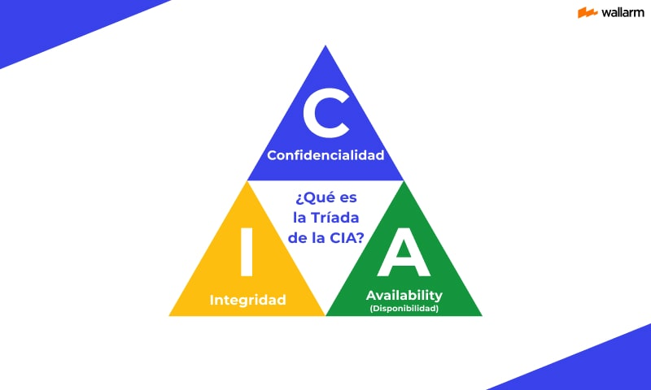
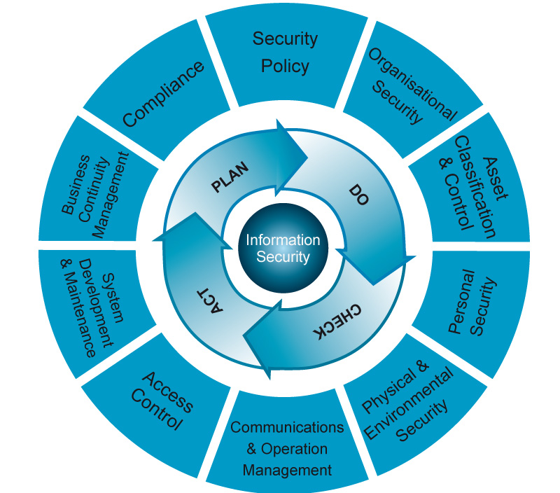

# UD2. Normativa, Marco Legal y Estándares de Seguridad

!!! note "Objetivos de la Unidad (Duración: 4 Horas)"
    * Comprender conceptualmente qué es un Sistema de Gestión de la Seguridad de la Información (SGSI) bajo la norma ISO/IEC 27001.
    * Conocer y aplicar las fases del ciclo de mejora continua (Ciclo de Deming / PDCA) a la gestión de la seguridad.
    * Conocer en profundidad las tres leyes clave del marco regulatorio tecnológico: RGPD, LOPDGDD y LSSI-CE, comprendiendo sus principios, derechos y obligaciones.
    * Aprender a verificar la vigencia legislativa y consultar fuentes oficiales primarias (BOE y EUR-Lex).
    * Reconocer el rol y funciones de los organismos de referencia en ciberseguridad: AEPD, INCIBE y CCN-CERT.
    * Desarrollar habilidades de investigación autónoma, análisis crítico de textos legales y defensa oral en equipo mediante la resolución de un caso práctico.

---

## 2.1. Estándares de Gestión: ISO/IEC 27001 y el SGSI

En el ámbito profesional de la administración de sistemas, la seguridad no se gestiona de forma improvisada. Para garantizar que los controles técnicos analizados en la unidad anterior (como contraseñas, cortafuegos o copias de seguridad) se apliquen de forma coherente y adaptada a las necesidades reales del negocio, se utilizan marcos internacionales de gestión.

### 2.1.1. ¿Qué es un SGSI?
Un **SGSI (Sistema de Gestión de la Seguridad de la Información)** es un conjunto organizado de políticas, procedimientos, directrices, recursos y actividades coordinadas por una organización para proteger sus activos de información frente a riesgos, garantizando la continuidad del negocio y minimizando el impacto de posibles incidentes.

!!! info "ISO/IEC 27000: La familia de referencia"
    La familia de normas **[ISO/IEC 27000](https://www.iso.org/es/normas/mas-comunes/familia-iso-27000){target="_blank"}** es el estándar internacional por excelencia en seguridad IT, ciberseguridad y protección de la privacidad.
    
    **[ISO/IEC 27001](https://www.iso.org/es/norma/27001){target="_blank"}:** Es la **única norma certificable** de la familia. Especifica todos los requisitos obligatorios para implantar, mantener, auditar y mejorar un SGSI en cualquier tipo de organización.

En la página web de la norma ISO/IEC 27001 puedes encontrar respuestas a las siguientes preguntas que te ayudarán a comprender mejor la norma:

   * ¿Qué es la norma ISO/IEC 27001?
   * ¿Por qué es importante la norma ISO/IEC 27001?
   * ¿Quién necesita la norma ISO/IEC 27001?
   * ¿Cómo beneficiará la norma ISO/IEC 27001 a mi organización?
   * ¿Cuáles son los tres principios de seguridad de la información de la norma ISO/IEC 27001, también conocidos como la tríada de la CIA (por sus siglas in inglés)?
   * ¿La norma ISO 27001 es la misma que la ISO/IEC 27001?
   *  ¿Qué es la certificación ISO/IEC 27001 y qué significa estar certificado según la norma ISO 27001?


!!! info "La tríada CIA"
    Recuerdas la tríada CIA que vimos en la unidad de Fundamentos de seguridad informática. Es importante recordarla.
    

---

### 2.1.2. El Ciclo de Deming o Ciclo PDCA
Para asegurar que la seguridad de la información no sea un estado estático sino un **proceso de mejora continua**, la norma ISO/IEC 27001 adopta la metodología del **Ciclo PDCA** (*Plan-Do-Check-Act* / Planificar-Hacer-Verificar-Actuar):

```
       [ PLAN ] (Planificar)  <------ Establecer políticas y riesgos
             |
             v
        [ DO ] (Hacer)        <------ Implementar controles y procesos
             |
             v
      [ CHECK ] (Verificar)   <------ Monitorear, medir y auditar
             |
             v
       [ ACT ] (Actuar)       <------ Aplicar acciones correctivas
             |
             +----------------------- Reiniciar ciclo para mejora continua
```

El ciclo PDCA es un proceso continuo.



#### 1. PLAN (Planificar)
Fase de diseño y modelado de la seguridad. Se definen el alcance del SGSI, las políticas de seguridad de la dirección y se realiza un **Análisis y Evaluación de Riesgos**. Tras identificar los riesgos intolerables, se diseña un plan de tratamiento de riesgos seleccionando los controles adecuados.

#### 2. DO (Hacer)
Fase de implantación y operación. Se ejecutan los planes diseñados, se despliegan los controles técnicos y organizativos elegidos, se asignan recursos y se imparte formación y concienciación a todo el personal (creación del *"Cortafuegos Humano"*).

#### 3. CHECK (Verificar)
Fase de monitorización, medición y auditoría. Se recopilan métricas y logs del sistema operativo y de red para comprobar si los controles implementados funcionan correctamente y cumplen los objetivos previstos. Se realizan auditorías internas periódicas para detectar desviaciones o fallos.

#### 4. ACT (Actuar)
Fase de mejora y corrección. Basándose en los resultados de la auditoría de la fase anterior, se toman acciones correctivas y preventivas ante los fallos detectados. La dirección del centro o de la empresa revisa el sistema para autorizar cambios y mejoras, reiniciando el ciclo de forma continua.

---

## 2.2. Marco Legal y Normativo de la Ciberseguridad

Un administrador de sistemas no puede operar al margen de la ley. Toda infraestructura de red corporativa que procese datos personales o preste servicios en Internet debe cumplir de forma obligatoria con el marco legislativo vigente para evitar graves sanciones administrativas, de reputación o penales.

 "Las tres columnas del marco regulatorio digital" está formada por:

   1. **RGPD (Reglamento General de Protección de Datos - Reglamento UE 2016/679):**
      Normativa de obligado cumplimiento a nivel europeo que regula el tratamiento de datos de carácter personal de personas físicas. Introduce principios fundamentales como la transparencia, la limitación de la finalidad, la minimización de datos (*recoger solo lo estrictamente necesario*) y la responsabilidad proactiva (*probar activamente que se protege la información*).
   2. **LOPDGDD (Ley Orgánica 3/2018, de 5 de diciembre, de Protección de Datos Personales y Garantía de los Derechos Digitales):**
      Ley española que adapta y complementa el RGPD a nivel nacional. Entre otras aportaciones, regula el catálogo de **Derechos Digitales** de la ciudadanía (como el derecho a la desconexión digital en el ámbito laboral o el testamento digital).
   3. **LSSI-CE (Ley 34/2002, de 11 de julio, de Servicios de la Sociedad de la Información y de Comercio Electrónico):**
      Regula las actividades y obligaciones legales de las empresas que ofrecen servicios comerciales en Internet, operan tiendas online, envían comunicaciones publicitarias por correo electrónico o alojan contenidos web. Afecta directamente al administrador de servidores web, obligando a disponer de textos legales transparentes (Aviso Legal, Política de Privacidad, Política de Cookies) e impedir el envío de publicidad no solicitada (*spam*).

Vamos a ver de qué trata cada una de estas leyes con un poco más de detalle.

---

### 2.2.1. RGPD: Reglamento General de Protección de Datos (Reglamento UE 2016/679)

🔗 **Enlace Oficial al Texto de la Ley:** [Reglamento (UE) 2016/679 en EUR-Lex / BOE](https://www.boe.es/buscar/doc.php?id=DOUE-L-2016-80807){target="_blank"}

!!! warning "Verificación indispensable: ¿Cómo comprobar si una ley sigue vigente?"
    En el ámbito del derecho, las normas evolucionan constantemente debido a directivas europeas o reformas parlamentarias. Antes de citar o aplicar cualquier ley en un proyecto técnico, **un profesional debe verificar siempre su estado de vigencia**.
    
    Tanto en la web del **BOE (Boletín Oficial del Estado)** como en **EUR-Lex** (portal de la Unión Europea), cada norma dispone de una pestaña o sección fija denominada **"Análisis"** o similar.
    
    Al consultar una ley en el BOE, debes revisar siempre:
    
    1. **Estado de Vigencia:** Confirmar que figura marcada como *"Vigente"* y no como *"Derogada"*.
    2. **Modificaciones Posteriores:** Comprobar la lista de leyes o reales decretos que han modificado artículos específicos con posterioridad a su publicación original.
    3. **Texto Consolidado:** Consultar siempre la versión *"Texto consolidado"*, que integra en un único documento el texto original junto con todas las modificaciones posteriores ya aplicadas.

El **RGPD** es la norma marco europea que regula de forma unificada el tratamiento de datos de carácter personal de las personas físicas en todos los Estados miembros de la Unión Europea.

El Nuevo Reglamento de Protección de Datos en menos de 3 minutos (2:49)


RGPD/GDPR: ¿Qué es el Reglamento Europeo de Protección de Datos? (2:39)


#### Puntos Clave del RGPD para el Administrador de Sistemas:

1. **Ámbito de Aplicación Extraterritorial:** Se aplica a cualquier organización (pública o privada) que trate datos de residentes en la UE, independientemente de si la empresa tiene su sede física dentro o fuera de la Unión Europea (ej. servicios de alojamiento *cloud* en EE.UU.).
2. **Principios Fundamentales del Tratamiento (Art. 5):**

    * **Licitud, lealtad y transparencia:** El usuario debe saber en todo momento qué se hace con sus datos y con qué base legal.
    * **Limitación de la finalidad:** Los datos solo se recogen para fines determinados, explícitos y legítimos.
    * **Minimización de datos:** Se debe solicitar **únicamente la información estrictamente necesaria** para prestar el servicio.
    * **Exactitud:** Los datos deben mantenerse actualizados y corregirse sin dilación.
    * **Limitación del plazo de conservación:** Los datos deben suprimirse o anonimizarse cuando dejen de ser necesarios para la finalidad originaria.
    * **Integridad y confidencialidad:** Obligación de implantar medidas de seguridad técnicas (cifrado, control de acceso) y organizativas.
    * **Responsabilidad Proactiva (*Accountability*):** No basta con cumplir la ley; la organización debe ser capaz de **demostrar documentalmente** ante una auditoría que aplica todas las medidas necesarias.

3. **Derechos de los Interesados (Derechos ARCO-POL):**
    * **Acceso, Rectificación, Supresión** (*"Derecho al Olvido"*), **Oposición, Portabilidad** (recibir sus datos en un formato estructurado como JSON/XML) y **Limitación del tratamiento**.
    

4. **Figuras Clave:**
    * **Responsable del Tratamiento:** La entidad o empresa que decide los fines y medios del tratamiento de datos.
    * **Encargado del Tratamiento:** El proveedor técnico o tercero que trata datos por cuenta del responsable (ej. la empresa de *hosting* o la plataforma de respaldo *cloud*).
    * **Delegado de Protección de Datos (DPD/DPO):** Asesor obligatorio en organismos públicos y empresas que traten datos masivos o sensibles.

5. **Seguridad y Brechas de Seguridad:**
    * Obligación de aplicar **Privacidad desde el diseño y por defecto** (*Privacy by Design / Default*).
    * **Notificación de Brechas de Seguridad:** Si el sistema sufre un incidente (ej. un ataque de *ransomware* o filtración de base de datos), el administrador debe notificarlo a la AEPD en un plazo máximo de **72 horas**.

---

### 2.2.2. LOPDGDD: Ley Orgánica 3/2018 de Protección de Datos Personales y Garantía de los Derechos Digitales

🔗 **Enlace Oficial al Texto de la Ley:** [Ley Orgánica 3/2018 en el BOE](https://www.boe.es/eli/es/lo/2018/12/05/3/con){target="_blank"}

!!! warning "Verificación indispensable: ¿Sigue vigente?"
    Como vimos antes es indispensable, antes de estudiar una ley, comprobar que ésta sigue vigente. ¿Sigue vigente esta ley? ¿Cuándo ha sido modificada por última vez?.

La **LOPDGDD** es la ley española que adapta y complementa el RGPD europeo al ordenamiento jurídico nacional, introduciendo novedades específicas de gran calado técnico y laboral.

#### Puntos Clave de la LOPDGDD para el Administrador de Sistemas:

1. **Edad Mínima de Consentimiento:** Establece en **14 años** la edad a partir de la cual un menor puede otorgar consentimiento válido para el tratamiento de sus datos personales en plataformas digitales sin requerir la autorización explícita de padres o tutores.
2. **Garantía de los Derechos Digitales (Título X):**

    * **Derecho a la desconexión digital en el trabajo:** Garantiza el descanso de los empleados limitando las comunicaciones laborales fuera del horario de trabajo.
    * **Derecho a la intimidad frente a dispositivos digitales y videovigilancia:** Regula estrictamente los límites del uso de cámaras de seguridad, sistemas de geolocalización en vehículos de empresa y la monitorización de ordenadores corporativos.
    * **Derecho al testamento digital:** Regula cómo los herederos o allegados pueden gestionar o cancelar perfiles en redes sociales y servicios digitales de personas fallecidas.

3. **Régimen Sancionador de la AEPD:**
    * Clasifica las infracciones en **leves, graves y muy graves**, estableciendo prescripciones de hasta 3 años. 
    * Permite aplicar multas administrativas que en el ámbito privado pueden alcanzar hasta los 20 millones de euros o el 4% de la facturación anual global de la empresa.

---

### 2.2.3. LSSI-CE: Ley 34/2002 de Servicios de la Sociedad de la Información y de Comercio Electrónico

🔗 **Enlace Oficial al Texto de la Ley:** [Ley 34/2002 en el BOE](https://www.boe.es/eli/es/l/2002/07/11/34/con){target="_blank"}

La **LSSI-CE** regula las obligaciones legales de cualquier sitio web, tienda *e-commerce*, servicio en la nube o plataforma digital que realice actividades económicas o comerciales en España.

#### Puntos Clave de la LSSI-CE para el Administrador de Sistemas:

1. **Deber de Información General (Art. 10 - Aviso Legal):**

    Todo sitio web comercial debe incluir en un lugar fácilmente accesible (pie de página) la información identificativa del titular: NIF/CIF, denominación social, domicilio físico, correo electrónico de contacto directo y datos de inscripción en el Registro Mercantil.

2. **Regulación estricta del Spam (Art. 21 - Comunicaciones Comerciales):**

    Prohibición absoluta de enviar correos publicitarios o promocionales no solicitados ni autorizados previamente (*spam*).
    *Excepción:* Se permite enviar publicidad si existe una relación contractual previa donde el usuario compró un producto similar, **siempre que en cada correo se incluya un método sencillo, directo y gratuito para darse de baja (*opt-out*)**.

3. **Regulación de Cookies y Almacenamiento Local (Art. 22.2):**

    Prohíbe instalar cualquier cookie de rastreo o analítica antes de que el usuario haya otorgado su **consentimiento explícito** mediante un banner interactivo transparente que permita rechazar todas las cookies no esenciales con la misma facilidad que aceptarlas.

4. **Seguridad y Contratación Electrónica:**

    Obligación de confirmar la recepción de los pedidos por correo electrónico en menos de 24 horas y utilizar protocolos de comunicación seguros (*HTTPS/TLS*) para proteger las transacciones y datos de pago.

En estos vídeos encontrarás una visión global de la ley:


---

### 2.2.4. Organismos Públicos de Referencia en Ciberseguridad

En España existen tres grandes instituciones de carácter público que sirven de soporte, referencia, supervisión y auxilio técnico para administradores y ciudadanos:

*   **[AEPD (Agencia Española de Protección de Datos)](https://www.aepd.es/){target="_blank"}:** Autoridad de control estatal independiente que vela por el cumplimiento de la normativa de protección de datos (RGPD/LOPDGDD). Tiene potestad para realizar inspecciones, resolver reclamaciones de ciudadanos, emitir guías de buenas prácticas y aplicar sanciones económicas en caso de infracciones de privacidad.
*   **[INCIBE (Instituto Nacional de Ciberseguridad)](https://www.incibe.es/){target="_blank"}:** Entidad de referencia para el desarrollo de la ciberseguridad y la confianza digital de los ciudadanos, pymes y profesionales del sector privado en España. Ofrece soporte técnico, guías de bastionado, recursos formativos y gestiona el **INCIBE-CERT**, el centro de respuesta a incidentes de seguridad para el entorno ciudadano y empresarial.
*   **[CCN-CERT (Centro Criptológico Nacional)](https://www.ccn-cert.cni.es/){target="_blank"}:** Organismo especializado encargado de coordinar la ciberseguridad en el sector público, administraciones gubernamentales y aquellas empresas consideradas operadores de infraestructuras críticas nacionales (suministro eléctrico, agua, transporte, sanidad). Es el desarrollador de las guías de seguridad CCN-STIC para el bastionado seguro de sistemas.

---

## 2.3. Proyecto de Investigación y Consultoría: "Auditoría de Cumplimiento Legal y Diseño de SGSI"

La teoría jurídica solo cobra verdadero sentido cuando se aplica sobre un entorno técnico real. Como futuros administradores de sistemas en red (ASIR), vuestro aprendizaje se consolidará enfrentando un caso práctico de consultoría en equipo.

---

### 2.3.1. Presentación del Caso de Estudio: "ElectroASIR S.L."

!!! abstract "Escenario"
    **ElectroASIR S.L.** es una pyme valenciana dedicada a la distribución y venta minorista de repuestos informáticos y de telecomunicaciones. Acaban de dar el salto al mercado digital inaugurando una plataforma web de comercio electrónico (*e-commerce*). 
    
    La infraestructura lógica es administrada por un único técnico. Toda la infraestructura (servidores, bases de datos, páginas web, etc) se encuentran alojadas en un proveedor de servicios externo. Se ha desplegado:
    
    1. Un servidor web apache/nginx que aloja la tienda online al que se accede por http. 
    2. Al registrarse en el servidor web se almacenan los datos de pago, nombres, direcciones postales, teléfonos y correos electrónicos de los clientes. No existe una casilla de consentimiento explícito para que se traten los datos facilitados. No se solicita la edad del cliente.
    3. En la web solo figura el nombre comercial de la empresa, pero no su razón social, dirección y teléfono.
    4. Los precios de la web no indican si incluyen o no impuestos aplicables.
    5. El servidor web guarda cookies en el ordenador del usuario, pero no avisa de ello.
    3. Un sistema de envío masivo de correos de ofertas y promociones a todos los clientes registrados en la tienda on-line. No existe una casilla de consentiento explícito del cliente para aceptar esos correos.

El gerente de la pyme os ha contratado como **consultores e inspectores de seguridad** tras recibir una notificación de aviso del INCIBE advirtiéndoles de que su servidor web está enviando tráfico de spam de forma sospechosa y carece de cifrado HTTPS. Tienen pánico de recibir una denuncia que pueda derivar en una sanción económica de la AEPD.

---

### 2.3.2. Instrucciones y Tareas de Investigación

En grupos de 3 o 4 alumnos, debéis investigar las leyes en los enlaces oficiales del BOE/EUR-Lex, analizar el escenario y resolver el caso abordando tres bloques de investigación:

#### 📂 Bloque 1: Auditoría de la Privacidad (RGPD / LOPDGDD)
1. **Figuras legales:** 
    * Identificad quién ostenta el rol de *Responsable del Tratamiento* y el *Encargado del tratamiento* de los datos de ElectroASIR S.L.(RGPD - Cap I Disposiciones generales). 
    * Qué obligaciones de responsabilidad proactiva tienen a nivel informático. (RGPD - CAPÍTULO IV Responsable del tratamiento y encargado del tratamiento) 
2. **Minimización de datos y consentimiento:** 
    * Analizad si el sistema de registro de la tienda online cumple con el principio de *consentimiento explícito* y *minimización de datos*. 
    * ¿Qué mecanismos de software se deben programar en los formularios web para cumplirlo?
    * ¿Debería solicitarse la edad de los clientes que se registran para almacenar sus datos?
3. **El Deber de Información:** 
    * Diseñad una propuesta de cláusula informativa de privacidad que deba aparecer en el pie de los formularios web de recogida de datos personales.

#### 📂 Bloque 2: Auditoría del Sitio Web y Comercio Electrónico (LSSI-CE)
1. **Spamming legal:** 
    * ¿Es legal enviar correos masivos de ofertas a los usuarios simplemente porque registraron sus datos? 
    * ¿Qué exige el artículo 21 de la LSSI sobre las comunicaciones comerciales no solicitadas?
2. **Textos obligatorios:** 
    * ¿Qué información mínima obligatoria debe figurar públicamente en la página web para cumplir con el artículo 10 de la LSSI (Aviso Legal)?
    * ¿Y para guardar cookines en el ordenador del cliente (Artículo 22 de la LSSI-CE)?
3. **Seguridad técnica obligada:** 
    * Al procesar datos de pago y contraseñas lógicas, ¿qué medida técnica de cifrado perimetral es obligatoria implementar en el servidor web apache/nginx por ley?

#### 📂 Bloque 3: Propuesta de un SGSI básico aplicando el Ciclo PDCA (ISO 27001)
1. **Plan (Planificar):** Identificad al menos 2 activos críticos del escenario y calculad un riesgo hipotético para cada uno.
2. **Do (Hacer):** Proponed al menos 1 medida técnica activas que el departamento informático deba implementar inmediatamente para blindar los activos identificados en el primer punto.
3. **Check (Verificar):** Proponed qué mecanismos lógicos de monitorización y auditoría técnica utilizaréis para verificar que las medidas del paso anterior funcionan (ej. análisis de logs, escaneo de puertos o simulacros).
4. **Act (Actuar):** Explicad qué protocolo organizativo o técnico aplicaríais en caso de que en la fase anterior detectarais en el paso anterior que uno de los activos presenta una vlnerabilidad.

---

### 2.3.3. Recursos y Herramientas recomendadas para la Investigación

Para la resolución del caso puedes utilizar las herramientas que consideres necesarias. No obstante, verifica siempre las 3 leyes que hemos visto en el tema para asegurarte que las respuestas se ajustan a su articulado.

Además de las leyes puedes usar estos recursos:

*   **Buscador oficial del BOE (Sección Análisis/Consolidado):** [Portal Oficial del BOE](https://www.boe.es){target="_blank"}.
*   **Guías prácticas de la AEPD:** [Portal oficial de la Agencia Española de Protección de Datos](https://www.aepd.es){target="_blank"} (sección *"Guías para pymes y desarrolladores"*).
*   **Kit de herramientas para empresas del INCIBE:** [Sección de empresas del Instituto Nacional de Ciberseguridad](https://www.incibe.es/empresas){target="_blank"}.
*   **Guías CCN-STIC:** [Guías de Seguridad TIC del Centro Criptológico Nacional](https://www.ccn-cert.cni.es){target="_blank"}.

---

### 2.3.4. Modalidad de Evaluación y Entregables

!!! danger "Aviso importante sobre el modelo de evaluación"
    El objetivo del trabajo no es conseguir un resultado final satisfactorio, sino que sea un vehículo de aprendizaje activo. Si se lo das a una IA te dará el resultado, pero no habrás aprendido nada. De ti depende. 
    
La evaluación del proyecto de investigación se articulará a través de las siguientes dos vías obligatorias:

#### 1. Presentación de Resultados (Defensa Oral con Diapositivas)
* Cada equipo dispondrá de **10 minutos** para realizar una presentación pública ante la clase simulando una reunión formal de consultores de seguridad ante la junta directiva de ElectroASIR S.L.
* Debéis apoyar la exposición con un soporte visual limpio y técnico (presentación de diapositivas).
* **Todos los miembros del equipo deben intervenir activamente** argumentando las decisiones legales y técnicas adoptadas.
* Tras la exposición, el docente y los compañeros realizarán preguntas específicas para verificar el grado de dominio del marco normativo y del caso de estudio.

!!! info "Rúbrica de Calificación de la Presentación Oral (RA7 / CE7.a, b, c, d, e, f, g)"

    Para la evaluación del trabajo de investigación se tendrá en cuenta
      
      * **Dominio y precisión del Marco Legal (35%):** Correcta identificación y citación de los artículos de la LSSI, LOPDGDD y RGPD que se infringen en el caso práctico [CE7.a, CE7.e].
      * **Calidad de la Propuesta del SGSI y Ciclo PDCA (25%):** Coherencia y rigor técnico de las salvaguardas y medidas correctoras propuestas para la empresa [CE7.f, CE7.g].
      * **Claridad en la Exposición y Argumentación Técnica (25%):** Capacidad de síntesis, expresión oral profesional, respuesta precisa a las preguntas del auditor/docente [CE7.b, CE7.c, CE7.d].
      * **Soporte Visual y Formato de Diapositivas (15%):** Calidad visual, estructura clara, ausencia de exceso de texto e inclusión de esquemas explicativos.

    MUY IMPORTANTE: las preguntas que se realizarán durante la exposición permitirán comprobar el dominio de la materia y el grado en que cada alumno ha contribuido al resultado final. Cada miembro del grupo podrá ser calificado de forma distinta en función de su desempeño en la presentación. 

#### 2. Cuestionario Final de Evaluación de la Unidad
* El cuestionario individual del tema (que se realizará en Moodle al finalizar la UD2) **incluirá preguntas específicas sobre las situaciones legales, infracciones y soluciones técnicas trabajadas en este proyecto de investigación**.
* Esta prueba garantiza que cada alumno comprenda de manera individual las repercusiones prácticas del RGPD, la LOPDGDD, la LSSI-CE y la norma ISO 27001.