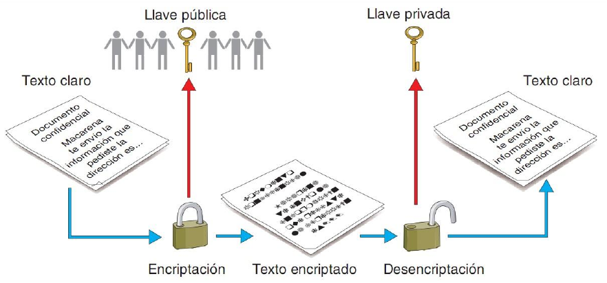

# Práctica 3.2: Criptografía Asimétrica y Gestión de Claves con GPG

!!! note "Objetivos de la Práctica"
    * Comprender el funcionamiento de la **criptografía asimétrica** (par de claves pública/privada) y cómo resuelve la problemática del intercambio seguro de claves.
    * Generar, administrar y consultar pares de claves PGP mediante la herramienta de línea de comandos `gpg`.
    * Exportar e importar claves públicas utilizando tanto archivos locales con armadura ASCII (`.asc`) como servidores remotos de claves (*keyservers*).
    * Cifrar archivos destinados exclusivamente a un tercero utilizando su clave pública y descifrar archivos dirigidos a nosotros con nuestra clave privada.
    * Participar en la actividad colaborativa de intercambio en Moodle, experimentando de forma práctica la seguridad del canal público.

---

## 1. Introducción: De la Clave Secreta al Par de Claves

En la práctica anterior comprobamos que la **criptografía simétrica** es extremadamente rápida y eficiente, pero presenta un inconveniente fundamental: **¿cómo le hacemos llegar la contraseña secreta al destinatario sin que un tercero la intercepte en el camino?** Si enviamos la contraseña por el mismo canal (Moodle, correo o mensajería), cualquier atacante que intercepte la clave podrá descifrar el mensaje.

La **criptografía asimétrica** resuelve este problema eliminando la necesidad de compartir contraseñas secretas. Cada usuario genera un **par de claves matemáticamente vinculadas**:

* **Clave Privada (K_priv):** Debe mantenerse **estrictamente en secreto**. Nunca se comparte ni se envía a nadie. Sirve para **descifrar** mensajes dirigidos a ti y para **firmar** digitalmente (esto ya lo veremos más adelante).
* **Clave Pública (K_pub):** Es **completamente pública**. Se puede enviar por correo, colgar en una web o subir a un servidor de claves (*keyserver*). Sirve para que **cualquiera pueda cifrarte** un archivo que solo tú podrás descifrar.



---

## 2. Fase 1: Generación de tu Par de Claves PGP

Para empezar a trabajar con criptografía asimétrica, debes generar tu propio par de claves en tu entorno Linux.

### Tarea 1: Creación del par de claves con `gpg`

Abre una terminal en tu sistema Linux y ejecuta el siguiente comando interactivo:

```bash
gpg --full-gen-key
```

!!! tip "¿Por qué `--full-gen-key` en lugar de `--gen-key`?"
    El parámetro `--gen-key` utiliza opciones por defecto automatizadas. Con `--full-gen-key` podemos controlar de forma explícita el tipo de algoritmo, la longitud en bits de la clave y su fecha de caducidad.

Sigue las instrucciones en pantalla especificando los siguientes parámetros:

1. **Tipo de clave:** Selecciona la opción `(1) RSA y RSA (por defecto)`.
2. **Tamaño de la clave:** Introduce `2048` bits (o `4096` bits para mayor seguridad).
3. **Validez de la clave:** Elige que la clave caduque en `1y` (1 año).
4. **Datos de identidad (UID):**
      * **Nombre y apellidos:** Tu nombre real o el usuario de clase (ej. `Nombre Apellido (SAD)`).
      * **Dirección de correo electrónico:** Tu correo corporativo del centro o de clase.
      * **Comentario:** `SAD - IES El Caminàs` (o el nombre de tu centro).
5. **Frase de paso (*Passphrase*):** Te pedirá una contraseña para proteger tu clave privada en el disco local. **¡No la olvides!** La necesitarás cada vez que quieras descifrar un archivo.

---

### Tarea 2: Inspección de tu anillo de claves (*Keyring*)

Una vez generado el par de claves, verifica que se han creado correctamente en tu sistema ejecutando los siguientes comandos:

* **Listar tu anillo de claves públicas:**
  ```bash
  gpg --list-keys
  # o su sintaxis abreviada:
  gpg -k
  ```
* **Listar tu anillo de claves privadas (secretas):**
  ```bash
  gpg --list-secret-keys
  # o su sintaxis abreviada:
  gpg -K
  ```

!!! info "Anotación de tu ID de Clave (*Key ID*)"
    En la salida de `gpg -k`, localiza el bloque correspondiente a tu usuario. Verás una cadena hexadecimal larga (la huella digital o *fingerprint*). Los últimos 8 o 16 caracteres corresponden a tu **Key ID**. Anótala, la usarás en los siguientes pasos.

---

## 3. Fase 2: Exportación e Importación de Claves Públicas

Para que un compañero o el profesor pueda enviarte un archivo cifrado, necesita disponer de tu **clave pública**.

### Tarea 3: Exportar tu clave pública a un archivo ASCII

Exporta tu clave pública a un archivo de texto utilizando la opción de "armadura ASCII" (`-a` o `--armor`) para que pueda ser compartido fácilmente:

```bash
gpg -a --export "tu_email@correo.com" > mi_clave_publica.asc
```

Abre el archivo resultante `mi_clave_publica.asc` con `cat` o un editor de texto. Observa que comienza con `-----BEGIN PGP PUBLIC KEY BLOCK-----`. Este archivo no contiene ningún dato secreto; puedes compartirlo libremente.

---

### Tarea 4: Servidores de Claves Públicas (*Keyservers*)

Los **servidores de claves** son bases de datos públicas distribuidas e interconectadas en Internet que permiten buscar y descargar claves públicas de usuarios de todo el mundo.

1. **Subir tu clave pública a un servidor público:**
   ```bash
   gpg --keyserver keyserver.ubuntu.com --send-keys TU_KEY_ID
   ```
2. **Buscar e importar la clave pública del profesor o de un compañero desde el servidor:**
   ```bash
   gpg --keyserver keyserver.ubuntu.com --search-keys "roman@ieselcaminas.org"
   # o descargando directamente por Key ID:
   gpg --keyserver keyserver.ubuntu.com --recv-keys ID_DE_LA_CLAVE
   ```

!!! warning "Atención con los servidores de claves"
    Las claves subidas a los servidores públicos PGP **no se pueden eliminar**, únicamente se pueden revocar si conservas el certificado de revocación. Ten cuidado con los datos personales que asocias a tu UID si vas a publicar en servidores globales.

---

## 4. Fase 3: Operaciones de Cifrado y Descifrado Asimétrico

### Tabla de Modificadores para Criptografía Asimétrica

Averigua y prueba la función de los siguientes parámetros de `gpg`:

| Parámetro | Nombre Largo | Descripción / Función |
| :--- | :--- | :--- |
| `-e` | `--encrypt` | Cifra datos. Requiere especificar el destinatario. |
| `-r` | `--recipient` | Especifica el destinatario (por correo, nombre o Key ID) cuya clave pública se usará. |
| `-d` | `--decrypt` | Descifra un archivo cifrado (utiliza automáticamente tu clave privada). |
| `-u` | `--local-user` | Selecciona qué clave privada local utilizar si se poseen varias. |
| `--import` | `--import` | Importa una clave pública o privada desde un archivo local `.asc` o `.key`. |

---

### Tarea 5: Cifrar un archivo para otra persona

Imagina que quieres enviar un archivo confidencial llamado `mensaje_profesor.txt` al profesor o a un compañero cuya clave pública ya tienes en tu anillo:

1. Crea el archivo de texto:
   ```bash
   echo "Hola profesor, esta es mi entrega secreta mediante clave pública." > mensaje_profesor.txt
   ```
2. Cifra el archivo utilizando la **clave pública del destinatario**:
   ```bash
   gpg -e -r "roman@ieselcaminas.org" -a mensaje_profesor.txt
   ```
3. Comprueba el resultado: se habrá generado el archivo `mensaje_profesor.txt.asc`.
4. **Intenta descifrarlo tú mismo:**
   ```bash
   gpg -d mensaje_profesor.txt.asc
   ```
   *¿Qué ocurre? ¿Por qué tú NO puedes descifrar un archivo que acabas de cifrar tú mismo si no incluiste tu propia clave como destinataria?*

---

## 5. Fase 4: Desafío Colaborativo en el Foro de Moodle (El Gran Cierre)

Llegó el momento de comprobar la gran ventaja de la criptografía asimétrica frente a la simétrica: **Cero intercambio previo de contraseñas secretas.**

```
                      +-------------------------------------------------+
                      |              FORO DE MOODLE (PÚBLICO)          |
                      +-------------------------------------------------+
                      | 1. Todos publican sus Claves Públicas (.asc)   |
                      | 2. Todos suben Archivos Cifrados para otros    |
                      +-------------------------------------------------+
```

### Paso A: Publicación de Claves Públicas
1. Accede al foro de Moodle de la unidad al tema de debate **"Directorio de Claves Públicas PGP"**.
2. Publica un mensaje adjuntando tu archivo `mi_clave_publica.asc` (o pega su contenido en texto plano) e indica tu Nombre y Correo asociado.

### Paso B: Descarga de Clave e Importación
1. Elige a un compañero de clase en el foro.
2. Descarga su archivo de clave pública (`clave_compañero.asc`) e impórtalo en tu sistema:
   ```bash
   gpg --import clave_compañero.asc
   ```
3. Verifica con `gpg -k` que la clave de tu compañero aparece en tu anillo público.

### Paso C: Cifrado y Envío en el Foro
1. Crea un archivo con un mensaje personalizado para tu compañero (ej. `para_carlos.txt`).
2. Cífralo en formato armadura ASCII con la **clave pública de tu compañero**:
   ```bash
   gpg -e -r "correo_de_tu_compañero@correo.com" -a para_carlos.txt
   ```
3. Entra en el foro de Moodle en el tema **"Intercambio Asimétrico"** y sube el archivo cifrado `para_carlos.txt.asc` indicando claramente en el asunto: **"Mensaje cifrado para [Nombre de tu Compañero]"**.

### Paso D: Descifrado y Confirmación
1. Busca en el foro el mensaje cifrado que algún compañero te haya enviado a ti.
2. Descarga el archivo cifrado y descífralo en tu terminal con tu **clave privada**:
   ```bash
   gpg -o mensaje_revelado.txt -d mensaje_recibido.asc
   ```
   *(El sistema te pedirá la frase de paso / passphrase de tu clave privada).*
3. Responde al mensaje de tu compañero en el foro confirmando el texto que has logrado descifrar.

---

## 6. Entregable / Cheatsheet de Criptografía Asimétrica

Completa la siguiente tabla en tu cuaderno de laboratorio con los comandos exactos utilizados durante la práctica:

| Operación | Comando GPG | Extensión de Salida |
| :--- | :--- | :---: |
| **Generar par de claves completo** | `gpg --full-gen-key` | N/A |
| **Listar claves públicas del anillo** | `gpg -k` | N/A |
| **Listar claves privadas del anillo** | `gpg -K` | N/A |
| **Exportar clave pública en ASCII** | `gpg -a --export "email" > clave.asc` | `.asc` |
| **Importar clave pública desde fichero** | `gpg --import clave.asc` | N/A |
| **Buscar/Descargar clave de un keyserver** | `gpg --keyserver server --recv-keys ID` | N/A |
| **Subir clave pública a un keyserver** | `gpg --keyserver server --send-keys ID` | N/A |
| **Cifrar archivo para un tercero (ASCII)** | `gpg -e -r "email" -a archivo` | `.asc` |
| **Descifrar archivo con clave privada** | `gpg -o salida -d archivo.asc` | `.txt` / Binario |

---

## 7. Cuestiones de Autoevaluación

Responde a las siguientes preguntas razonadas al final de tu informe:

1. **El problema de la clave compartida:** ¿Por qué en esta práctica hemos podido publicar libremente los archivos cifrados en un foro público de Moodle sin haber tenido que intercambiar previamente ninguna contraseña secreta en privado con el compañero?
2. **Seguridad del par de claves:** Si un atacante consigue tu clave pública, ¿puede descifrar los mensajes que otros te envían a ti? ¿Por qué?
3. **Pérdida de la clave privada:** Si se te avería el disco duro y pierdes tu clave privada, ¿podrás descifrar los archivos que tus compañeros te enviaron la semana pasada? ¿Se puede recuperar de alguna forma la clave privada a partir de la pública?
4. **Doble cifrado:** Si quieres cifrar un archivo de forma que **tanto tú como tu compañero** podáis descifrarlo en el futuro con vuestras respectivas claves privadas, ¿cómo deberías ejecutar el comando `gpg -e`? *(Pista: consulta las opciones del parámetro `-r` / `--recipient`)*.
