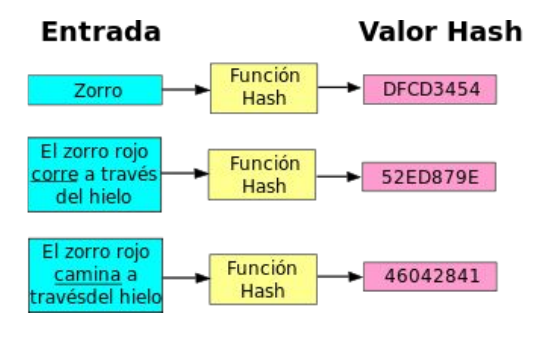

# Práctica 3.3: Funciones Hash y Verificación de Integridad de Datos

!!! note "Objetivos de la Práctica"
    * Comprender el concepto, propiedades y casos de uso de las **funciones hash o resumen digital** (MD5, SHA-256, SHA-512).
    * Experimentar con la verificación de la **integridad** de ficheros utilizando herramientas gráficas (**QuickHash GUI**) y de consola Linux (`sha256sum`, `sha512sum`).
    * Integrar la herramienta `gpg` (`gpg --print-md`) para el cálculo de resúmenes criptográficos en la línea de comandos.
    * Realizar la verificación masiva y automatizada de la integridad de archivos utilizando ficheros de suma de comprobación (`SHA256SUMS` / `.sha512`).
    * Analizar el impacto del **efecto avalancha** y la detección de archivos manipulados o corruptos.

---

## 1. Introducción: ¿Qué es y para qué sirve una Función Hash?

En la administración de sistemas y la seguridad informática, garantizar que un archivo no ha sido alterado por un fallo en la descarga, un error en el disco o la manipulación maliciosa de un tercero es fundamental. Para ello se utilizan las **funciones hash o algoritmos de resumen criptográfico**.

Una función hash es un algoritmo matemático irreversible que transforma cualquier bloque de datos de entrada (desde una palabra hasta una imagen ISO de varios gigabytes) en una cadena de caracteres de **longitud fija** denominada **hash, digest o resumen digital**.

```
  [ Archivo de entrada ]  --->  [ Función Hash (ej. SHA-512) ]  --->  [ Resumen (128 caracteres Hex) ]
   (Cualquier tamaño)                                                    (Longitud fija e inalterable)
```




### Propiedades Clave de las Funciones Hash:

1. **Unidireccionalidad:** Es imposible obtener el contenido original a partir de su resumen hash.
2. **Determinismo:** El mismo archivo de entrada generará siempre exactamente el mismo hash.
3. **Efecto Avalancha:** Si se modifica un solo bit del archivo original, el hash resultante cambia de forma drástica e impredecible.
4. **Resistencia a Colisiones:** Es matemáticamente inviable encontrar dos archivos distintos que generen el mismo resumen hash.

---

## 2. Fase 1: Cálculo e Inspección con Herramienta Gráfica (QuickHash GUI)

**QuickHash GUI** es una herramienta multiplataforma de código abierto que proporciona una interfaz visual intuitiva para calcular y comparar resúmenes hash de archivos, textos y discos completos.

### Tarea 1: Instalación y exploración de QuickHash

1. Descarga **QuickHash GUI** desde su portal oficial ([quickhash-gui.org](https://www.quickhash-gui.org/)). 
3. Descomprime el archivo y ejecuta la aplicación (`QuickHash-GUI` en Linux - recuerda darle permiso de ejecución - o `.exe` en Windows).
4. Explora la interfaz navegando por sus pestañas principales (*File*, *Files*, *Copy Data*, *Text*, *Compare Two Files*).

---

### Tarea 2: Cálculo del Hash de un archivo

1. Selecciona o descarga el archivo de prueba [imagen01-1.jpg](img/imagen01-1.jpg).
2. Accede a la pestaña **File** en QuickHash.
3. Observa los distingos algoritmos de hashing disponibles.
4. En el desplegable de algoritmos (*Algorithm*), selecciona **SHA512**.
5. Haz clic en **Select File** y elige la imagen `imagen01-1.jpg`.
6. Observa la cadena hexadecimal resultante generada en la casilla de salida.

**Reflexión:** ¿Crees que el hash resultante obtenido en tu equipo coincide exactamente con el que obtienen tus compañeros de clase? Compruébalo. Debido a la propiedad de **determinismo**, si el archivo es idéntico byte a byte, el resumen SHA-512 será exactamente el mismo.

---

### Tarea 3: Verificación de Integridad y Detección de Falsificaciones

Descarga los ficheros de prueba del aula virtual:

* Ficheros del Caso A: [imagen01-2.jpg](img/imagen01-2.jpg) y su resumen en [imagen01-2.sha512](img/imagen01-2.sha512).
* Ficheros del Caso B: [imagen01-3.jpg](img/imagen01-3.jpg) y su resumen en [imagen01-3.sha512](img/imagen01-3.sha512).

1. Abre el archivo de texto `imagen01-2.sha512` para ver el hash esperado.
2. Calcula con QuickHash el hash SHA-512 de la imagen `imagen01-2.jpg` y compara ambos valores. Visualmente es difícil, así que utiliza el cuadro **Expected Hash Value**.
3. Repite el mismo procedimiento para la imagen `imagen01-3.jpg` y su correspondiente `imagen01-3.sha512`.

!!! danger "Análisis de Resultados"
    * ¿Qué ocurre con la verificación del Caso B (`imagen01-3.jpg`)?
    * ¿Por qué falla la coincidencia? ¿En qué condiciones puede fallar la verificación de integridad de un archivo descargado?

---

## 3. Fase 2: Cálculo e Inspección en Consola Linux (`sha512sum` / `sha256sum`)

En la administración de servidores Linux sin interfaz gráfica, el cálculo de resúmenes se realiza directamente en la consola mediante utilidades del paquete `coreutils` como `md5sum`, `sha256sum` o `sha512sum`.

### Tarea 4: Uso básico de `sha512sum`

1. Abre una terminal Linux y consulta la ayuda y manual del comando:
   ```bash
   sha512sum --help
   man sha512sum
   ```
2. Calcula el hash SHA-512 de la imagen `imagen01-1.jpg`:
   ```bash
   sha512sum imagen01-1.jpg
   ```
3. Guarda el resultado en un archivo de suma de comprobación utilizando la redirección de salida (`>`):
   ```bash
   sha512sum imagen01-1.jpg > imagen01-1.sha512
   ```
4. Inspecciona el contenido del archivo generado con `cat imagen01-1.sha512`. Observa que almacena la cadena hash seguida de dos espacios y el nombre del archivo.
5. Realiza la misma operación con las otras 2 imágenes y compara el hash resultante con los comandos diff o cmp. (Ojo a las mayúsculas o minúsculas)

---

### Tarea 5: Verificación Automática de Integridad con `sha512sum -c`

El parámetro `-c` (`--check`) de `sha512sum` permite verificar automáticamente la integridad de uno o varios archivos leyendo el fichero de resúmenes.

1. Ejecuta la comprobación sobre los archivos de prueba descargados anteriormente:
   ```bash
   sha512sum -c imagen01-2.sha512
   sha512sum -c imagen01-3.sha512
   ```
---

### Tarea 6: Verificación Real de la ISO de Ubuntu con `sha256sum`

Al descargar imágenes de sistemas operativos de Internet, es imprescindible validar su integridad antes de instalarlas.

1. Accede al repositorio de descargas de Ubuntu ([releases.ubuntu.com](https://releases.ubuntu.com/)).
2. Navega al directorio de la versión actual de Ubuntu Server o Desktop.
3. Descarga el archivo de resúmenes **`SHA256SUMS`** y la imagen más pequeña de instalación en el mismo directorio de tu equipo.
4. Ejecuta en consola la verificación de comprobación mediante `sha256sum`:
   ```bash
   sha256sum -c SHA256SUMS --ignore-missing
   ```

!!! tip "El parámetro `--ignore-missing`"
    El archivo `SHA256SUMS` contiene los resúmenes de todas las ISOs de esa distribución. Al añadir `--ignore-missing`, `sha256sum` ignorará los archivos que no hayas descargado y verificará únicamente la ISO que tienes presente en tu carpeta.

---

## 4. Fase 3: Cálculo de Hashes con `gpg` (`gpg --print-md`)

Para dar continuidad al conjunto de herramientas criptográficas con las que hemos trabajado en las prácticas anteriores (`gpg`), es importante conocer que **GnuPG** también incorpora un motor interno para el cálculo de resúmenes digest.

### Tarea 7: Cálculo de resúmenes criptográficos con GPG

1. Abre la terminal y consulta los algoritmos hash soportados por la versión de `gpg` instalada en tu sistema:
   ```bash
   gpg --version
   ```
   Observa el apartado **Algoritmos admitidos: Hash:** (verás algoritmos como `SHA1`, `SHA256`, `SHA512`, `RIPEMD160`).

2. Calcula el hash SHA-512 de la imagen `imagen01-1.jpg` utilizando el parámetro `--print-md`:
   ```bash
   gpg --print-md SHA512 imagen01-1.jpg
   ```

3. Calcula el hash SHA-256 del mismo archivo:
   ```bash
   gpg --print-md SHA256 imagen01-1.jpg
   ```

4. Calcula simultáneamente **todos los resúmenes soportados** por `gpg` sobre el mismo archivo mediante `--print-mds`:
   ```bash
   gpg --print-mds imagen01-1.jpg
   ```

```
  [ Ejemplo de salida de gpg --print-mds ]
  imagen01-1.jpg: MD5 = 4A 8B 12 3F ...
  imagen01-1.jpg: SHA1 = A1 B2 C3 D4 ...
  imagen01-1.jpg: SHA256 = 8F 9E 0A 1B ...
  imagen01-1.jpg: SHA512 = F3 E2 D1 C0 ...
```

**Comprobación de Coincidencia:** Compara la cadena SHA-512 obtenida mediante `gpg --print-md SHA512` con la generada anteriormente por `sha512sum` y **QuickHash**. Observa que, eliminando los espacios de formato, **los tres valores son idénticos**.

---

## 5. Cheatsheet y Cuestiones de Autoevaluación

### Cheatsheet a completar para tu informe final

Completa la siguiente tabla resumen comparativa entre los métodos gráficos y de consola estudiados:

| Herramienta / Entorno | Comando / Acción exacto | Algoritmo Hash usado | Formato de Salida resultante |
| :--- | :--- | :---: | :--- |
| **QuickHash (GUI)** | Pestaña *File* -> *Select File* | SHA-512 / SHA-256 | Cadena Hexadecimal en pantalla |
| **Consola Linux (`sha512sum`)** |  |  |  |
| **Consola Linux (`sha512sum -c`)** |  |  |  |
| **Consola Linux (`sha256sum -c`)** |  |  |  |
| **GPG CLI (`gpg --print-md`)** |  |  |  |
| **GPG CLI (`gpg --print-mds`)** |  |  |  |

---

### Cuestiones de Autoevaluación

1. **Efecto Avalancha:** Si modificas únicamente un píxel o un carácter en un archivo de 2 GB, ¿qué porcentaje de la cadena hash resultante cambia? ¿Cómo se denomina esta propiedad matemática?
2. **Determinismo:** Si dos personas en ordenadores y países distintos descargan la misma ISO oficial de Ubuntu y calculan su hash SHA-256, ¿obtendrán exactamente la misma cadena hexadecimal? ¿Por qué?
3. **Obsolescencia de Algoritmos:** ¿Por qué algoritmos clásicos como **MD5** y **SHA-1** se consideran actualmente obsoletos y desaconsejados para aplicaciones de seguridad crítica? ¿Qué es una colisión hash?
4. **Seguridad en Descargas Web:** Si un atacante compromete un servidor web de descargas y sustituye la ISO original por una versión con malware, ¿por qué también intentaría modificar el archivo `SHA256SUMS`? ¿Cómo resuelve la **firma digital** (`SHA256SUMS.gpg`) este problema de suplantación?
