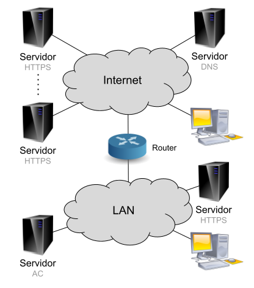
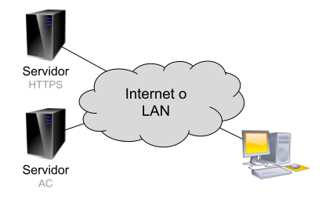
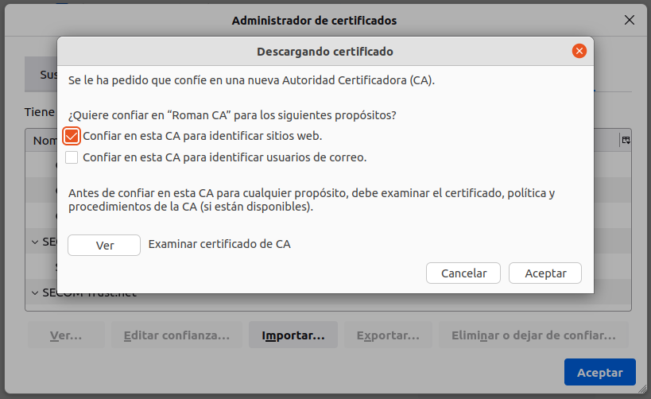
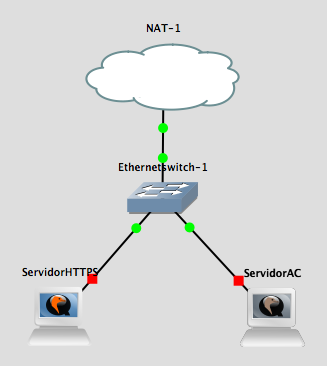

# Práctica 3.5: PKI - Gestión de Claves con Easy-RSA en Servidores Separados

!!! note "Datos y Objetivos de la Práctica"
    * **Módulo:** Seguridad y Alta Disponibilidad (SAD - 0378)
    * **Unidad Didáctica:** UD3 - Criptografía y Mecanismos de Certificación Digital
    * **Objetivos:**
        * Comprender la arquitectura y el funcionamiento de una Infraestructura de Clave Pública (PKI) propia en un entorno corporativo.
        * Desplegar y administrar una Autoridad de Certificación (AC / CA) independiente utilizando `easy-rsa` en un servidor dedicado.
        * Generar solicitudes de firma de certificados (CSR / `req`) en un servidor web Apache sin exponer sus claves privadas.
        * Firmar peticiones en la AC e instalar los certificados emitidos en el servidor web.
        * Instalar el certificado raíz de la AC en los clientes, configurar la resolución de nombres y verificar la navegación segura HTTPS sin alertas.

---

## 1. Introducción y Escenarios

### 1.1. Escenario Real

El siguiente esquema representa un posible escenario corporativo en el que una empresa dispone de diferentes servidores web y clientes alojados tanto en Internet como en su red de área local (LAN). Además, cuenta con un servidor DNS en Internet y un servidor con la Autoridad de Certificación (AC) de su PKI propia que, por estrictas razones de seguridad, se encuentra ubicado en las instalaciones internas de la empresa.



### 1.2. Escenario de Trabajo

Para poder trabajar en el laboratorio con un número menor de máquinas virtuales, utilizaremos el siguiente esquema simplificado:



Ambos servidores contarán con una distribución **Debian** y la herramienta de gestión de certificados de la PKI (`easy-rsa`). Además, uno de ellos prestará el servicio **HTTPS** mediante Apache. Como cliente puedes usar una máquina virtual o tu propio equipo anfitrión, teniendo en cuenta que deberás importar certificados en el navegador web y modificar, en su caso, el archivo local de resolución de nombres.

Podemos realizar la práctica de diversas formas:

* Virtualizar ambos servidores en **VirtualBox** o **VMware**.
* Desplegar ambos servidores en instancias EC2 de **Amazon Web Services (AWS)**.
* Virtualizar ambos servidores en **GNS3**.

Cada opción tiene sus ventajas e inconvenientes. Puedes elegir la que prefieras. En esta guía documentaremos el procedimiento utilizando **GNS3**.

---

## 2. Organización de las Tareas y Código de Máquinas

A continuación tienes los pasos necesarios para montar el escenario y realizar las pruebas de funcionamiento. Están divididos en las siguientes fases:

1. Instalación del servidor web
2. Creación de la autoridad de certificación
3. Instalación del certificado de la AC en el cliente
4. Generación del par de claves en el servidor web y de la petición de certificación
5. Creación de los certificados del servidor en la AC
6. Instalación de los certificados en el servidor web
7. Configuración de la resolución de nombres del cliente
8. Comprobación final del canal seguro HTTPS

!!! info "Identificación visual de las máquinas de trabajo"
    Para tener claro en todo momento en qué equipo debes ejecutar cada comando o configuración, utilizaremos el siguiente código de referencia:
    
    * 🟢 **Verde - Servidor Web (`ServidorHTTPS`):** Servidor donde se instala y configura Apache y el sitio SSL.
    * 🔵 **Azul - Servidor AC (`ServidorAC`):** Servidor dedicado que actúa como Autoridad de Certificación con `easy-rsa`.
    * 🟣 **Morado - Equipo Cliente:** Tu máquina real o máquina virtual desde la que se accede por navegador web.

!!! warning "Uso responsable de privilegios (Sin usuario `root` directo)"
    Recuerda que **no debes trabajar con el usuario `root`**, ni validándote directamente con su contraseña ni utilizando `sudo su`. Debes trabajar con tu usuario habitual utilizando el comando `sudo` únicamente cuando sea estrictamente necesario.

---

## 3. Despliegue del Escenario en GNS3

Para montar el escenario en GNS3 utilizaremos servidores Debian en formato *appliance*, ya que consumen muy pocos recursos y espacio en disco. Sigue estos pasos previos:

1. Crea un proyecto nuevo en GNS3 y nómbralo `practicaPKI`.
2. Descarga desde el GNS3 Marketplace la *appliance* [Debian para GNS3](https://gns3.com/marketplace/appliances/debian-2){:target="_blank"} en la última versión disponible e impórtala en GNS3. Deberías ver en el panel de *End Devices* el dispositivo `Debian 12.6` (o la versión descargada).
3. Construye la siguiente topología en el área de trabajo:



4. Arrastra dos instancias del *device* Debian al área de trabajo. Renombra una como **`ServidorHTTPS`** y la otra como **`ServidorAC`**. Conéctalas al conmutador Ethernet y este a la interfaz `NAT-1`.

---

## 4. Fase 1: Instalación y Puesta en Marcha del Servidor Web

> 🟢 **Máquina:** Servidor Web (`ServidorHTTPS`)

### 4.1. Configuración de Red del Servidor

Abre la consola para acceder a `ServidorHTTPS`. Por defecto, esta *appliance* tiene la interfaz de red deshabilitada. Compruébalo ejecutando:

```bash
ip link
ip address
```

Verás que la interfaz `ens4` no tiene dirección IP asignada. Actívala editando el archivo de interfaces:

```bash
sudo nano /etc/network/interfaces
```

Descomenta la configuración DHCP para `ens4` de modo que quede así:

```text
#DHCP config for ens4 
auto ens4 
iface ens4 inet dhcp 
```

Añade un servidor DNS editando `/etc/resolv.conf`:

```bash
sudo nano /etc/resolv.conf
```

Añade la siguiente directiva (puedes indicar el DNS de Google o el que utilice tu host):

```text
nameserver 8.8.8.8
```

Guarda los cambios y reinicia el servicio de red:

```bash
sudo systemctl restart networking.service
```

Vuelve a comprobar que la interfaz ha obtenido IP:

```bash
ip address
```

**Verificaciones de conectividad:**

* Lanza un `ping` desde una terminal de tu host hacia la IP obtenida por `ServidorHTTPS` para confirmar que hay conectividad local.
* Lanza un `ping` desde `ServidorHTTPS` a `google.com` para verificar que la resolución DNS y la salida a Internet funcionan correctamente.

---

### 4.2. Instalación de Apache y Habilitación de SSL

Sigue estas indicaciones para instalar el servidor web Apache en `ServidorHTTPS`:

1. Accede con un usuario con privilegios administrativos (por defecto `debian`/`debian`). Actualiza la lista de paquetes disponibles en los repositorios:
   ```bash
   sudo apt-get update
   ```
   *(Opcionalmente puedes ejecutar `sudo apt-get upgrade`, aunque puede tomar unos minutos).*
2. Averigua el paquete correspondiente a Apache e instálalo (no es necesario instalar la pila LAMP completa):
   ```bash
   sudo apt-get install apache2 -y
   ```
   *(Si estás trabajando en AWS EC2, asegúrate de que el Security Group permite tráfico entrante en los puertos 80 HTTP y 443 HTTPS).*
3. Realiza una prueba de conexión desde el navegador del cliente hacia la IP del servidor web. En este punto solo responderá por HTTP.
4. **Habilitar el módulo SSL:** Apache funciona mediante módulos modulares. Habilita el módulo SSL ejecutando:
   ```bash
   sudo a2enmod ssl
   ```
   Salida esperada:
   ```text
   admin01@srv:~$ sudo a2enmod ssl
   [sudo] password for admin01: 
   Considering dependency setenvif for ssl:
   Module setenvif already enabled
   Considering dependency mime for ssl:
   Module mime already enabled
   Considering dependency socache_shmcb for ssl:
   Enabling module socache_shmcb.
   Enabling module ssl.
   See /usr/share/doc/apache2/README.Debian.gz on how to configure SSL and create self-signed certificates.
   To activate the new configuration, you need to run:
     systemctl restart apache2
   ```

5. **Habilitar el sitio SSL por defecto:** Un mismo servidor web puede alojar varios sitios virtuales (*VirtualHosts*). En `/etc/apache2/sites-available` se encuentran las plantillas disponibles: `000-default.conf` (HTTP) y `default-ssl.conf` (HTTPS). En `/etc/apache2/sites-enabled` se crean enlaces simbólicos a los sitios activos.
   
   Comprueba que aún no está activo con:
   ```bash
   ls -la /etc/apache2/sites-enabled
   ```
   Habilita el sitio SSL predefinido:
   ```bash
   sudo a2ensite default-ssl.conf
   ```
   Salida esperada:
   ```text
   admin01@srv:~$ sudo a2ensite default-ssl.conf
   Enabling site default-ssl.
   To activate the new configuration, you need to run:
     systemctl reload apache2
   ```

6. Reinicia el servicio para aplicar los cambios:
   ```bash
   sudo systemctl restart apache2.service
   ```

7. Verifica que el sitio y el módulo SSL están correctamente habilitados:
   ```bash
   sudo a2query -s
   sudo a2query -m | grep ssl
   ```
   Salida esperada:
   ```text
   admin01@srv:~$ sudo a2query -s
   default-ssl (enabled by site administrator)
   000-default (enabled by site administrator)
   admin01@srv:~$ sudo a2query -m | grep ssl
   ssl (enabled by site administrator)
   ```

8. **Prueba de advertencia inicial:** Realiza una nueva prueba desde el navegador del cliente abriendo una ventana privada hacia `https://IP_servidor/`. Con HTTP navegarás sin problemas, pero con HTTPS recibirás una advertencia de seguridad. **No continúes con la excepción:** como Apache viene configurado con un certificado autofirmado temporal (*snakeoil*), el navegador rechaza la conexión porque la CA emisora no está en su almacén de confianza.

---

## 5. Fase 2: Creación de la Autoridad de Certificación (AC)

> 🔵 **Máquina:** Servidor AC (`ServidorAC`)

Ahora instalaremos el software `easy-rsa` en el segundo servidor para crear la Autoridad de Certificación (AC / CA) de la organización:

1. Si utilizas GNS3 y no lo hiciste antes, arrastra el segundo Debian a la zona de trabajo, asígnale el nombre `ServidorAC` y configura su red.
2. Inicia sesión como administrador e instala la aplicación `easy-rsa`:
   ```bash
   sudo apt-get update && sudo apt-get upgrade -y
   sudo apt-get install easy-rsa -y
   ```
3. **Crear usuario gestor de la AC:** Por seguridad, no gestionaremos la CA con `root` ni con el usuario administrador genérico. Crea un usuario normal sin privilegios (en los ejemplos se utiliza `autoridad`, pero **debes llamarlo con tu propio nombre**):
   ```bash
   sudo adduser --gecos "" autoridad
   ```
4. Cierra la sesión administrativa e inicia sesión en el servidor con el nuevo usuario que acabas de crear (`autoridad`).
5. **Inicializar la PKI de la AC:** Crea la estructura de directorios de la PKI que se encargará de gestionar la Autoridad de Certificación:
   ```bash
   /usr/share/easy-rsa/easyrsa init-pki
   ```
   Salida esperada:
   ```text
   autoridad@srv:~$ /usr/share/easy-rsa/easyrsa init-pki
   init-pki complete; you may now create a CA or requests.
   Your newly created PKI dir is: /home/autoridad/pki
   ```
6. **Generar la Autoridad Certificadora (Root CA):** Durante este paso se creará la clave privada de la CA (que deberás blindar con una contraseña segura) y su certificado público raíz (`ca.crt`).
   ```bash
   /usr/share/easy-rsa/easyrsa build-ca
   ```
   Introduce una contraseña para la clave de la CA y, cuando el asistente solicite el **Common Name**, introduce tu nombre seguido de `CA` (por ejemplo, `Roman CA` o `TuNombre CA`):
   ```text
   autoridad@srv:~$ /usr/share/easy-rsa/easyrsa build-ca
   Using SSL: openssl OpenSSL 3.0.2 15 Mar 2022 (Library: OpenSSL 3.0.2 15 Mar 2022)
   Enter New CA Key Passphrase: 
   Re-Enter New CA Key Passphrase: 
   You are about to be asked to enter information that will be incorporated
   into your certificate request.
   What you are about to enter is what is called a Distinguished Name or a DN.
   There are quite a few fields but you can leave some blank
   For some fields there will be a default value,
   If you enter '.', the field will be left blank.
   -----
   Common Name (eg: your user, host, or server name) [Easy-RSA CA]:Roman CA

   CA creation complete and you may now import and sign cert requests.
   Your new CA certificate file for publishing is at:
   /home/autoridad/pki/ca.crt
   ```

El certificado público de tu autoridad queda listo en `/home/autoridad/pki/ca.crt`.

---

## 6. Fase 3: Instalación del Certificado de la AC en el Cliente

> 🟣 **Máquina:** Equipo Cliente

Para que los clientes reconozcan como legítimos los certificados que emita tu AC, deben tener instalado el certificado público de la misma (`ca.crt`) en su almacén de autoridades de confianza.

1. **Descargar el certificado:** Copia el archivo `ca.crt` desde `ServidorAC` a tu máquina cliente utilizando el método que prefieras (por ejemplo, mediante `scp`):
   ```bash
   scp autoridad@IP_ServidorAC:/home/autoridad/pki/ca.crt .
   ```

2. **Opción A: Importación en Mozilla Firefox:**
   * Abre Firefox y accede a: **Menú principal > Ajustes > Privacidad & Seguridad > Certificados > Ver certificados…**
   * Selecciona la pestaña **Autoridades** y haz clic en **Importar…**
   * Selecciona el archivo `ca.crt` descargado.
   * Marca la casilla: **"Confiar en esta CA para identificar sitios web"** y pulsa **Aceptar**.

   

3. **Opción B: Importación en Google Chrome:**
   * Abre Chrome y accede a: **Ajustes > Privacidad y seguridad > Seguridad > Administrar certificados**.
   * En la sección **Personalizado > Instalados por ti > Certificados de confianza**, importa el archivo `ca.crt`.

*(Nota: Si trabajas en un equipo donde no tienes permisos de administrador a nivel de sistema operativo, la configuración en Chrome resulta especialmente útil).*

---

## 7. Fase 4: Generación de Claves y Solicitud (CSR) en el Servidor Web

> 🟢 **Máquina:** Servidor Web (`ServidorHTTPS`)

Del par de claves asimétricas de un servidor, la clave pública es la que debe ser firmada por la AC para generar el certificado. Existen dos modelos para realizar este procedimiento:

1. **Generación centralizada en la AC:** La AC genera el par de claves, emite el certificado y envía la clave privada y el certificado al administrador web. *(Inconveniente: la AC conoce la clave privada).*
2. **Generación en el propio servidor (Recomendado):** El servidor genera su propio par de claves y remite a la AC únicamente una **Petición de Certificado** (*Certificate Signing Request* - CSR / `.req`) con su clave pública. La AC firma la petición sin conocer jamás la clave privada del servidor.

En esta práctica utilizaremos el **segundo método**.

1. Conéctate a `ServidorHTTPS` con el usuario administrador.
2. Instala el paquete `easy-rsa` en el servidor web:
   ```bash
   sudo apt-get install easy-rsa -y
   ```
3. Inicializa una PKI local para gestionar las claves del servicio web:
   ```bash
   /usr/share/easy-rsa/easyrsa init-pki
   ```
   *(Observa que esta PKI se crea en `/home/admin01/pki`, de forma totalmente independiente a la del servidor de la AC).*
   
   Salida esperada:
   ```text
   admin01@srv:~$ /usr/share/easy-rsa/easyrsa init-pki
   init-pki complete; you may now create a CA or requests.
   Your newly created PKI dir is: /home/admin01/pki
   ```

4. **Generar la clave privada y la petición de certificado (CSR):**
   ```bash
   /usr/share/easy-rsa/easyrsa gen-req srv nopass
   ```
   
   !!! important "Parámetros críticos"
       * El parámetro `nopass` es fundamental para que la clave privada no tenga contraseña, permitiendo que el servicio Apache arranque automáticamente sin requerir intervención manual en cada reinicio.
       * Cuando el asistente solicite el **Common Name**, introduce el nombre del servidor (`srv`) o el nombre FQDN público si trabajas en AWS EC2.

   Salida esperada:
   ```text
   admin01@srv:~$ /usr/share/easy-rsa/easyrsa gen-req srv nopass
   Using SSL: openssl OpenSSL 3.0.2 15 Mar 2022 (Library: OpenSSL 3.0.2 15 Mar 2022)
   .+....+...........+.......+..+.+..+.+..............+++++++++++++++++++++++++++++++++++++++++++++++++++++++++++++++++*.+++++++++++++++++++++++++++++++++++++++++++++++++++++++++++++++++*......+...................+........+.......+.....+......
   [...]
   Common Name (eg: your user, host, or server name) [srv]:
   Keypair and certificate request completed. Your files are:
   req: /home/admin01/pki/reqs/srv.req
   key: /home/admin01/pki/private/srv.key
   ```

5. **Transferir la petición a la AC:** Envía el archivo `srv.req` al servidor de la AC mediante `scp`:
   ```bash
   scp /home/admin01/pki/reqs/srv.req autoridad@IP_ServidorAC:/home/autoridad/
   ```
   *(Recuerda: únicamente se transfiere la petición `.req`, la clave privada `.key` debe permanecer celosamente custodiada en el servidor web).*

---

## 8. Fase 5: Firma del Certificado en la AC

> 🔵 **Máquina:** Servidor AC (`ServidorAC`)

Una vez que la AC dispone de la petición con la clave pública del servidor web, debe importarla en su base de datos y firmarla:

1. Inicia sesión en `ServidorAC` con el usuario gestor (`autoridad`).
2. **Importar la petición de certificación:**
   ```bash
   /usr/share/easy-rsa/easyrsa import-req srv.req srv
   ```
   Salida esperada:
   ```text
   autoridad@srv:~$ /usr/share/easy-rsa/easyrsa import-req srv.req srv
   Using SSL: openssl OpenSSL 3.0.2 15 Mar 2022 (Library: OpenSSL 3.0.2 15 Mar 2022)
   The request has been successfully imported with a short name of: srv
   You may now use this name to perform signing operations on this request.
   ```

3. **Firmar la petición como certificado de tipo servidor:** Indicamos a `easy-rsa` que incluya las extensiones de servidor web:
   ```bash
   /usr/share/easy-rsa/easyrsa sign-req server srv
   ```
   *(El asistente te pedirá confirmación tecleando `yes` y la contraseña de la clave privada de la CA que creaste en la Fase 2).*
   
   Salida esperada:
   ```text
   autoridad@srv:~$ /usr/share/easy-rsa/easyrsa sign-req server srv
   [...]
   Certificate created at: /home/autoridad/pki/issued/srv.crt
   ```

4. **Enviar el certificado emitido al servidor web:**
   ```bash
   scp /home/autoridad/pki/issued/srv.crt admin01@IP_ServidorHTTPS:/home/admin01/
   ```

---

## 9. Fase 6: Instalación del Certificado en Apache

> 🟢 **Máquina:** Servidor Web (`ServidorHTTPS`)

Configuraremos Apache para que utilice su nueva clave privada y el certificado digital firmado por nuestra propia AC corporativa:

1. Inicia sesión en `ServidorHTTPS` con el usuario administrador.
2. Copia la clave privada generada localmente al directorio seguro del sistema:
   ```bash
   sudo cp /home/admin01/pki/private/srv.key /etc/ssl/private/
   ```
3. Copia el certificado emitido por la AC al almacén de certificados:
   ```bash
   sudo cp /home/admin01/srv.crt /etc/ssl/certs/
   ```
4. **Editar la configuración del sitio SSL en Apache:**
   ```bash
   sudo nano /etc/apache2/sites-available/default-ssl.conf
   ```
   Localiza las directivas `SSLCertificateFile` y `SSLCertificateKeyFile` y actualízalas con las nuevas rutas:
   ```apache
   # Descomenta o actualiza con las rutas de tus nuevos ficheros:
   SSLCertificateFile      /etc/ssl/certs/srv.crt
   SSLCertificateKeyFile   /etc/ssl/private/srv.key
   ```
5. Guarda los cambios y recarga el servidor web:
   ```bash
   sudo systemctl reload apache2.service
   ```
6. Comprueba que el servicio está activo y sin errores de sintaxis:
   ```bash
   sudo systemctl status apache2.service
   ```
   *(Pulsa la tecla `q` para salir del visor de estado si es necesario).*

---

## 10. Fase 7: Resolución de Nombres en el Cliente

> 🟣 **Máquina:** Equipo Cliente

Los certificados SSL/TLS van vinculados estrictamente al nombre de dominio o Common Name (`srv`). Si accedes por dirección IP numérica, el navegador emitirá una advertencia por discrepancia de nombre. Debes asegurar que el cliente resuelva el nombre `srv`:

* **Situación A:** Si trabajas con un FQDN público en AWS EC2, la resolución DNS pública ya funciona automáticamente.
* **Situación B:** Si trabajas en una red corporativa con servidor DNS integrado.
* **Situación C (Escenario de Laboratorio habitual):** Modificación del archivo local de resolución de nombres `hosts`.

### Configuración en el archivo `hosts`:

Edita el archivo con permisos de administración:

* En **Linux / macOS:** `/etc/hosts` (`sudo nano /etc/hosts`)
* En **Windows:** `C:\Windows\System32\drivers\etc\hosts` (abrir Notepad como Administrador)

Añade una línea que relacione la IP de tu servidor web con el nombre `srv`:

```text
# [...]
127.0.0.1        localhost
127.0.1.1        cliente
IP_servidor_web  srv
```

!!! tip "Alternativa sin permisos de administración (Google Chrome)"
    Si estás en un equipo donde no tienes permisos para editar `/etc/hosts`, puedes forzar a Google Chrome a resolver el nombre mediante una regla por línea de comandos:
    
    1. Cierra todas las ventanas abiertas de Google Chrome.
    2. Ejecútalo desde una terminal indicando la regla de resolución:
       ```bash
       google-chrome --host-resolver-rules="MAP srv IP_servidor_web"
       # Ejemplo:
       google-chrome --host-resolver-rules="MAP srv 192.168.1.32"
       ```
    Esta instancia aplicará la resolución de forma temporal sin tocar la configuración del sistema.

---

## 11. Fase 8: Comprobación Final del Canal Seguro HTTPS

> 🟣 **Máquina:** Equipo Cliente

Llegó el momento de comprobar el resultado:

1. Abre el navegador web del cliente donde importaste el certificado de la CA.
2. Accede al servidor web mediante HTTPS utilizando su nombre:
   ```text
   https://srv/
   ```
3. Observa que la conexión se establece con el **candado de seguridad cerrado** y sin ninguna advertencia de certificado no confiable.
4. Pulsa sobre el candado y consulta los detalles del certificado: podrás comprobar que el certificado ha sido emitido para `srv` por tu propia Autoridad de Certificación (`TuNombre CA`), validando con éxito toda la cadena de confianza corporativa.


