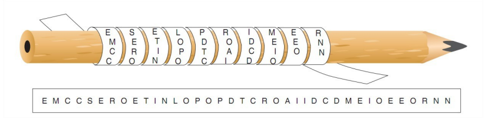
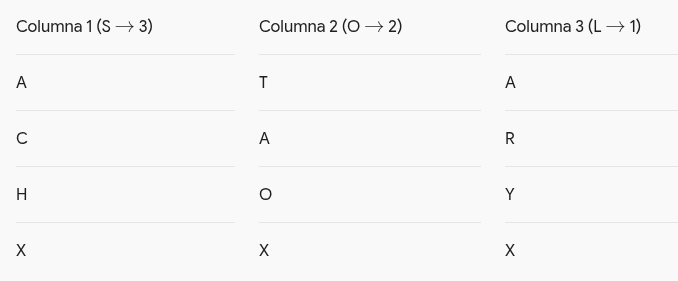
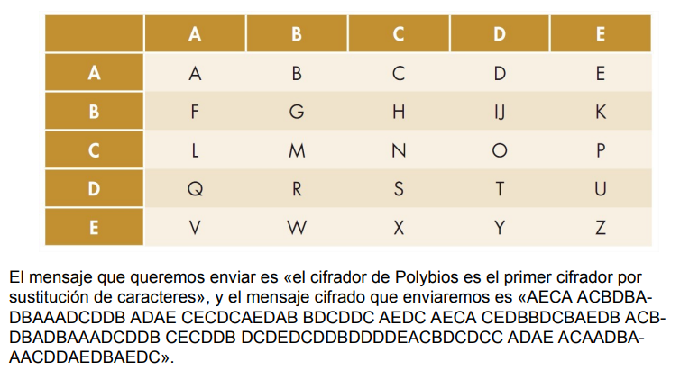
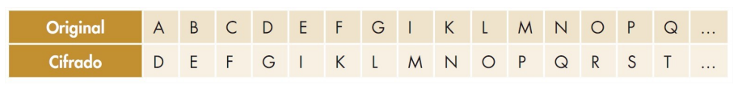
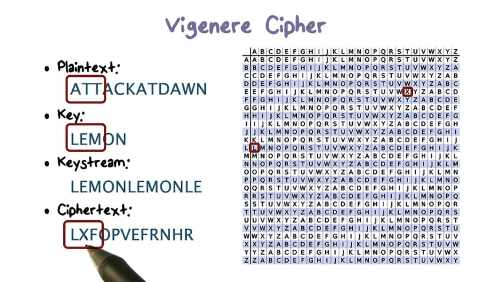
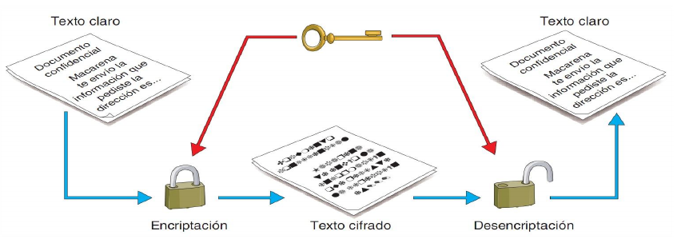
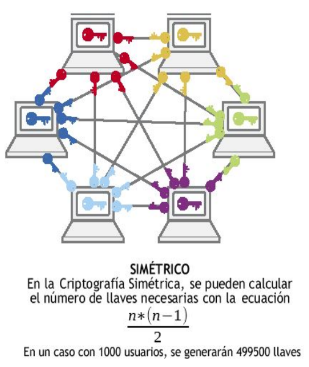
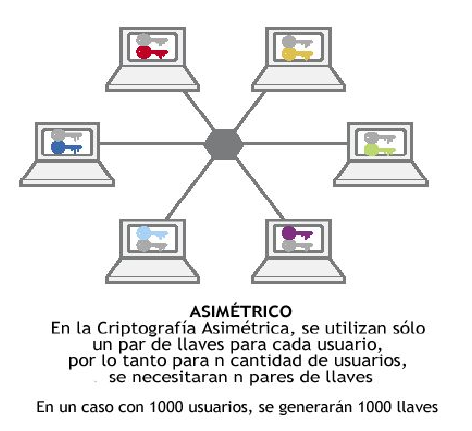

# UD3. Criptografía y Mecanismos de Certificación Digital

!!! note "Objetivos de la Unidad (Duración: 8 Horas)"
    * Aplicar técnicas criptográficas en el almacenamiento y la transmisión de la información para garantizar la seguridad de los datos (CE 1.g).
    * Proteger la privacidad, autenticidad y confidencialidad mediante el uso de certificados digitales y correo seguro (CE 2.f).
    * Comprender y diferenciar los métodos criptográficos clásicos y modernos (simétricos, asimétricos e híbridos).
    * Analizar las propiedades matemáticas y aplicaciones prácticas de las funciones hash (resumen digital).
    * Dominar el mecanismo técnico de la firma digital y el funcionamiento de una Infraestructura de Clave Pública (PKI) bajo el estándar X.509.
    * Conocer la arquitectura criptográfica del DNI electrónico (DNIe) y los protocolos seguros SSL/TLS/HTTPS.

---

## 3.1. Introducción y Fundamentos de Criptografía

### 3.1.1. ¿Por qué cifrar en la Sociedad de la Información?
Desde la antigüedad, la humanidad ha tenido la necesidad de proteger el intercambio de mensajes confidenciales. En la era digital actual, este requerimiento se vuelve crítico debido a la exposición masiva de los datos en canales de comunicación no seguros (redes Wi-Fi abiertas, correo electrónico, voz sobre IP, redes móviles) y el uso constante de dispositivos de almacenamiento portátiles (pendrives, discos externos, teléfonos inteligentes) propensos a pérdidas o robos.

### 3.1.2. Criptografía Clásica: Historia y Clasificación
El término **criptografía** proviene del griego *kryptós* (oculto) y *graphía* (escritura): la ciencia que estudia la transformación de un texto claro en un texto cifrado ininteligible para terceros no autorizados.

Históricamente, los métodos de cifrado clásico se dividen en dos grandes familias:

1. **Sistemas de Transposición:** Consisten en descolocar o reordenar los caracteres del mensaje sin alterar las letras originales.
    * **La Escítala Espartana (Siglo V a.C.):** Primer método criptográfico documentado. Consistía en enrollar una cinta de cuero sobre un bastón de madera con un diámetro específico. Al escribir a lo largo del bastón y desenrollar la cinta, las letras quedaban desordenadas de forma aleatoria, siendo únicamente legible al enrollarla en una vara del mismo diámetro exacto.
    
      Como podemos ver en la imagen, el mensaje es «es el primer método de encriptación conocido», pero en la cinta lo que se podría leer es «EMCCSEROETINLOPOPDTCROAIIDCDMEIOEEORNN»
    * **Transposición simple y múltiple:** Métodos matriciales donde el texto se escribe en filas y se lee en columnas según una clave acordada.
        Ejemplo:

        Mensaje: ATACAR HOY

        Clave: SOL

        Se distribuyen las 8 letras del mensaje A-T-A-C-A-R-H-O-Y horizontalmente. La última fila queda con 2 letras, así que se añade una X para cerrar el bloque:

        

        Se leen las columnas de arriba abajo según la prioridad numérica de la clave. Primero la columna cuya letra en la clave es anterior alfabéticamente, en este caso la L. Luego la siguiente, que sería la O y finalmente la última, la S:

           * Columna 1 (letra L): A R Y X

           * Columna 2 (letra O): T A O X

           * Columna 3 (letra S): A C H X

        Criptograma final: ARYX TAOX ACHX (o agrupado: ARYXTAOXACHX).

        En la transposición múltiple se aplica una nueva transposición al mensaje encriptado del paso anterior con una nueva clave


2. **Sistemas de Sustitución:** Consisten en reemplazar unos caracteres o símbolos del alfabeto original por otros según una regla predefinida.
    * **Tablero de Polibio (Siglo II a.C.):** Sustitución por pares de letras o números que representan las coordenadas (fila y columna) de una matriz de 5x5 donde se ubica cada letra del alfabeto.
    
    * **Cifrador del César (Siglo I a.C.):** Sustitución monoalfabética utilizada por Julio César. Consiste en desplazar cada letra del alfabeto un número fijo *n* de posiciones hacia la derecha (en el ejemplo **n=3**).
       
        
        Mensaje del César a Cleopatra: «sic amote ut sin ete iam viverem non posit» (de tal manera te amo que sin ti no podría vivir).
        
        Para traducir el mensaje necesitamos los dos alfabetos el claro y el cifrado, que son los dos alfabetos latinos del cifrador del César.
        
        Si nos fijamos en el alfabeto cifrado el mensaje oculto debe corresponderse con el siguiente: VMF DPRXI YX VMQ IXI MDP ZMZIUIP QRQ SRVMX

    * **Cifrador de Alberti (Siglo XV) y Vigenère (Siglo XVI):** Sustitución polialfabética. León Battista Alberti propuso alternar entre varios alfabetos, pero fue Blaise de Vigenère quien XVI desarrolle la idea de Alberti. 
    
        El cifrador de Vigenère utiliza veintiséis alfabetos cifrados, obteniéndose cada uno de ellos comenzando con la siguiente letra del anterior, es decir, el primer alfabeto cifrado se corresponde con el cifrador del César con un cambio de una posición, de la misma manera para el segundo alfabeto, cifrado con el cifrador del César de dos posiciones. 
      
        Para cifrar hace falta una palabra clave que se va repitiendo hasta llegar a la longitud del mensaje a cifrar. Cada letra del mensaje original nos da la columna y cada letra de la clave la fila, que nos perminten obtener la letra en el mensaje cifrado.
      
        


!!! info "Esteganografía: El arte del ocultamiento"
    A diferencia de la criptografía (que hace ininteligible el mensaje pero no oculta su existencia), la **esteganografía** busca ocultar la presencia del propio mensaje dentro de un archivo portador de apariencia inofensiva (como una imagen PNG, un archivo de audio WAV o un archivo ejecutable).
    
    *Una herramienta clásica de línea de comandos en GNU/Linux para realizar ejercicios de esteganografía es `steghide`.*

### 3.1.3. Criptoanálisis de los Cifrados Clásicos
El **criptoanálisis** es la disciplina que estudia las técnicas para romper o descifrar códigos sin conocer la clave legítima:

* **Ataques de Fuerza Bruta:** Probar sistemáticamente todas las claves posibles. El cifrador del César solo posee 25 claves posibles en el alfabeto latino, por lo que es trivialmente roturable por fuerza bruta en segundos.

* **Análisis de Frecuencias:** En los cifrados por sustitución monoalfabética, la frecuencia de aparición de cada letra se mantiene. En español, las letras 'E', 'A' y 'O' son las más comunes; al analizar las frecuencias del texto cifrado, se puede deducir la correspondencia con las letras claras.

* **Método Kasiski:** Permite romper la criptografía polialfabética de Vigenère identificando repeticiones de patrones en el texto cifrado para deducir la longitud de la clave utilizada.

### 3.1.4. El Principio de Kerckhoffs
En el siglo XIX, Auguste Kerckhoffs estableció un axioma fundamental que rige toda la ciberseguridad moderna:

!!! quote "Principio de Kerckhoffs"
    "La seguridad de un sistema de cifrado debe recaer exclusivamente en el secreto de la **clave**, y no en el secreto del **algoritmo**."

Es decir, aunque el algoritmo criptográfico sea de dominio público y su código sea analizado por toda la comunidad internacional (código abierto), un atacante no debe ser capaz de descifrar el mensaje si desconoce la clave secreta utilizada.

### 3.1.5. Servicios de Seguridad
La criptografía moderna sirve para garantizar cuatro servicios fundamentales de la información:

* **Confidencialidad:** Garantizar que los datos solo sean legibles por receptores autorizados.
* **Integridad:** Garantizar que los datos no hayan sido alterados o manipulados en tránsito.
* **Autenticidad:** Confirmar la identidad legítima del emisor del mensaje.
* **No Repudio:** Impedir que el emisor de una comunicación o transacción pueda negar su autoría.

---

## 3.2. Criptografía Simétrica (Clave Secreta)

### 3.2.1. Concepto y Funcionamiento
La **criptografía simétrica** (o de clave privada/secreta) se basa en el uso de **una única clave compartida** tanto para el proceso de cifrado como para el de descifrado. Tanto el emisor como el receptor deben ponerse de acuerdo de forma previa sobre qué clave utilizarán.



Un ejemplo histórico de cifrado electromecánico simétrico fue la máquina **Enigma** utilizada durante la Segunda Guerra Mundial, cuyo código fue roto por el equipo de matemáticos de Alan Turing en Bletchley Park.

### 3.2.2. Clasificación de Algoritmos Simétricos
Atendiendo a la forma en que se procesan los datos en memoria, los algoritmos simétricos se clasifican en:

1. **Algoritmos de Bloque:** Dividen la información de entrada en bloques de tamaño fijo (por ejemplo, 64 o 128 bits) y cifran cada bloque de manera independiente antes de ensamblar el resultado. * *Ejemplos:* 
  
      * **DES** (Data Encryption Standard, 56 bits - obsoleto)
      * **3DES** (Triple DES - obsoleto) y 
      * **AES** (Advanced Encryption Standard / Rijndael, con tamaños de clave de 128, 192 o 256 bits, estándar global actual).

2. **Algoritmos de Flujo:** Cifran la información de forma continua, bit a bit o byte a byte, conforme se van generando o transmitiendo los datos. Son ideales para transmisiones de voz o vídeo en tiempo real. *Ejemplos:*
   
      * **RC4** (utilizado históricamente en WEP/WPA, hoy desaconsejado) y 
      * **ChaCha20** (muy rápido en dispositivos móviles).

### 3.2.3. Desventajas y Limitaciones de la Criptografía Simétrica
Aunque los algoritmos simétricos modernos como AES son extremadamente rápidos y eficientes en términos de rendimiento computacional, presentan dos inconvenientes críticos:

1. **El Problema del Intercambio Inicial de Claves:** ¿Cómo se transmite de forma segura la clave compartida por primera vez a través de una red insegura como Internet para que el receptor pueda descifrar el mensaje?
2. **Escalabilidad y Gestión de Claves:** El número de claves necesarias para que *N* usuarios puedan comunicarse de forma segura de manera individualizada crece de forma exponencial según la fórmula:
   
   *Para una red de solo 1.000 usuarios, se requeriría generar y almacenar de forma segura **499.500 claves simétricas diferentes**.*

### 3.2.4. Práctica de criptografía simétrica

!!! info "Ahora que conoces la teoría es el momento de practicar."
    **[Práctica 3.1: Cifrado Simétrico con GnuPG (GPG)](P01.md)**
    
       *En esta práctica utilizarás la herramienta GNU Privacy Guard (`gpg`) desde la línea de comandos en GNU/Linux para cifrar y   descifrar archivos de texto utilizando algoritmos simétricos robustos (como AES256) mediante claves secretas compartidas.*

---

## 3.3. Criptografía Asimétrica (Clave Pública)

### 3.3.1. Concepto y Par de Claves
A mediados de la década de 1970 (con las investigaciones de Diffie, Hellman, Rivest, Shamir y Adleman), surgió la **criptografía asimétrica** o de clave pública para resolver las debilidades del cifrado simétrico.

En un sistema asimétrico, cada participante dispone de **un par de claves matemáticamente enlazadas**:

* **Clave Pública (.pub):** Es de libre acceso y se distribuye abiertamente a cualquier usuario o servidor con el que queramos comunicarnos.
* **Clave Privada (.priv):** Es secreta y debe ser custodiada bajo el control exclusivo de su propietario. Nunca debe transmitirse ni revelarse a nadie.


### 3.3.2. Funciones Unidireccionales con Trampa
Las claves se generan simultáneamente utilizando propiedades matemáticas de **funciones de un solo sentido con trampa** (*trapdoor one-way functions*): es computacionalmente fácil calcular la clave pública a partir de los datos iniciales, pero resulta **computacionalmente imposible** calcular la clave privada a partir de la clave pública conocida.

Por "computacionalmente imposible" se entiende que, con la potencia de cálculo actual, un ataque de fuerza bruta tardaría décadas o siglos en despejar la clave.

### 3.3.3. Ventajas y Algoritmos Asimétricos Principales

* **Ventajas Principales:**
    1. *Resuelve el intercambio de claves:* Ya no es necesario enviar secretos por canales inseguros; basta con publicar la clave pública.
    2. *Alta Escalabilidad:* Para *N* usuarios, solo se requieren *N* pares de claves (*2N* claves en total en todo el sistema).

    

* **Algoritmos Asimétricos Destacados:**
    * **RSA:** Basado en la dificultad matemática de factorizar el producto de dos números primos muy grandes. Es el estándar más extendido.
    * **ElGamal:** Basado en la complejidad del problema del logaritmo discreto.
    * **ECC (Criptografía de Curva Elíptica):** Ofrece el mismo nivel de seguridad que RSA utilizando claves significativamente más cortas, reduciendo la carga de procesamiento y consumo de batería en dispositivos IoT y móviles.

### 3.3.4. Desventajas de la Criptografía Asimétrica

Las principales desventajas de la criptografía asimétrica son:

* **Lentitud Computacional:** Los algoritmos de clave pública son entre 100 y 1.000 veces más lentos que los simétricos debido a la complejidad de las operaciones matemáticas con números gigantescos.
* **Mayor Tamaño de Datos:** El texto cifrado resulta sensiblemente mayor que el texto original en claro.

### 3.3.5. Práctica de criptografía asimétrica y gestión de cables con GPG


!!! info "Ahora que conoces la teoría es el momento de practicar."
    **[Práctica 3.2: Criptografía Asimétrica y Gestión de Claves con GPG](P02.md)**
    
       *En esta práctica generarás tu propio par de claves asimétricas (K_pub y K_priv) utilizando GnuPG, importarás la clave pública de otras personas y cifrarás un documento para garantizar que solo el receptor legítimo pueda descifrarlo con su clave privada.*


---

## 3.4. Criptografía Híbrida

### 3.4.1. La Solución Combinada
Dado que el cifrado simétrico es muy rápido pero inseguro al compartir claves, y el asimétrico es muy seguro pero excesivamente lento, la criptografía moderna utiliza en la práctica un enfoque combinado denominado **Criptografía Híbrida**.

La criptografía híbrida utiliza la **criptografía asimétrica** únicamente para intercambiar de forma segura una clave aleatoria temporal, y la **criptografía simétrica** para cifrar el volumen real del documento o la sesión de red.

### 3.4.2. Mecánica de una Comunicación Híbrida Paso a Paso
Imaginemos que el Emisor quiere enviar un archivo voluminoso al Receptor:

1. **Generación de Clave de Sesión:** El Emisor genera automáticamente una clave simétrica aleatoria eímera (llamada **clave de sesión**, ej. AES-256).
2. **Cifrado del Mensaje (Simétrico):** El Emisor cifra el archivo de datos utilizando la clave de sesión simétrica (operación muy rápida).
3. **Cifrado de la Clave de Sesión (Asimétrico):** El Emisor obtiene la clave pública del Receptor ($K_{pub\_Receptor}$) y cifra con ella únicamente la pequeña clave de sesión.
4. **Envío Conjunto:** El Emisor transmite al Receptor el archivo cifrado simétricamente junto con la clave de sesión cifrada asimétricamente.
5. **Descifrado por el Receptor:** El Receptor utiliza su clave privada ($K_{priv\_Receptor}$) para descifrar la clave de sesión y, con esta última, descifra instantáneamente el archivo completo.

```
                                    +-----------------------+
                                    | Clave de Sesión (AES) |
                                    +-----------------------+
                                        /                           (Cifra datos voluminosos)  /                 \ (Cifra solo la clave)
                                      v                   v
+------------------+         +---------------+   +-----------------------+
|  Archivo Datos   |  -----> | Archivo Cifr. |   | Clave Sesión Cifrada  |
+------------------+         +---------------+   | (con K_pub_Receptor)  |
                                                 +-----------------------+
```

Este sistema es la base del funcionamiento de protocolos seguros como **PGP/GPG, SSH y HTTPS/TLS**.

---

## 3.5. Funciones Hash o Resumen Digital

### 3.5.1. Concepto de Función Hash
Una **función hash** (o función de resumen) es un algoritmo matemático que transforma cualquier conjunto de datos de entrada (desde una sola palabra hasta una imagen ISO de varios Gigabytes) en una cadena alfanumérica de **longitud fija** que actúa a modo de *huella digital* única del contenido.

A diferencia de los cifrados simétricos y asimétricos, las funciones hash **no utilizan claves** y son **procesos estrictamente irreversibles** (unidireccionales).

### 3.5.2. Las 6 Propiedades Criptográficas Fundamentales (Píldora UPM)
Para que un algoritmo hash sea considerado criptográficamente seguro, debe cumplir obligatoriamente seis propiedades:

1. **Unidireccionalidad:** Dado un resumen $h(M)$, debe ser computacionalmente imposible calcular o recuperar el mensaje original $M$.
2. **Compresión:** Independientemente del tamaño de la entrada, la salida siempre tendrá exactamente el mismo número de bits (por ejemplo, SHA-256 siempre entrega 256 bits).
3. **Facilidad y Rapidez de Cálculo:** El cálculo de $h(M)$ a partir de $M$ debe ser ágil en tiempo de ejecución.
4. **Difusión de Bits o Efecto Avalancha:** Si se modifica tan solo un bit o carácter del mensaje original $M$, el nuevo hash resultante cambiará aproximadamente en el 50% de sus bits de forma impredecible.
5. **Resistencia Débil a Colisiones:** Conocido un mensaje $M$, es computacionalmente imposible encontrar otro mensaje distinto $M'$ tal que $h(M) = h(M')$.
6. **Resistencia Fuerte a Colisiones:** Es computacionalmente imposible encontrar un par aleatorio de mensajes distintos $(M, M')$ que produzcan el mismo resumen $h(M) = h(M')$ (evitando ataques basados en la *Paradoja del Cumpleaños*).

### 3.5.3. Evolución de los Algoritmos Hash
* **MD5 (128 bits) y SHA-1 (160 bits):** **Obsoletos**. Se han demostrado colisiones prácticas en laboratorio, por lo que están desaconsejados para su uso en ciberseguridad.
* **SHA-2 (SHA-256, SHA-512):** Estándar actual ampliamente utilizado en firmas digitales, certificados y cadenas de bloques (*blockchain*).
* **SHA-3:** Última familia estandarizada por el NIST con una estructura matemática completamente renovada (algoritmo Keccak).

### 3.5.4. Aplicaciones Principales de los Hashes
* **Verificación de Integridad:** Permite comprobar si una ISO descargada de Internet se ha transmitido sin corrupciones o si un archivo en disco ha sido modificado por malware.
* **Almacenamiento Seguro de Contraseñas:** Las contraseñas de usuarios en sistemas operativos (como `/etc/shadow` en Linux) nunca se guardan en texto claro. Se almacena el hash de la clave combinado con una cadena aleatoria (*salting*) utilizando funciones deliberadamente lentas (como **PBKDF2, bcrypt o Argon2**) para dificultar ataques por diccionario o fuerza bruta.
* **Optimización de la Firma Digital:** Permite firmar digitalmente documentos de cientos de Megabytes aplicando la cifra asimétrica únicamente sobre los pocos bits del resumen hash.

!!! note "Práctica"
    !!! info "Ahora que conoces la teoría es el momento de hacer las prácticas..."
        **Práctica Moodle: Funciones hash o resumen con QuickHash**
        
        *En esta práctica utilizarás la herramienta gráfica multiplataforma QuickHash GUI para calcular resúmenes SHA-256 y MD5 de archivos, verificar la integridad de descargas y comprobar de forma visual el efecto avalancha al modificar un solo carácter de un documento de texto.*

---

## 3.6. Firma Digital

### 3.6.1. Concepto y Servicios
La **firma digital** es un mecanismo criptográfico que equivale a la firma manuscrita tradicional en el ámbito electrónico. Su objetivo **no es proporcionar confidencialidad** (no oculta el documento), sino garantizar de forma simultánea tres servicios:
* **Autenticidad:** Prueba de forma inequívoca la identidad del emisor.
* **Integridad:** Confirma que el documento no ha sufrido ninguna modificación desde que fue firmado.
* **No Repudio en Origen:** El emisor no puede negar haber firmado el documento.

### 3.6.2. Mecánica de Generación de la Firma
Para firmar un documento digital, el emisor realiza el siguiente procedimiento:

1. Aplica una función hash (ej. SHA-256) sobre el documento original para obtener su resumen $h_1$.
2. Cifra el resumen $h_1$ utilizando su propia **clave privada** ($K_{priv\_Emisor}$). Este resumen cifrado constituye la **firma digital**.
3. Se envía el documento original en claro junto con la firma digital adjunta.

```
[ Documento ] ---> [ Hash ] ---> [ Cifrado con K_priv_Emisor ] ---> [ Firma Digital ]
```

### 3.6.3. Mecánica de Verificación por el Receptor
Cuando el receptor recibe el documento y la firma, realiza el siguiente proceso informático:

1. Descifra la firma digital utilizando la **clave pública del emisor** ($K_{pub\_Emisor}$), obteniendo el resumen hash original $h_1$.
2. Calcula de nuevo el resumen hash sobre el documento recibido utilizando la misma función hash, obteniendo $h_2$.
3. **Comparación:**
   * Si $h_1 == h_2$: La firma es **VÁLIDA** (el emisor posee la clave privada y el documento está intacto).
   * Si $h_1 
eq h_2$: La firma es **NULA** (el documento fue modificado o la clave no corresponde al emisor).

```
[ Documento Recibido ] -----------------------> [ Calculo Hash ] -------------> h2
                                                                                 |
[ Firma Recibida ] ---> [ Descifro con K_pub_Emisor ] ---> [ Hash Extraído ] -> h1
                                                                                 |
                                                       (Compara h1 == h2) <-----+
```

!!! note "Práctica"
    !!! info "Ahora que conoces la teoría es el momento de hacer las prácticas..."
        **Práctica Moodle: Firma digital**
        
        *En esta práctica utilizarás GnuPG / Kleopatra (o Gpg4win) para firmar digitalmente documentos de texto, verificar la autenticidad e integridad de ficheros firmados recibidos (como la verificación de la clave e identidad de Ramón Onrubia) e identificar los mensajes que hayan sido manipulados.*

---

## 3.7. Certificados Digitales y Estándar X.509

### 3.7.1. El Problema de la Confianza y el Ataque Man-in-the-Middle
La criptografía asimétrica y la firma digital funcionan si estamos 100% seguros de que la clave pública que utilizamos pertenece realmente a quien dice ser. Si un atacante suplanta la identidad de un servidor web bancario y nos entrega su propia clave pública, podrá interceptar y descifrar nuestras comunicaciones (ataque *Man-in-the-Middle* / MITM).

Para resolver el problema de la asignación de identidades entran en juego los **Certificados Digitales**.

### 3.7.2. ¿Qué es un Certificado Digital?
Un **certificado digital** es un documento electrónico emitido por un tercero de confianza (denominado **Autoridad de Certificación - CA**) que vincula de forma pública e inalterable la identidad de una persona, empresa o servidor web con su clave pública correspondiente.

Básicamente, un certificado digital contiene la clave pública del usuario **firmada digitalmente por la clave privada de la Autoridad de Certificación**.

### 3.7.3. El Estándar X.509 v3
El formato estándar más extendido a nivel mundial para la estructuración de certificados digitales es el **UIT-T X.509 v3**. Los campos fundamentales que almacena son:

* **Número de Versión:** Versión del estándar (X.509 v3).
* **Número de Serie:** Identificador único asignado por la CA emisora.
* **Algoritmo de Firma:** Algoritmo utilizado por la CA para firmar el certificado (ej. `sha256WithRSAEncryption`).
* **Emisor (Issuer):** Identificación de la Autoridad de Certificación que emite el certificado (ej. FNMT, ACCV, DigiCert).
* **Período de Validez:** Fechas de inicio (*Not Before*) y caducidad (*Not After*).
* **Sujeto (Subject):** Identificación del titular (persona, NIF, o dominio web como `www.mimodelo.es`).
* **Información de Clave Pública del Sujeto:** Algoritmo y valor de la clave pública del titular.
* **Firma Digital de la CA:** Firma generada por la CA con su clave privada sobre todos los campos anteriores.


### 3.7.4. Clasificación de Certificados Digitales
* **Por su Uso u Objetivo:**
  * *Certificados Personales / de Ciudadano:* Para identificación y firma de trámites administrativos (ej. FNMT).
  * *Certificados de Servidor (SSL/TLS):* Para cifrar el tráfico web HTTPS de sitios e-commerce o portales.
  * *Certificados de Código / Software:* Para firmar ejecutables y garantizar que no contienen malware.
* **Por el Nivel de Verificación de la CA:**
  * *Clase 1:* Verificación mínima (solo se comprueba la dirección de e-mail).
  * *Clase 2:* Verificación intermedia para personas físicas y servidores web.
  * *Clase 3:* Alta verificación presencial de la identidad y de la existencia jurídica de la organización.
* **Por el Soporte Físico:** Ficheros de software en disco (`.p12`, `.pfx`, `.crt`), tarjetas criptográficas inteligentes (*smartcards*) o tokens USB criptográficos.

---

## 3.8. Infraestructura de Clave Pública (PKI) y DNIe

### 3.8.1. Componentes de una PKI (*Public Key Infrastructure*)
Una **PKI** es el conjunto coordinado de hardware, software, políticas, personal y procedimientos legales necesarios para crear, gestionar, distribuir, evaluar, almacenar y revocar certificados digitales.

Los interlocutores y roles clave de una PKI son:

1. **Autoridad de Certificación (CA / AC):** Entidad de máxima confianza responsable de emitir, firmar y revocar los certificados digitales.
2. **Autoridad de Registro (RA / AR):** Encargada de verificar presencial o telemáticamente la identidad real de los solicitantes antes de autorizar a la CA la emisión del certificado.
3. **Autoridad de Validación (VA / AV):** Suministra información en tiempo real sobre la validez actual de un certificado a través de consultas **OCSP** (*Online Certificate Status Protocol*) o mediante la publicación de listas de revocación (**CRL** - *Certificate Revocation Lists*).
4. **Repositorios:** Directorios públicos donde se almacenan los certificados emitidos y las listas CRL.

### 3.8.2. Establecimiento de una Sesión Web Segura (HTTPS / TLS Handshake)
Cuando un navegador cliente conecta con un servidor web seguro, el protocolo PKI actúa según la siguiente secuencia:

1. El servidor envía su certificado X.509 (que contiene su clave pública $K_{pub\_Servidor}$) al navegador cliente.
2. El navegador comprueba la **cadena de confianza**: verifica que el certificado esté dentro de su período de validez, que no figure en las listas de revocación y que la firma de la CA emisora sea válida utilizando la clave pública de la CA que el navegador tiene preinstalada en su almacén de certificados raíz.
3. Una vez validado el certificado, se acuerda de forma híbrida la clave de sesión simétrica para cifrar todo el tráfico HTTPS.

### 3.8.3. Estudio de Caso: El DNI Electrónico (DNIe)
El **DNIe** español es un ejemplo cotidiano de implementación de una PKI sobre una tarjeta inteligente (*smartcard*):

* Contiene un chip criptográfico que almacena la filiación del ciudadano, datos biométricos (huella dactilar) y dos certificados digitales X.509 independientes:
  1. **Certificado de Autenticación:** Para identificarse de forma segura en sistemas telemáticos.
  2. **Certificado de Firma:** Para firmar documentos con plena validez jurídica equivalente a la firma manuscrita.
* **Separación de Claves por Seguridad:** Se utilizan claves diferentes para autenticar y para firmar. De esta forma, si la clave de autenticación se expone por un uso continuado en la red, la clave de firma legal no se ve comprometida.
* En el esquema PKI estatal, las comisarías de la Policía Nacional actúan simultáneamente como **Autoridad de Registro (RA)** (verifican la identidad física y la huella del ciudadano) y como **Autoridad de Certificación (CA)** (emiten y graban los certificados en el chip).

!!! note "Práctica"
    !!! info "Ahora que conoces la teoría es el momento de hacer las prácticas..."
        **Práctica Moodle: Práctica PKI - Gestión de claves con easyrsa**
        
        *En esta práctica desplegarás tu propia Infraestructura de Clave Pública (PKI) en consola Linux utilizando Easy-RSA. Asumirás el rol de CA raíz para emitir, firmar, gestionar y revocar certificados digitales X.509 para clientes y servidores de red.*

---

## 3.9. Protocolos Seguros, Vulnerabilidades y Buenas Prácticas

### 3.9.1. Protocolos SSL/TLS y HTTPS
Los protocolos **SSL** (*Secure Sockets Layer*) y su evolución **TLS** (*Transport Layer Security*) actúan como una capa intermedia de seguridad entre los protocolos de aplicación (como HTTP, FTP o SMTP) y la capa de transporte TCP, proporcionando un canal cifrado perimetral.

### 3.9.2. Vulnerabilidades e Incidentes Históricos en SSL/TLS
A lo largo de la historia, diversos fallos en la implementación de software o la emisión inadecuada de certificados han puesto en riesgo la seguridad web:

* **Heartbleed (2014):** Vulnerabilidad crítica en la librería OpenSSL que permitía a un atacante leer la memoria física del servidor web, exponiendo claves privadas y cookies de sesión.
* **Poodle (2014):** Ataque que forzaba la degradación (*downgrade*) de la conexión segura a protocolos obsoletos como SSL 3.0 para explotar sus debilidades en el cifrado de bloques.
* **Emisión de Certificados Fraudulentos:** Casos históricos de CAs comprometidas (como el caso de *DigiNotar* en 2011) donde atacantes lograron emitir certificados falsos válidos para dominios como `google.com` para realizar ataques Man-in-the-Middle masivos.

### 3.9.3. Mecanismos de Protección Avanzados
* **Certificate Pinning:** Técnica que consiste en asociar un dominio web exclusivamente a un certificado o clave pública concreta en el navegador, rechazando conexiones incluso si provienen de una CA válida pero no autorizada previamente.
* **Certificate Transparency (CT):** Framework público donde todas las CAs están obligadas a registrar públicamente cada certificado X.509 emitido en libros de registro (*CT logs*). Los navegadores modernos exigen el sello **SCT** (*Signed Certificate Timestamp*) para aceptar la conexión HTTPS, detectando en tiempo real certificados emitidos de forma anómala.m