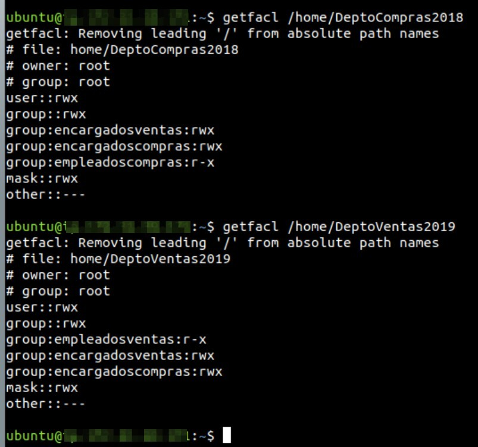
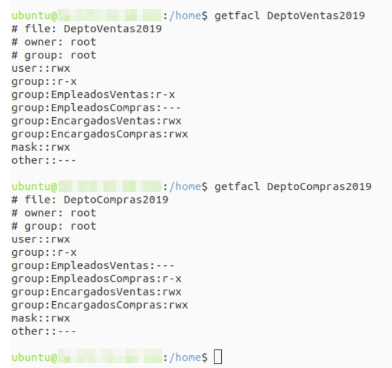

# Práctica 4.2: Listas de Control de Acceso (ACLs POSIX) en GNU/Linux

!!! note "Datos de la Práctica"
    * **Módulo:** Seguridad y Alta Disponibilidad (SAD - 0378)
    * **Unidad Didáctica:** UD4 - Control de Accesos
    * **Requisitos:** Sistema operativo Linux (Debian o Ubuntu Server en GNS3 o VirtualBox) con privilegios de superusuario (`sudo`).

---

## 1. Objetivos

* Comprender de forma práctica las limitaciones del modelo de permisos tradicional UNIX (`UGO`) frente a escenarios de colaboración departamental en entornos corporativos.
* Verificar el soporte de Listas de Control de Acceso (ACLs) en los sistemas de ficheros de GNU/Linux e instalar las herramientas de gestión `acl`.
* Manejar con destreza las utilidades de línea de comandos `getfacl` y `setfacl` para consultar, asignar, modificar y revocar permisos granulares.
* Diseñar e implantar una matriz de seguridad de accesos cruzados entre departamentos sobre múltiples usuarios y grupos nombrados.
* Configurar la herencia obligatoria de permisos en directorios compartidos mediante **ACLs por defecto** (`default:`).
* Comprender y comprobar el efecto limitador de la **máscara (*mask*)** sobre los permisos efectivos resultantes.
* Automatizar la exportación, clonación y migración de estructuras completas de ACLs mediante tuberías (*pipes*) para nuevos ejercicios anuales.

---

## 2. Escenario Departamental y Caso Práctico

Una empresa comercializadora necesita reorganizar la estructura de carpetas de almacenamiento local en su servidor principal GNU/Linux para dar cabida a los departamentos de **Ventas** y de **Compras**.

Se crearán dos carpetas principales en `/home`:

* `/home/DeptoVentas2025` (con el archivo testigo inicial `/home/DeptoVentas2025/Ventas2025.txt`)
* `/home/DeptoCompras2025` (con el archivo testigo inicial `/home/DeptoCompras2025/Compras2025.txt`)

Ambas carpetas y ficheros pertenecerán inicialmente al usuario `root:root`.

```text
/home/
├── DeptoVentas2025/
│   └── Ventas2025.txt
└── DeptoCompras2025/
    └── Compras2025.txt
```

### Estructura de Cuentas y Grupos

Para gestionar el personal de la empresa, se desplegará la siguiente estructura de usuarios y grupos:

| Grupo | Usuarios miembros | Rol en la Organización |
| :--- | :--- | :--- |
| **`EmpleadosVentas`** | `Sabiondo`, `Grunyon` | Personal operativo de ventas. |
| **`EncargadosVentas`** | `Timido` | Responsable / supervisor del departamento de ventas. |
| **`EmpleadosCompras`** | `Mudito`, `Dormilon` | Personal operativo de compras. |
| **`EncargadosCompras`** | `Bonachon` | Responsable / supervisor del departamento de compras. |
| **`Administradores`** | *TuNombreApellido* (ej. `jmunoz`) | Administrador global de sistemas y seguridad. |

*(Nota: Evita utilizar tildes, eñes o caracteres especiales en los nombres de usuario y grupos para prevenir problemas de codificación en consola).*

---

### Matriz de Requerimientos de Seguridad

Debes implantar la siguiente directiva de accesos mediante ACLs:

#### 1. Carpeta `/home/DeptoVentas2025`:

* Los miembros del grupo **`EmpleadosVentas`** podrán acceder a la carpeta y ver/leer su contenido (`r-x`).
* Los miembros del grupo **`EncargadosVentas`**, además de leer, podrán crear, modificar y borrar archivos en la carpeta (`rwx`).
* El usuario administrador **`TuNombreApellido`** tendrá control total absoluto sobre la carpeta y sus archivos (`rwx`).
* El resto de usuarios del sistema (`other`) **no tendrán ningún tipo de acceso** (`---`).

#### 2. Carpeta `/home/DeptoCompras2025`:

* Los miembros del grupo **`EmpleadosCompras`** podrán acceder a la carpeta y ver/leer su contenido (`r-x`).
* Los miembros del grupo **`EncargadosCompras`**, además de leer, podrán crear, modificar y borrar archivos en la carpeta (`rwx`).
* El usuario administrador **`TuNombreApellido`** tendrá control total absoluto sobre la carpeta y sus archivos (`rwx`).
* El resto de usuarios del sistema (`other`) **no tendrán ningún tipo de acceso** (`---`).

---

## 3. Desarrollo Paso a Paso de la Práctica

---

### Fase 1: Preparación del Entorno y Verificación Previa

Puedes realizar la práctica en una máquina virtual **Debian** o **Ubuntu Server** (en GNS3 conectada a una nube NAT, o en VirtualBox con red puente/NAT).

!!! tip "Vídeos Explicativos de Apoyo"
    Si deseas visualizar los pasos en vídeo antes o durante la realización de la práctica:

    * [Vídeo: Ubuntu Server - ACL - Comprobación previa](https://youtu.be/HPwxGV3qNtA){:target="_blank"}
    * [Vídeo: Ubuntu Server - ACL - Configuración](https://youtu.be/-O9RRv3XG4E){:target="_blank"}

1. Inicia sesión en la máquina con tu usuario habitual con privilegios `sudo`.

2. Comprueba que el sistema de archivos de la partición `/` o `/home` soporte ACLs:
   ```bash
   sudo tune2fs -l $(df /home | tail -1 | awk '{print $1}') | grep "Default mount options"
   ```
   *(En la salida debe figurar la opción `acl`).*

3. Asegúrate de tener instalado el paquete de utilidades de administración de ACLs:
   ```bash
   sudo apt update
   sudo apt install acl -y
   ```

4. Comprueba que dispones de los comandos `getfacl` y `setfacl`:
   ```bash
   getfacl --version
   setfacl --version
   ```

---

### Fase 2: Creación de Grupos, Usuarios y Carpetas Base

#### 1. Creación de Grupos Departamentales:
Ejecuta los siguientes comandos para crear los grupos corporativos:

```bash
sudo groupadd EmpleadosVentas
sudo groupadd EncargadosVentas
sudo groupadd EmpleadosCompras
sudo groupadd EncargadosCompras
sudo groupadd Administradores
```

#### 2. Creación de Usuarios y Asignación de Pertenencia:
Crea las cuentas de usuario indicando su directorio personal e incorporándolos a sus respectivos grupos principales o secundarios:

```bash
# Personal de Ventas:
sudo useradd -m -s /bin/bash -g EmpleadosVentas Sabiondo
sudo useradd -m -s /bin/bash -g EmpleadosVentas Grunyon
sudo useradd -m -s /bin/bash -g EncargadosVentas Timido

# Personal de Compras:
sudo useradd -m -s /bin/bash -g EmpleadosCompras Mudito
sudo useradd -m -s /bin/bash -g EmpleadosCompras Dormilon
sudo useradd -m -s /bin/bash -g EncargadosCompras Bonachon

# Administrador (sustituye por tu nombre y primer apellido real, ej. jmunoz):
# Si ya estás trabajando con tu propio usuario en la máquina, puedes agregarlo al grupo:
sudo usermod -aG Administradores $USER
```

Asigna una contraseña sencilla a los usuarios de prueba para poder validar el cambio de sesión más adelante:
```bash
for u in Sabiondo Grunyon Timido Mudito Dormilon Bonachon; do
    echo "$u:sad1234" | sudo chpasswd
done
```

#### 3. Creación de Carpetas y Ficheros Testigo:
Crea las carpetas departamentales en `/home` y sus archivos iniciales con el usuario `root`:

```bash
sudo mkdir /home/DeptoVentas2025
sudo mkdir /home/DeptoCompras2025

sudo touch /home/DeptoVentas2025/Ventas2025.txt
sudo touch /home/DeptoCompras2025/Compras2025.txt

# Asegurar que el propietario inicial sea root:root
sudo chown -R root:root /home/DeptoVentas2025 /home/DeptoCompras2025
```

---

### Fase 3: Asignación de Permisos Granulares con `setfacl`

Configuraremos las ACLs para cumplir estrictamente con los requerimientos de seguridad.

#### 1. Configuración de la Carpeta de Ventas:
```bash
# 1. Denegar cualquier acceso al resto de usuarios del sistema:
sudo setfacl -m o::--- /home/DeptoVentas2025

# 2. Conceder lectura y navegación a los Empleados de Ventas:
sudo setfacl -m g:EmpleadosVentas:rx /home/DeptoVentas2025

# 3. Conceder control completo a los Encargados de Ventas:
sudo setfacl -m g:EncargadosVentas:rwx /home/DeptoVentas2025

# 4. Conceder control total al Administrador (TuNombreApellido):
sudo setfacl -m u:$USER:rwx /home/DeptoVentas2025
```

Aplica también los permisos correspondientes sobre el archivo testigo existente `Ventas2025.txt`:
```bash
sudo setfacl -m g:EmpleadosVentas:r--,g:EncargadosVentas:rw-,u:$USER:rw-,o::--- /home/DeptoVentas2025/Ventas2025.txt
```

#### 2. Configuración de la Carpeta de Compras:
Aplica la directiva equivalente para el departamento de compras:

```bash
sudo setfacl -m o::--- /home/DeptoCompras2025
sudo setfacl -m g:EmpleadosCompras:rx /home/DeptoCompras2025
sudo setfacl -m g:EncargadosCompras:rwx /home/DeptoCompras2025
sudo setfacl -m u:$USER:rwx /home/DeptoCompras2025

sudo setfacl -m g:EmpleadosCompras:r--,g:EncargadosCompras:rw-,u:$USER:rw-,o::--- /home/DeptoCompras2025/Compras2025.txt
```

#### 3. Inspección con `getfacl`:
Comprueba la lista de acceso resultante en ambas carpetas:

```bash
getfacl /home/DeptoVentas2025
getfacl /home/DeptoCompras2025
```

Observa también el listado largo del directorio `/home`:
```bash
ls -ld /home/DeptoVentas2025 /home/DeptoCompras2025
```
*(Deberás apreciar el característico **signo más (`+`)** al final de los permisos en ambas carpetas).*

---

### Fase 4: Configuración de la Herencia de Permisos (`default:`)

Si un encargado crea un archivo nuevo dentro de `/home/DeptoVentas2025`, por defecto ese archivo se creará con la `umask` personal del usuario, impidiendo que otros compañeros puedan acceder según la política del departamento.

Para solucionar esto, definiremos **ACLs por defecto** en ambas carpetas:

```bash
# Reglas por defecto para DeptoVentas2025:
sudo setfacl -d -m g:EmpleadosVentas:rx,g:EncargadosVentas:rwx,u:$USER:rwx,o::--- /home/DeptoVentas2025

# Reglas por defecto para DeptoCompras2025:
sudo setfacl -d -m g:EmpleadosCompras:rx,g:EncargadosCompras:rwx,u:$USER:rwx,o::--- /home/DeptoCompras2025
```

Verifica con `getfacl /home/DeptoVentas2025` que ahora se muestran las entradas que comienzan por `default:`.

---

### Fase 5: Pruebas de Acceso Efectivo

Realizaremos comprobaciones reales cambiando de identidad con `su -` (o ejecutando comandos mediante `sudo -u`):

#### 1. Pruebas con el usuario `Sabiondo` (Empleado de Ventas):
```bash
# Listar la carpeta de ventas (debe permitirlo):
sudo -u Sabiondo ls -l /home/DeptoVentas2025

# Leer el archivo de ventas (debe permitirlo):
sudo -u Sabiondo cat /home/DeptoVentas2025/Ventas2025.txt

# Intentar crear un archivo en ventas (DEBE DENEGARLO):
sudo -u Sabiondo touch /home/DeptoVentas2025/nuevo_sabiondo.txt
# Salida esperada: touch: cannot touch '/home/DeptoVentas2025/nuevo_sabiondo.txt': Permission denied

# Intentar acceder a compras (DEBE DENEGARLO):
sudo -u Sabiondo ls /home/DeptoCompras2025
# Salida esperada: ls: cannot open directory '/home/DeptoCompras2025': Permission denied
```

#### 2. Pruebas con el usuario `Timido` (Encargado de Ventas):
```bash
# Crear un archivo nuevo en ventas (debe permitirlo):
sudo -u Timido touch /home/DeptoVentas2025/informe_timido.txt

# Comprobar que el archivo recién creado ha heredado las ACLs por defecto:
getfacl /home/DeptoVentas2025/informe_timido.txt
```

#### 3. Pruebas con el usuario `Mudito` (Empleado de Compras):
```bash
# Comprobar que no puede acceder a ventas:
sudo -u Mudito ls /home/DeptoVentas2025
# Salida esperada: Permission denied

# Comprobar que puede leer en compras:
sudo -u Mudito ls -l /home/DeptoCompras2025
```

---

### Fase 6: Automatización de la Clonación de ACLs para el Nuevo Ejercicio Anual

Al llegar el nuevo año, el usuario `root` necesita preparar las carpetas del siguiente ejercicio fiscal:

* `/home/DeptoVentas2026`
* `/home/DeptoCompras2026`
* Archivos `Ventas2026.txt` y `Compras2026.txt`

En lugar de reescribir manualmente cada regla `setfacl`, utilizaremos la **potencia de las tuberías de Linux** para extraer las ACLs completas de 2025 y aplicarlas de forma automática a las carpetas de 2026.

1. **Crea las nuevas carpetas y ficheros base con `root`:**
   ```bash
   sudo mkdir /home/DeptoVentas2026 /home/DeptoCompras2026
   sudo touch /home/DeptoVentas2026/Ventas2026.txt /home/DeptoCompras2026/Compras2026.txt
   sudo chown -R root:root /home/DeptoVentas2026 /home/DeptoCompras2026
   ```

2. **Clona las ACLs de forma automática mediante tubería:**
   ```bash
   # Clonar ACLs de Ventas (incluyendo permisos de acceso y de herencia):
   sudo getfacl -p -R /home/DeptoVentas2025 | sudo setfacl -b -R -M - /home/DeptoVentas2026

   # Clonar ACLs de Compras:
   sudo getfacl -p -R /home/DeptoCompras2025 | sudo setfacl -b -R -M - /home/DeptoCompras2026
   ```
   *(La opción `-p` preserva los nombres absolutos sin avisos informativos, `-b` limpia permisos residuales en destino y `-M -` lee las especificaciones directamente desde la tubería).*

3. **Verificación final con `getfacl`:**
   Ejecuta `getfacl` sobre las carpetas de 2026 y confirma que los permisos son idénticos a los del año anterior:
   ```bash
   getfacl /home/DeptoVentas2026
   getfacl /home/DeptoCompras2026
   ```

---

## 4. Referencia de Salidas Esperadas

A continuación puedes consultar dos ejemplos de ejecución real de `getfacl` que ilustran la estructura exacta de permisos tras configurar las directivas departamentales:





---

## 5. Entregables y Memoria de Prácticas

Elabora una memoria en formato **PDF** con tu nombre completo que incluya las siguientes evidencias:

1. **Captura 1:** Comandos utilizados para crear los usuarios y grupos departamentales.
2. **Captura 2:** Comandos de `setfacl` utilizados para aplicar las directivas de acceso y las reglas de herencia por defecto en `/home/DeptoVentas2025` y `/home/DeptoCompras2025`.
3. **Captura 3:** Salida del comando `getfacl` sobre `/home/DeptoVentas2025` y `/home/DeptoCompras2025`.
4. **Captura 4:** Pruebas de acceso demostrando:

   * Acceso concedido de `Sabiondo` a ventas y denegación al intentar escribir.
   * Denegación de acceso de `Sabiondo` a compras.
   * Creación exitosa de un archivo por `Timido` y salida de `getfacl` sobre dicho archivo mostrando la herencia.

5. **Captura 5:** Comandos utilizados para trasladar automáticamente las ACLs de las carpetas de 2025 a las de 2026.
6. **Captura 6:** Salida de `getfacl` sobre cada una de las carpetas de 2026 y listado largo `ls -ld /home/Depto*` donde se visualicen los propietarios y el indicador `+` de ACL extendida.

---

## 6. Cuestiones de Autoevaluación

Responde de forma fundamentada a las siguientes preguntas en tu documento:

1. ¿Por qué el modelo tradicional UGO no permitía resolver los requerimientos planteados para los departamentos de Ventas y Compras sin comprometer la seguridad?
2. Si aplicamos la regla `g:EncargadosVentas:rwx` a una carpeta, pero la máscara de la ACL tiene el valor `m::rx`, ¿qué permiso real o efectivo tendrán los miembros de ese grupo? Justifica tu respuesta citando la fórmula matemática de evaluación.
3. ¿Cuál es la diferencia entre un permiso de acceso ordinario asignado a un directorio y un permiso por defecto (`default:`)? ¿Qué ocurre si un usuario crea un subdirectorio dentro de una carpeta con permisos por defecto?
4. Si un usuario concreto tiene una entrada en la ACL con `u:sabiondo:---`, pero pertenece al grupo `g:EmpleadosVentas:r-x`, ¿podrá acceder al archivo? Explica qué regla del algoritmo de evaluación del kernel de Linux determina el resultado.
