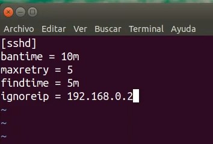
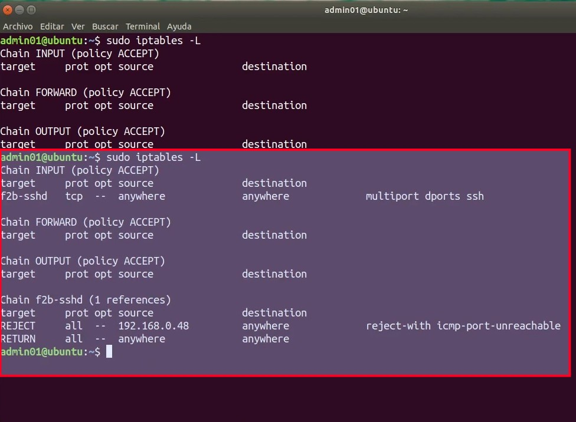

# Práctica 4.3: Monitorización de Accesos y Defensa Activa con Fail2ban en SSH

!!! note "Datos de la Práctica"
    * **Módulo:** Seguridad y Alta Disponibilidad (SAD - 0378)
    * **Unidad Didáctica:** UD4 - Control de Accesos
    * **Requisitos:** Sistema operativo Linux (Debian o Ubuntu Server en VirtualBox o GNS3) como servidor, y una segunda máquina cliente (o el equipo anfitrión) con cliente SSH para realizar pruebas de acceso y ataques controlados. Privilegios de superusuario (`sudo`).

---

## 1. Objetivos

* Comprender el funcionamiento de un sistema de prevención de intrusiones en host (*HIPS*) mediante la inspección automatizada de ficheros de registro.
* Instalar, verificar y gestionar el demonio de seguridad **Fail2ban** en un servidor GNU/Linux.
* Configurar de forma persistente y modular directivas de protección en `/etc/fail2ban/jail.local` respetando la jerarquía sobre `jail.conf`.
* Establecer parámetros de contención temporal frente a ataques de fuerza bruta (`bantime`, `findtime`, `maxretry`).
* Implementar listas blancas de exclusión (`ignoreip`) para blindar el equipo de administración frente a bloqueos accidentales.
* Simular ataques de fuerza bruta por SSH y auditar en tiempo real la respuesta reactiva en el registro `/var/log/fail2ban.log` y en las cadenas dinámicas de `iptables`.

---

## 2. Escenario y Fundamentos Técnicos

**Fail2ban** es un demonio de seguridad que monitoriza de forma continua los registros del sistema operativo (como `/var/log/auth.log`) en busca de intentos de autenticación fallidos o anómalos. Cuando una dirección IP sobrepasa el umbral de errores configurado dentro de una ventana temporal determinada, Fail2ban actúa de forma proactiva inyectando una regla en el cortafuegos del kernel (`iptables` o `nftables`) para bloquear el tráfico entrante desde dicha dirección durante un tiempo prefijado.

```text
  [ Máquina Atacante ] ──────── Múltiples fallos SSH (>= 5) ────────> [ Servidor OpenSSH ]
     (192.168.1.150)                                                         │
                                                                       Genera eventos en:
                                                                      /var/log/auth.log
                                                                             │
                                                                       Monitorizado por:
                                                                             ▼
                                                                     [ Motor Fail2ban ]
                                                                     Jail [sshd] activa
                                                                             │
                                                                   Dispara contramedida:
                                                                             ▼
  [ Tráfico BLOQUEADO ] <────── Regla DROP / REJECT inyectada ────── [ iptables (f2b-sshd) ]
```

### Elementos del Laboratorio

| Máquina / Rol | Función en la Práctica | Observaciones |
| :--- | :--- | :--- |
| **Servidor Linux** (Ubuntu Server / Debian) | Servidor SSH y ejecución de Fail2ban. | Debe tener IP fija o conocida (ej. `192.168.1.43`). |
| **Equipo Anfitrión (Host)** | Máquina del administrador de sistemas. | Su dirección IP se incluirá en `ignoreip` para garantizar inmunidad. |
| **Máquina de Pruebas / Cliente** | Cliente SSH que simulará los accesos no autorizados. | IP distinta a la del administrador para comprobar el bloqueo efectivo. |

---

## 3. Desarrollo Paso a Paso de la Práctica

---

### Fase 1: Comprobaciones Previas e Instalación

Puedes realizar la práctica en una máquina virtual **Debian** o **Ubuntu Server** (en VirtualBox con adaptador en modo puente o red NAT, o en GNS3).

!!! tip "Vídeos Explicativos de Apoyo"
    Si deseas visualizar los pasos en vídeo antes o durante la realización de la práctica:

    * [Vídeo: Ubuntu Server 18.04 - Fail2ban - Instalación](https://youtu.be/zoEzuQntOMU){:target="_blank"}
    * [Vídeo: Ubuntu Server 18.04 - Fail2ban - Inspección SSH](https://youtu.be/5sE2Mici96o){:target="_blank"}

1. Inicia sesión en tu servidor Linux con una cuenta con privilegios `sudo`.

2. Asegúrate de que el servicio OpenSSH esté instalado y escuchando en el puerto TCP 22:
   ```bash
   ss -lt | grep ssh
   ```
   *(Si el puerto 22 no está en escucha o el paquete no está instalado, instálalo con `sudo apt update && sudo apt install openssh-server -y`).*

3. Instala el paquete de **Fail2ban**:
   ```bash
   sudo apt install fail2ban -y
   ```

4. **Nota para entornos Debian:** Si realizas la práctica sobre una distribución Debian mínima, es posible que el demonio `fail2ban` reporte errores al arrancar debido a que no existe previamente el fichero de eventos `/var/log/auth.log`. En ese caso, créalo y asígnale los permisos apropiados ejecutando:
   ```bash
   sudo touch /var/log/auth.log
   sudo chmod 640 /var/log/auth.log
   ```

---

### Fase 2: Configuración de la Jaula SSH en `/etc/fail2ban/jail.local`

Si examinas el directorio `/etc/fail2ban/`, encontrarás el archivo `jail.conf`. Este archivo contiene la configuración predeterminada de la aplicación y plantillas para decenas de servicios (SSH, Apache, FTP, Nginx, Dovecot).

!!! warning "Regla de Oro: Nunca modifiques directamente `jail.conf`"
    En la propia documentación oficial de Fail2ban se indica que **no deben realizarse cambios en el archivo `jail.conf`**. En futuras actualizaciones del paquete por parte de la distribución, el archivo `jail.conf` se sobrescribe por completo, perdiéndose cualquier personalización.
    
    Por ello, se debe crear el archivo **`/etc/fail2ban/jail.local`**. La configuración definida en `jail.local` **prevalece siempre sobre la de `jail.conf`**, y no es modificada por las actualizaciones del sistema. Tampoco debes copiar todo el contenido de `jail.conf` a `jail.local`, sino definir únicamente las secciones y parámetros que deseas personalizar.

#### Requerimientos de la Política de Seguridad

Configura el servicio **SSH** en Fail2ban de forma que cumpla los siguientes criterios:

* **`bantime`:** El baneo temporal debe durar **10 minutos** (`600` segundos).
* **`findtime`:** Los intentos fallidos se evaluarán en una ventana de **5 minutos** (`300` segundos).
* **`maxretry`:** Si se producen **más de 5 intentos fallidos**, se bloqueará la dirección IP.
* **`ignoreip`:** La dirección IP de tu ordenador anfitrión (host físico) **nunca debe ser bloqueada**, evitando perder el acceso de gestión.

#### Procedimiento de Edición:

1. Crea o edita el archivo `/etc/fail2ban/jail.local` con un editor de textos:
   ```bash
   sudo nano /etc/fail2ban/jail.local
   ```

2. Añade las siguientes directivas, indicando en `ignoreip` la IP real de tu máquina de gestión (sustituye `192.168.1.50` por la IP correspondiente a tu ordenador host):

   ```ini
   [DEFAULT]
   # Lista de IPs excluidas de baneo (separadas por espacio):
   ignoreip = 127.0.0.1/8 ::1 192.168.1.50

   # Ventana temporal en segundos para contabilizar fallos (5 minutos):
   findtime = 300

   # Tiempo de duracion del bloqueo en segundos (10 minutos):
   bantime = 600

   # Numero maximo de fallos permitidos antes del bloqueo:
   maxretry = 5

   [sshd]
   enabled = true
   port    = ssh
   logpath = %(sshd_log)s
   backend = %(sshd_backend)s
   ```

3. Guarda los cambios (`Ctrl + O` y `Enter`) y sal del editor (`Ctrl + X`).

---

### Fase 3: Activación y Verificación del Demonio Fail2ban

1. Aplica los cambios reiniciando el servicio de Fail2ban:
   ```bash
   sudo systemctl reload-or-restart fail2ban.service
   ```

2. Comprueba que el servicio se encuentra activo y en ejecución sin fallos:
   ```bash
   sudo systemctl status fail2ban
   ```

3. Utiliza la herramienta de gestión `fail2ban-client` para verificar qué jaulas (*jails*) se encuentran supervisadas por el motor de seguridad:
   ```bash
   sudo fail2ban-client status
   ```
   *(En la salida debe figurar `Jail list: sshd`).*

4. Consulta el estado detallado específico de la jaula SSH:
   ```bash
   sudo fail2ban-client status sshd
   ```
   *(Observa que inicialmente los contadores `Currently banned: 0` y `Total banned: 0` reflejan que no hay ninguna IP sancionada).*

---

### Fase 4: Comprobación del Cortafuegos y Simulación del Ataque

#### 1. Estado inicial del cortafuegos:
Antes de lanzar las pruebas de acceso, comprueba que el subsistema de filtrado no tiene reglas de bloqueo activas:

```bash
sudo iptables -L -n -v
```

*(Deberás observar la cadena `f2b-sshd` creada por Fail2ban, pero sin ninguna IP en su lista de descarte).*

#### 2. Simulación de ataque de fuerza bruta:
Desde una máquina cliente o terminal **cuya IP sea distinta a la indicada en `ignoreip`**, intenta iniciar sesión vía SSH contra el servidor utilizando un usuario inexistente o una contraseña deliberadamente errónea:

```bash
ssh usuario_falso@192.168.1.43
```

Introduce contraseñas incorrectas de forma reiterada. Observa que, tras superar el límite de **5 intentos fallidos** dentro de la ventana de 5 minutos, el servidor **cortará la conexión y denegará cualquier nuevo intento de enlace**, mostrando mensajes del tipo:

```text
ssh: connect to host 192.168.1.43 port 22: Connection refused
```

---

### Fase 5: Auditoría de Logs y Reglas Dinámicas en `iptables`

1. **Inspección de las reglas activas de cortafuegos:**
   En el servidor, vuelve a consultar la tabla de filtrado de `iptables`:
   ```bash
   sudo iptables -L -n -v
   ```
   Comprueba que en la cadena `f2b-sshd` aparece una nueva regla que rechaza (`REJECT`) todo el tráfico TCP dirigido al puerto 22 procedente de la dirección IP atacante.

2. **Inspección del registro de eventos de Fail2ban:**
   Abre el fichero de log de la aplicación para analizar el registro de la detección y sanción:
   ```bash
   sudo tail -n 20 /var/log/fail2ban.log
   ```
   Localiza las líneas donde se aprecian los intentos detectados y la orden de baneo ejecutada:
   ```text
   [sshd] Found 192.168.1.150 - 2026-10-08 11:20:12
   [sshd] Ban 192.168.1.150
   ```

3. **Consulta de estado con `fail2ban-client`:**
   Ejecuta de nuevo el comando de estado para ver la lista de IPs castigadas:
   ```bash
   sudo fail2ban-client status sshd
   ```
   *(Comprobarás que `Currently banned: 1` y que en `Banned IP list` figura la dirección IP del equipo bloqueado).*

---

### Fase 6: Verificación de Lista Blanca (`ignoreip`) y Expiración

1. **Prueba de inmunidad con `ignoreip`:**
   Desde el equipo cuya IP registraste en la directiva `ignoreip` (tu máquina host física), intenta realizar más de 5 conexiones fallidas seguidas por SSH hacia el servidor:
   ```bash
   ssh usuario_prueba@192.168.1.43
   ```
   Comprueba que, a pesar de superar el número de fallos fijado en `maxretry`, **esta máquina NUNCA es bloqueada**, garantizando que el administrador mantenga siempre el control del servidor.

2. **Comprobación de expiración del baneo:**
   Una vez transcurridos los **10 minutos** estipulados en `bantime`, vuelve a consultar el cortafuegos en el servidor:
   ```bash
   sudo iptables -L -n -v
   ```
   Comprueba que la regla de bloqueo ha sido eliminada automáticamente por Fail2ban y que la máquina atacante puede volver a establecer comunicación con el puerto SSH.

!!! tip "Desbaneo manual para pruebas rápidas de laboratorio"
    Si estás realizando pruebas en el aula y no deseas esperar los 10 minutos completos de `bantime`, puedes levantar el castigo manualmente desde la consola del servidor con el comando:
    ```bash
    sudo fail2ban-client set sshd unbanip 192.168.1.150
    ```

---

## 4. Referencia de Salidas Esperadas

A continuación puedes consultar las capturas de la solución oficial que muestran la configuración requerida en `jail.local` y el comportamiento del cortafuegos tras producirse el bloqueo:

### 1. Configuración de `/etc/fail2ban/jail.local`



### 2. Reglas Dinámicas inyectadas en `iptables`



*Observaciones:*

* La cadena `f2b-sshd` intercepta el tráfico del puerto 22 antes de que llegue al servicio SSH.
* La dirección IP indicada en `ignoreip` no requiere máscara de red `/32` si se trata de un host individual.
* La regla `REJECT` envía un paquete de rechazo inmediato (*icmp-port-unreachable* o *tcp-reset*), impidiendo que el atacante siga consumiendo recursos del proceso OpenSSH.

---

## 5. Entregables y Memoria de Prácticas

Elabora una memoria en formato **PDF** con tu nombre completo que incluya las siguientes evidencias:

1. **Captura 1:** Contenido completo de tu archivo `/etc/fail2ban/jail.local` mostrando los parámetros `ignoreip`, `bantime`, `findtime`, `maxretry` y la jaula `[sshd]`.
2. **Captura 2:** Salida del comando `sudo fail2ban-client status sshd` antes de realizar las pruebas de ataque (mostrando 0 baneos).
3. **Captura 3:** Terminal de la máquina cliente demostrando los intentos fallidos consecutivos de conexión y el momento exacto en el que la conexión es rechazada por el servidor.
4. **Captura 4:** Salida del comando `sudo iptables -L` o `sudo iptables -L f2b-sshd` en el servidor mostrando la regla de bloqueo con la dirección IP del equipo atacante.
5. **Captura 5:** Líneas del registro `/var/log/fail2ban.log` donde se observe la acción de baneo (`Ban <IP>`).
6. **Captura 6:** Demostración de que la IP configurada en `ignoreip` no es bloqueada tras superar los 5 fallos, o captura mostrando el desbaneo automático tras cumplirse el tiempo de `bantime`.

---

## 6. Cuestiones de Autoevaluación

Responde de forma fundamentada a las siguientes preguntas en tu documento:

1. **Jerarquía de configuración:** ¿Por qué es una mala práctica de administración editar directamente el archivo `/etc/fail2ban/jail.conf`? ¿Qué ventaja aporta centralizar nuestras personalizaciones en `/etc/fail2ban/jail.local` frente a una actualización del sistema con `apt upgrade`?
2. **Impacto de la directiva `ignoreip`:** Si un administrador omite incluir su propia dirección IP o la subred de gestión en `ignoreip` y se equivoca varias veces al escribir su contraseña en una sesión remota, ¿qué consecuencia operativa sufrirá? ¿Cómo podría resolverlo si no dispone de acceso físico al equipo?
3. **Mecanismo de acción del cortafuegos:** Explica qué diferencia existe entre que Fail2ban aplique una acción con objetivo `REJECT` frente a una acción con objetivo `DROP`. ¿Qué ventaja defensiva aporta `DROP` frente a escáneres masivos de Internet?
4. **Entornos en la Nube (AWS / VPS):** En servidores expuestos directamente a Internet (como instancias EC2 en AWS), ¿por qué se recomienda elevar el parámetro `bantime` a valores de varias horas o días, mientras que en un laboratorio de clase utilizamos valores reducidos como 10 minutos?

