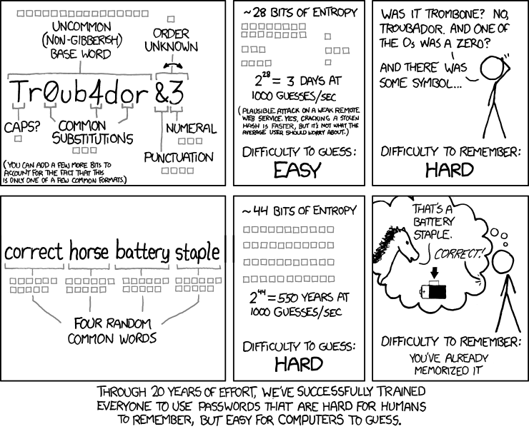

# UD4. Control de accesos

## 1. Políticas y Modelos de Control de Acceso

El control de acceso constituye la primera línea de defensa en cualquier arquitectura de seguridad informática. En el marco de la administración de sistemas en red y según las directrices del Instituto Nacional de Ciberseguridad (INCIBE), regular quién ingresa a los entornos digitales, a qué recursos específicos se le permite llegar y qué operaciones puede ejecutar es la garantía fundamental para preservar la confidencialidad, la integridad y la trazabilidad de la información corporativa.

---

### 1.1. Concepto y Retos Actuales del Control de Acceso

Se define el **control de acceso** como el conjunto de mecanismos **técnicos, administrativos y físicos** diseñados para permitir, restringir, monitorizar y proteger el acceso a los servicios, equipos, redes e información de una organización.

En los entornos operativos contemporáneos, la frontera perimetral tradicional ha desaparecido. La implantación de soluciones de control de acceso enfrenta retos complejos debido a la convergencia de varios factores tecnológicos:

* **Extensión del Teletrabajo y Accesos Remotos:** Los usuarios se conectan a los servidores internos a través de redes públicas no confiables desde ubicaciones geográficas diversas.
* **Proliferación de Dispositivos Móviles y Políticas BYOD (*Bring Your Own Device*):** El personal utiliza smartphones, tabletas y portátiles personales para consultar aplicaciones y datos corporativos, introduciendo vectores de riesgo no gestionados por el equipo de IT.
* **Uso Intensivo de Servicios en la Nube y Redes Inalámbricas:** La migración a entornos IaaS, PaaS y SaaS desplaza el almacenamiento fuera del centro de datos local, haciendo imperativo gestionar identidades de forma distribuida.

---

### 1.2. El Modelo IAAA (Identificación, Autenticación, Autorización y Anotación)

Toda arquitectura rigurosa de control de acceso se fundamenta en un flujo secuencial de cuatro fases conocido como el **Modelo IAAA**:

```
  [ Identificación ]    ──>  [ Autenticación ]     ──>  [ Autorización ]  ──>  [ Anotación / Auditoría ]
   "¿Quién dices ser?"     "Demuestra quién eres"   "¿A qué tienes acceso?"    "Registro de lo que haces"
```

1. **Identificación (I):** Proceso mediante el cual una entidad (usuario, proceso o dispositivo) declara su identidad ante el sistema. Ejemplos habituales son el nombre de usuario (*username*), el NIF, el código de empleado o la dirección de correo electrónico corporativo.
2. **Autenticación (A):** Verificación técnica de que la entidad es legítima y corresponde realmente a la identidad declarada. Se apoya en la validación de factores pertenecientes a tres categorías clásicas:
   * *Algo que sabes:* Elementos memorísticos como contraseñas, PINs, códigos de acceso o respuestas a preguntas secretas.
   * *Algo que tienes:* Objetos físicos o lógicos en posesión del usuario, como tarjetas inteligentes (DNIe), tokens criptográficos hardware, tarjetas de coordenadas o aplicaciones generadoras de códigos temporales (OTP).
   * *Algo que eres:* Rasgos biológicos e inalterables, como la huella dactilar, el patrón de iris, el reconocimiento facial o el análisis de la voz.
3. **Autorización (A):** Fase en la que el sistema consulta sus directrices de seguridad para conceder o denegar privilegios específicos (lectura, escritura, ejecución, administración) sobre los recursos solicitados.
4. **Anotación y Auditoría (*Accounting / Auditing*) (A):** Registro sistemático en ficheros de eventos (*logs*) de las acciones realizadas durante la sesión. Permite verificar el cumplimiento de las políticas, detectar anomalías en tiempo real y realizar análisis forenses tras un incidente de ciberseguridad.

---

### 1.3. Tendencias y Tecnologías Modernas de Autenticación

Debido a que el uso de una única contraseña estática resulta vulnerable frente a ataques de fuerza bruta, *phishing* o filtraciones masivas, las recomendaciones actuales de INCIBE priorizan la adopción de mecanismos avanzados de autenticación.

#### A) Autenticación Multi-Factor (MFA / 2FA)

La autenticación de doble o múltiple factor exige verificar **al menos dos factores de categorías distintas** antes de conceder acceso al sistema. Su objetivo es garantizar que, si un ciberdelincuente compromete una contraseña, no pueda ingresar sin el segundo factor físico o biométrico.

> **Ejemplo de aplicación:** Al conectar a la VPN corporativa desde casa, un administrador introduce su contraseña personal (factor de conocimiento) e inmediatamente recibe una notificación *push* en su dispositivo móvil registrado (factor de posesión) requiriendo la confirmación mediante lectura de huella dactilar (factor biométrico).

#### B) Ciberllaves y Passkeys (Estándares FIDO2 / WebAuthn)

Mecanismos de autenticación sin contraseña (*passwordless*) basados en criptografía asimétrica de clave pública. La clave privada permanece almacenada en el chip de seguridad del dispositivo del usuario (módulo TPM, teléfono móvil o token USB), mientras que el servidor guarda únicamente la clave pública.

> **Ejemplo de aplicación:** Un técnico de sistemas inserta una llave física de seguridad USB (como una *YubiKey*) en el ordenador de trabajo. Al tocar el sensor de la llave, el dispositivo firma un desafío matemático enviado por el servidor, autenticando al usuario de forma instantánea sin necesidad de teclear ningún carácter.

#### C) Single Sign-On (SSO) y Autenticación Federada

Sistemas que permiten a un usuario autenticarse una sola vez ante un Proveedor de Identidad (*Identity Provider* - IdP) centralizado para obtener acceso automático a múltiples aplicaciones y servicios vinculados, evitando la dispersión de credenciales.

> **Ejemplo de aplicación:** Un usuario inicia sesión por la mañana en el portal corporativo. Al abrir la plataforma Moodle, el servidor de correo electrónico o la herramienta de almacenamiento en la nube, los protocolos de federación (SAML 2.0 u OpenID Connect) validan el token de sesión emitido por el servidor de identidad sin volver a solicitar usuario y contraseña.

#### D) Gestores de Contraseñas Corporativos

Repositorios virtuales cifrados que generan, almacenan y autocompletan claves complejas e independientes para cada servicio. Eliminan la necesidad de memorizar múltiples contraseñas o de anotarlas en medios inseguros.

> **Ejemplo de aplicación:** El departamento de IT despliega un gestor de credenciales corporativo (como *Bitwarden* o *KeePassXC*). Cada empleado memoriza exclusivamente una **frase de paso maestra** (*master passphrase*) protegida por MFA; el gestor se encarga de rellenar de forma transparente contraseñas aleatorias de 20 caracteres para los diferentes servicios web.

---

### 1.4. Ciclo de Vida de las Credenciales y Políticas de Seguridad

La gestión de accesos exige un marco normativo interno que defina cómo se generan, distribuyen, mantienen y revocan las credenciales de usuario.

#### Principios Organizativos Fundamentales

* **Mínimo Privilegio (*Least Privilege* / *Need-to-Know*):** Todo usuario o proceso debe disponer únicamente de los permisos estrictamente necesarios para desempeñar su función laboral durante el tiempo indispensable.
* **Segregación de Funciones (*Separation of Duties*):** División de procesos críticos entre distintos responsables para impedir que una sola persona ejecute acciones de alto impacto sin supervisión.
* **Denegación por Defecto (*Default Deny*):** Toda petición de acceso que no esté explícitamente autorizada en la directiva debe ser rechazada.

#### Directrices para la Gestión de Contraseñas

* **Sustitución de claves por defecto:** Modificación obligatoria de las contraseñas de fábrica en servidores, aplicaciones y equipamiento de red (*routers*, *switches*, puntos de acceso) antes de su puesta en producción.
* **Requisitos de fortaleza:** Establecimiento de una longitud mínima recomendada de **12 a 14 caracteres**, combinando letras mayúsculas, minúsculas, números y símbolos especiales, evitando términos de diccionario o datos personales.
* **Almacenamiento seguro en servidores:** Las contraseñas nunca deben guardarse en texto claro; deben protegerse mediante funciones hash criptográficas robustas acompañadas de un valor aleatorio único (*salt*).
* **Gestión de bajas y cambios de puesto:** Desactivación y revocación inmediata de cuentas, certificados y credenciales en el momento en que un empleado finaliza su vinculación laboral o cambia de departamento.

---

### 1.5. Modelos Teóricos de Control de Acceso (Autorización)

A la hora de implementar la fase de autorización, existen cuatro modelos teóricos fundamentales que determinan la forma en que se estructuran y conceden los permisos.

#### 1. DAC (*Discretionary Access Control* – Control de Acceso Discrecional)

En el modelo DAC, el **propietario** (*owner*) o creador de un recurso posee plena facultad para decidir qué otros usuarios pueden acceder a él y qué permisos específicos se les otorgan.

* **Mecánica:** El sistema mantiene una lista de control de acceso en cada objeto. El creador administra los permisos de forma descentralizada.
* **Ejemplo práctico:** El esquema tradicional de permisos en Linux (`rwx` gestionado mediante el comando `chmod`), las carpetas compartidas en Windows o los enlaces de documentos en Google Drive.
* **Valoración:** Destaca por su flexibilidad y facilidad de uso, pero presenta el riesgo de falta de control centralizado si un usuario otorga permisos excesivos de forma descuidada.

#### 2. MAC (*Mandatory Access Control* – Control de Acceso Mandatorio)

En el modelo MAC, las decisiones de acceso las impone **el sistema operativo de forma centralizada** en función de políticas de seguridad estrictas. Ni siquiera el propietario de un archivo puede modificar los permisos de su propio recurso.

* **Mecánica:** Asigna etiquetas de clasificación a los recursos (*Público, Confidencial, Secreto*) y etiquetas de acreditación a los usuarios o procesos.
* **Ejemplo práctico:** Los sistemas de protección de kernel en Linux como **SELinux** o **AppArmor** (que restringen las acciones de un servicio como Apache aunque sea vulnerado), los entornos con requerimientos militares y los mecanismos de aislamiento (*sandboxing*) en Android e iOS.
* **Valoración:** Proporciona la máxima contención frente a malware y elevación de privilegios, a costa de una elevada complejidad de configuración.

#### 3. RBAC (*Role-Based Access Control* – Control de Acceso Basado en Roles)

En el modelo RBAC, los permisos se asocian a **Roles o Funciones Laborales** dentro de la organización, y los usuarios adquieren las autorizaciones al ser adscritos a uno o varios roles.

* **Mecánica:** Abstrae la gestión individual. Cuando un empleado cambia de puesto, basta con retirarle el rol anterior y asignarle el nuevo, sin necesidad de redefinir permisos en cientos de archivos.
* **Ejemplo práctico:** Los grupos de seguridad en Directorios Activos (Active Directory / LDAP), las matrices de permisos en sistemas ERP o la asignación de roles en plataformas educativas como Moodle (*Profesor*, *Estudiante*, *Administrador*).
* **Valoración:** Simplifica radicalmente la administración en empresas medianas y grandes, facilitando el cumplimiento del principio de mínimo privilegio.

#### 4. ABAC (*Attribute-Based Access Control* – Control de Acceso Basado en Atributos)

Considerado la evolución dinámica de RBAC, el modelo ABAC evalúa en tiempo real **múltiples atributos** del sujeto, del recurso, de la acción y del entorno para autorizar cada petición.

* **Mecánica:** Aplica reglas condicionales del tipo *"Permitir si [Atributos del Usuario] + [Atributos del Recurso] + [Atributos del Entorno] cumplen la condición"*.
* **Ejemplo práctico:** Las directivas de Acceso Condicional en la nube (Microsoft Entra ID / AWS IAM) que evalúan la IP de origen, la hora, el país y el estado de seguridad del equipo antes de permitir la conexión, formando la base de la arquitectura ***Zero Trust*** (*"Nunca confíes, verifica siempre"*).
* **Valoración:** Ofrece un control granular e inteligente adaptado al teletrabajo y entornos *cloud*, aunque requiere motores de evaluación de políticas avanzados.

---

#### Cuadro Resumen Comparativo de los Modelos de Control de Acceso

| Modelo | Criterio Principal de Decisión | Responsable del Control | Ámbito / Caso de Uso Típico |
| :--- | :--- | :--- | :--- |
| **DAC** | Identidad del usuario y permisos asignados por el dueño. | El Propietario del archivo/recurso. | Sistemas de ficheros locales (`chmod` en Linux / NTFS). |
| **MAC** | Etiquetas de seguridad del sujeto y clasificación del objeto. | El Sistema Operativo (Centralized). | Módulos de seguridad SELinux, AppArmor, entorno militar. |
| **RBAC** | Rol o función laboral desempeñada en la organización. | El Administrador del Sistema / IT. | Directorio Activo (LDAP), Moodle, sistemas ERP. |
| **ABAC** | Atributos dinámicos (Sujeto + Objeto + Hora + Ubicación/IP). | Motor de Políticas en tiempo real. | Entornos Cloud (Azure/AWS), arquitectura *Zero Trust*. |

## 2. Protección Física y Seguridad en el Arranque

### 2.1. Seguridad a Nivel de Firmware: BIOS y UEFI

La **BIOS** (*Basic Input Output System*) y su evolución **UEFI** (*Unified Extensible Firmware Interface*) constituyen el software básico grabado en la memoria no volátil (ROM/NVRAM) de la placa base. Su función principal es chequear el hardware (proceso POST) e iniciar la secuencia de arranque.

Toda política de seguridad informática debe considerar el firmware de arranque como la primera línea de contención frente a intrusiones físicas o manipulación de dispositivos.

```
 [ Encendido ] ──> [ Firmware: BIOS/UEFI ] ──> [ Cargador: GRUB2 ] ──> [ Kernel / Sistema Operativo ]
                         │                            │
                   Contraseñas y                Protección por
                    Secure Boot                 Contraseña GRUB
```

#### Objetivos Principales de Seguridad en el Firmware

1. **Proteger el arranque del sistema:** Impedir que personas no autorizadas enciendan o inicien el equipo desde medios externos no permitidos.
2. **Proteger la configuración del firmware:** Evitar que se modifiquen los parámetros de seguridad establecidos por el administrador.

#### Mecanismos de Protección en BIOS/UEFI

* **Activación y Desactivación de Dispositivos y Puertos:** Permite habilitar o deshabilitar desde la propia placa base el uso de componentes físicos específicos para prevenir la fuga de información o la introducción de malware (desactivación de puertos SATA/NVMe secundarios, bloqueo de puertos USB e interfaces de red Ethernet/Wi-Fi).
* **Definición de la Secuencia de Arranque (*Boot Order*):** Establece qué dispositivos buscará el sistema para cargar el sistema operativo y en qué orden estricto. La buena práctica dicta configurar el **disco duro interno principal como primera (y única) opción de arranque**, deshabilitando el arranque automático desde dispositivos USB, lectoras o red (PXE).
* **Establecimiento de Contraseñas:**
    * *Contraseña de Supervisor / Administrador:* Protege el acceso al menú de configuración (*Setup*), evitando que un usuario modifique el orden de arranque o reactive puertos deshabilitados.
    * *Contraseña de Usuario / Arranque (*Boot Password*):* Exige introducir una clave nada más encender el equipo, deteniendo el proceso de carga antes de que se inicie cualquier sistema operativo.

#### El Límite de la Seguridad en BIOS y la Necesidad de la Seguridad Física

Existen procedimientos físicos documentados por los fabricantes para recuperar o resetear las contraseñas del firmware en caso de olvido (como el reseteo por jumper *CLR_CMOS* o la retirada de la pila botón CR2032). Dado que un atacante con acceso físico al interior de la caja podría utilizar estos mismos métodos para anular la contraseña, la seguridad lógica del firmware **debe respaldarse siempre con medidas de seguridad física**:

* Ubicación de servidores en armarios rack o salas de máquinas con acceso restringido.
* Uso de chasis informáticos con **cerradura de llave** o sensores de apertura de caja (*Chassis Intrusion*).
* Candados de seguridad tipo Kensington en puestos de trabajo de acceso público.

---

### 2.2. UEFI y Secure Boot (*Arranque Seguro*)

En los equipos modernos, la interfaz **UEFI** sustituye a la BIOS tradicional aportando mejoras como el soporte de discos de gran capacidad (tabla de particiones GPT), interfaz gráfica y módulos de red nativos. Una de las características de seguridad más relevantes de UEFI es **Secure Boot** (*Arranque Seguro*).

#### Funcionamiento de Secure Boot

* **Verificación de Firmas Digitales:** Al encender el equipo, UEFI comprueba la firma criptográfica del cargador de arranque (*bootloader*, como `bootloader.efi` o GRUB2) y de los controladores antes de ejecutarlos.
* **Base de Datos de Claves de Confianza:** El firmware mantiene una lista interna de claves públicas autorizadas (emitidas por fabricantes o distribuidores de sistemas operativos como Microsoft, Canonical/Ubuntu, Red Hat).
* **Objetivo de Protección:** Bloquear la ejecución de software no firmado, impidiendo ataques mediante **Rootkits** o **Bootkits** (malware diseñado para cargarse en memoria antes de que arranque el propio sistema operativo y el antivirus).

---

### 2.3. La Brecha de Seguridad en el Cargador de Arranque: GRUB2

Una vez que la BIOS/UEFI valida el hardware, pasa el control al cargador de arranque. En entornos Linux, el estándar es **GRUB2** (*Grand Unified Bootloader*).

Si la BIOS/UEFI está protegida pero el menú de GRUB2 se deja abierto sin contraseña, el sistema presenta una **vulnerabilidad crítica de acceso local**:

```
 Menú de GRUB2 ──> Edición interactiva [Tecla 'e'] ──> Añadir 'init=/bin/bash' ──> Consola ROOT sin Contraseña
```

#### Anatomía del Ataque por Edición de GRUB2 (Bypass de Root)

1. Un usuario con acceso al teclado enciende el equipo y, en el menú visual de GRUB2, pulsa la tecla **`e`** para editar los parámetros de arranque en tiempo real.
2. Localiza la línea del kernel que empieza por `linux /boot/vmlinuz...` y añade al final la instrucción:
   `init=/bin/bash`
3. Pulsa `Ctrl + X` o `F10` para arrancar.
4. **Resultado:** El kernel omite el proceso de inicialización habitual (`systemd`) y entrega directamente al usuario una consola de comandos `bash` con **privilegios de superusuario (`root`)**, sin solicitar ninguna contraseña. Desde ahí, el atacante puede cambiar la contraseña de root (`passwd root`), montar el disco en lectura/escritura y acceder a todos los archivos del sistema.

#### La Solución: Protección de GRUB2 mediante Contraseña

Para cerrar esta brecha, GRUB2 permite definir usuarios y cifrar contraseñas mediante algoritmos hash (como PBKDF2). De este modo:

* Se exige usuario y contraseña si alguien intenta **editar las opciones de arranque (tecla `e`)** o acceder a la línea de comandos de GRUB2 (tecla `c`).
* Se puede restringir el inicio de entradas específicas del menú (como el *Recovery Mode* o el arranque de kernels alternativos).

!!! info "Práctica de Laboratorio"
    **[Práctica 4.1: Protección del Gestor de Arranque GRUB2 con Contraseña](P01.md)**
    
    *En esta práctica comprobarás la vulnerabilidad de escalada a root mediante la inyección del parámetro `init=/bin/bash` en GRUB2 y aprenderás a fortificar el gestor de arranque mediante contraseñas cifradas con PBKDF2.*

---

## 3. Control de Acceso al Sistema de Ficheros: Listas de Control de Acceso (ACLs)

### 3.1. Limitaciones del Modelo Tradicional UNIX (UGO)

En los sistemas operativos GNU/Linux y tipo UNIX, el mecanismo nativo de control de acceso al sistema de archivos se basa en el **modelo discrecional clásico (UGO - *User, Group, Others*)**.

Cada inodo (archivo o directorio) dispone únicamente de tres conjuntos de permisos de lectura, escritura y ejecución (`rwx`):

* **Propietario (`u` - *User / Owner*):** El usuario dueño del recurso.
* **Grupo principal (`g` - *Group*):** Un único grupo asignado al recurso.
* **Otros (`o` - *Others*):** El resto de usuarios del sistema.

#### La Rigidez en Entornos Colaborativos

Este esquema resulta rígido e insuficiente en organizaciones reales:

* **Solo admite un único grupo propietario:** Si un directorio departamental pertenece a *Ventas*, no es posible conceder acceso de solo lectura a *Auditores* sin abrir el acceso a toda la organización mediante la categoría *Otros (`o`)*.
* **Vulnera el Principio de Mínimo Privilegio:** Obliga a otorgar permisos excesivos o a crear una proliferación inmanejable de grupos secundarios en el sistema.

Para solventar esta limitación surgieron las **Listas de Control de Acceso (ACLs - *Access Control Lists*)**.

---

### 3.2. Concepto de ACLs POSIX (Access Control Lists)

Las **ACLs POSIX** (definidas en el estándar POSIX 1003.1e / 1003.2c) extienden el sistema de permisos tradicional asociando a cada archivo o directorio una lista detallada de **Entradas de Control de Acceso (ACE - *Access Control Entries*)**.

Están soportadas de forma nativa por los sistemas de archivos habituales de Linux (`ext4`, `XFS`, `Btrfs`) y aportan:

1. **Usuarios nombrados:** Posibilidad de conceder permisos específicos a usuarios concretos adicionales, con independencia del dueño.
2. **Grupos nombrados:** Posibilidad de asignar permisos diferenciados a múltiples grupos de trabajo.
3. **Mecanismo de contención (Máscara):** Un filtro global que limita los permisos máximos efectivos.
4. **Herencia en directorios:** Reglas por defecto para que los nuevos archivos y subcarpetas adquieran automáticamente la política del departamento.

!!! info "El indicador visual del signo más (`+`) en `ls -l`"
    Cuando un archivo o directorio dispone de una ACL extendida, el comando `ls -l` añade automáticamente un **signo más (`+`)** al final de la cadena de 10 caracteres de permisos (por ejemplo, `drwxr-xr-x+`). Esto alerta al administrador de que existen reglas adicionales que deben consultarse con herramientas específicas.

---

### 3.3. Mecanismos Fundamentales: La Máscara y la Herencia

Para comprender el funcionamiento de las ACLs, destacan dos conceptos esenciales:

#### 1. La Máscara de Permisos Efectivos (`mask`)

La **máscara (*mask*)** define el **techo máximo de permisos permitidos** que pueden ejercer los usuarios nombrados, el grupo propietario y los grupos nombrados:

* Actúa como un filtro lógico **AND**: aunque una regla conceda permisos de lectura y escritura (`rw-`), si la máscara está fijada en solo lectura (`r--`), el **permiso efectivo** del usuario será únicamente lectura (`r--`).
* **Excepción:** La máscara nunca limita los permisos del usuario propietario (`user::`) ni de la categoría otros (`other::`).

> **Cálculo del Permiso Efectivo:** `Permiso Asignado en la ACL` **AND** `Máscara (mask)`

#### 2. Permisos por Defecto (*Default ACLs*) y Herencia

En UNIX clásico, los archivos nuevos heredan la máscara `umask` del proceso creador, lo que suele impedir que compañeros de un mismo departamento puedan colaborar en carpetas compartidas:

* Las **ACLs por defecto** solo se pueden aplicar a **directorios**.
* No otorgan acceso sobre la carpeta en sí, sino que actúan como una **plantilla de herencia obligatoria**: cualquier archivo o subdirectorio creado dentro adoptará automáticamente esos permisos, asegurando la continuidad de la directiva de seguridad.

---

### 3.4. Algoritmo de Evaluación de Permisos en el Kernel

Cuando un proceso intenta leer, escribir o ejecutar un archivo protegido por ACLs, el kernel de Linux evalúa los permisos de forma estrictamente secuencial y **se detiene en la primera coincidencia**:

```text
       [ Proceso solicita acceso a un archivo ]
                          │
                          ▼
        ¿Es el Usuario Propietario (owner)? ───── SÍ ───> Aplica permisos de 'user::' y TERMINA.
                          │ NO
                          ▼
       ¿Hay regla para este Usuario específico? ── SÍ ───> Aplica regla AND 'mask' y TERMINA.
                          │ NO
                          ▼
      ¿Pertenece al Grupo principal o nombrados? ─ SÍ ───> Une los permisos de sus grupos (OR),
                          │ NO                             aplica la 'mask' (AND) y TERMINA.
                          ▼
            Aplica permisos de 'other::' y TERMINA.
```

!!! note "Prioridad de Reglas"
    Una regla específica de usuario tiene prioridad sobre las pertenencias a grupos: si un usuario tiene denegado el acceso individualmente, no podrá acceder aunque pertenezca a un grupo con permisos totales.

---

### 3.5. Práctica de Laboratorio

El manejo práctico de las utilidades de consola (`getfacl` y `setfacl`), el diseño de matrices de permisos departamentales y la clonación de directivas se ejercita en la práctica del bloque:

!!! note "Práctica de Laboratorio"
    **[Práctica 4.2: Listas de Control de Acceso (ACLs POSIX) en GNU/Linux](P02.md)**
    
    *En esta práctica crearás una estructura departamental con usuarios y grupos corporativos, aplicarás permisos granulares cruzados con `setfacl`, verificarás el comportamiento de la máscara de permisos y configurarás herencia por defecto en directorios compartidos.*

---

## 4. Robustecimiento Lógico de Accesos y Autenticación

El control de acceso no se limita al almacenamiento físico ni al sistema de ficheros; la autenticación de usuarios y la gestión de accesos remotos constituyen la superficie de ataque más expuesta de cualquier infraestructura corporativa.

---

### 4.1. Ciclo de Vida y Políticas de Envejecimiento de Contraseñas

En los sistemas GNU/Linux, las credenciales de usuario se gestionan mediante una arquitectura desacoplada entre dos ficheros fundamentales:

* **`/etc/passwd`:** Contiene información general de las cuentas (identificador UID, GID del grupo principal, directorio personal y shell por defecto). Al ser legible por todos los usuarios del sistema (`-rw-r--r--`), **no contiene las contraseñas**.
* **`/etc/shadow`:** Almacenable de forma exclusiva por `root` (`-rw-r-----`), guarda los resúmenes hash criptográficos salteados de las contraseñas junto a los parámetros del **ciclo de vida y envejecimiento (*password aging*)**.



#### Parámetros del Ciclo de Vida en `/etc/shadow`

Cada registro de `/etc/shadow` estructura la caducidad temporal a través de nueve campos separados por dos puntos (`:`):

```text
usuario:$6$sal...$hash:19723:1:90:7:14:19800:
   │          │          │   │  │  │  │   │
   │          │          │   │  │  │  │   └── Fecha absoluta de expiración de cuenta (días desde epoch)
   │          │          │   │  │  │  └────── Días de inactividad permitidos tras expirar antes de deshabilitar
   │          │          │   │  │  └───────── Días de aviso previo al usuario antes de caducar
   │          │          │   │  └──────────── Días máximos de validez de la contraseña
   │          │          │   └─────────────── Días mínimos que deben transcurrir antes de poder cambiarla de nuevo
   │          │          └─────────────────── Fecha del último cambio de clave (días desde 01/01/1970)
   │          └────────────────────────────── Algoritmo ($6$ = SHA-512) + Salt aleatorio + Hash
   └───────────────────────────────────────── Nombre de usuario
```

* **Días mínimos:** Impiden que un usuario cambie la clave varias veces seguidas en el mismo día para volver a su contraseña antigua favorita.
* **Días máximos y aviso:** Fuerza la rotación periódica de credenciales avisando al usuario con antelación durante el login.
* **Herramienta de gestión:** El comando administrativo **`chage`** (*change age*) permite auditar y modificar estos valores de forma centralizada sin editar manualmente `/etc/shadow`.

---

### 4.2. Arquitectura de Módulos de Autenticación Conectables (PAM)

Históricamente, cada servicio de red (`sshd`, `login`, `su`, `ftp`) implementaba su propia lógica para validar usuarios contra `/etc/passwd`. Para evitar duplicidades y permitir la integración de nuevos métodos (LDAP, Kerberos, biometría, 2FA) sin recompilar las aplicaciones, UNIX y Linux adoptaron **PAM (*Pluggable Authentication Modules*)**.


#### 1. Tipos de Módulos de Gestión (Las 4 Caras de PAM)

Cada servicio o aplicación invoca directivas agrupadas en cuatro áreas de control dentro de sus ficheros de configuración en `/etc/pam.d/`:

1. **`auth` (Autenticación):** Valida la identidad del usuario (mediante contraseña, token TOTP, huella o clave de seguridad FIDO2).
2. **`account` (Gestión de Cuentas):** Comprueba si la cuenta está autorizada a acceder en este momento (verifica que no esté bloqueada, caducada o fuera de su horario laboral permitido).
3. **`password` (Gestión de Contraseñas):** Regula el proceso de cambio o actualización de credenciales.
4. **`session` (Gestión de Sesión):** Ejecuta tareas previas y posteriores al inicio de sesión (montaje del directorio `/home`, establecimiento de límites de recursos `limits.conf`, registro en logs de auditoría).

#### 2. Banderas de Control (*Control Flags*) en la Evaluación de la Pila

Cuando un usuario intenta acceder, PAM evalúa secuencialmente los módulos en cascada aplicando las directivas de control:

* **`required`:** La comprobación debe tener éxito obligatorio. Si falla, el intento será denegado, pero PAM **continúa ejecutando los siguientes módulos de la pila** para que un atacante no pueda deducir qué verificación falló en concreto.
* **`requisite`:** De obligado cumplimiento. A diferencia de `required`, si este módulo falla, **aborta la ejecución de inmediato**, rechazando la autenticación sin evaluar más reglas.
* **`sufficient`:** Si este módulo tiene éxito (y ninguno previo de tipo `required` había fallado), **concede el acceso inmediatamente** y finaliza con éxito. Si falla, su error se ignora y la pila continúa.
* **`optional`:** El módulo se ejecuta a título informativo; su resultado solo se toma en cuenta si ningún otro módulo decide el resultado final.

#### 3. Fortificación mediante Módulos Específicos

* **Control de Complejidad (`pam_pwquality`):** Analiza en tiempo real las contraseñas nuevas, obligando a respetar longitudes mínimas, mezclas de mayúsculas, minúsculas, dígitos y caracteres especiales, e impidiendo el uso de contraseñas de diccionario o datos del usuario.
* **Defensa ante Ataques de Fuerza Bruta (`pam_faillock`):** Registra los intentos de acceso erróneos y bloquea automáticamente la cuenta durante un periodo configurable tras superar un número umbral de fallos continuados.

---

### 4.3. Fortificación del Acceso Remoto Seguro (SSH)

El protocolo **SSH (*Secure Shell*)** es el canal estándar para la administración remota de servidores. Al estar expuesto a redes públicas o a la red corporativa, el uso de contraseñas convencionales resulta vulnerable frente a ataques de fuerza bruta automatizados (*bots*, *scanners*).


#### La Autenticación Criptográfica Asimétrica (SSH Keys)

La mejor práctica de seguridad consiste en sustituir o complementar las contraseñas mediante **criptografía asimétrica**:

1. **Par de claves en el cliente:** El usuario genera en su estación un par de claves (`ssh-keygen`, empleando algoritmos modernos y resistentes como `Ed25519` o `RSA-4096`).
2. **Clave privada (`id_ed25519`):** Permanece almacenada en la máquina del cliente, protegida por los permisos del sistema de archivos (`chmod 600`) y cifrada mediante una frase de paso (*passphrase*). **Nunca viaja por la red ni se copia en ningún servidor.**
3. **Clave pública (`id_ed25519.pub`):** Se transfiere y registra en el servidor de destino dentro del archivo de claves autorizadas del usuario (`~/.ssh/authorized_keys`).
4. **Desafío criptográfico (*Challenge-Response*):** Durante el inicio de sesión, el servidor emite un reto aleatorio que el cliente firma con su clave privada. El servidor comprueba matemáticamente la firma utilizando la clave pública registrada. Si coincide, autoriza la conexión **sin que ninguna clave o contraseña secreta haya transitado por la red**.

#### Directivas de Fortificación del Servidor (`/etc/ssh/sshd_config`)

Para mitigar riesgos habituales en el servidor, el fichero de configuración de OpenSSH (`sshd_config`) debe incluir las siguientes restricciones:

* **`PermitRootLogin no`:** Impide iniciar sesión remota directamente como superusuario `root`. Obliga a conectarse con una cuenta nominal auditada y elevar privilegios puntualmente mediante `sudo`.
* **`PasswordAuthentication no`:** Deshabilita de forma estricta el inicio de sesión mediante contraseña tradicional, obligando a emplear claves criptográficas autorizadas.
* **`PubkeyAuthentication yes`:** Habilita el mecanismo de validación por clave pública.
* **`MaxAuthTries 3`:** Restringe los reintentos permitidos por conexión para mitigar sondeos de fuerza bruta.
* **`Port <puerto_no_estandar>` (Opcional):** Cambiar el puerto por defecto (TCP 22) reduce drásticamente el ruido de los escaneos automatizados en Internet (defensa en profundidad / oscuridad complementaria).

---

## 5. Monitorización de Accesos y Respuesta Reactiva con Fail2ban

### 5.1. Registro y Auditoría de Intentos de Acceso en GNU/Linux

Toda arquitectura de seguridad se vuelve ineficaz si carece de monitorización (fase de *Anotación y Auditoría* del modelo IAAA). Los intentos de intrusión, tanto exitosos como frustrados, quedan reflejados en los registros del sistema operativo:

* **`/var/log/auth.log` (Debian/Ubuntu) o `/var/log/secure` (RHEL/CentOS):** Almacenan todos los eventos de autenticación generados por PAM, `sshd`, `sudo` y las consolas de login.
* **`journalctl -u ssh.service`:** Permite consultar de forma estructurada los eventos del demonio SSH gestionados por `systemd-journald`.

En un servidor conectado a una red corporativa o a Internet, es habitual que se produzcan cientos de intentos continuados de fuerza bruta con usuarios inexistentes o contraseñas aleatorias. La supervisión manual de estos registros resulta inabordable para un administrador; se hace imprescindible disponer de herramientas de **defensa reactiva automatizada**.

---

### 5.2. Concepto de Defensa Activa contra Fuerza Bruta: Fail2ban

**Fail2ban** es una solución de defensa activa basada en host (*HIPS - Host-based Intrusion Prevention System*) que automatiza la respuesta ante intentos de intrusión repetidos.


Su funcionamiento conceptual se fundamenta en un ciclo continuo de tres etapas:

1. **Monitorización de registros:** Inspecciona en tiempo real los ficheros de log en busca de patrones de acceso fallido reiterado.
2. **Detección de umbrales:** Si una misma dirección IP supera un número prefijado de intentos fallidos en una ventana de tiempo determinada, se clasifica como comportamiento hostil.
3. **Respuesta reactiva en el cortafuegos:** Actúa de forma proactiva inyectando una regla temporal en el cortafuegos del kernel (`iptables` o `nftables`) para bloquear el tráfico procedente de dicha dirección IP, liberando de carga al servidor.

---

### 5.3. Práctica de Laboratorio

El despliegue de la herramienta, la personalización de las políticas de bloqueo, la protección de direcciones IP de confianza y la comprobación del filtrado ante ataques de fuerza bruta se desarrollan en la práctica del bloque:

!!! info "Práctica de Laboratorio"
    **[Práctica 4.3: Monitorización de Accesos y Defensa Activa con Fail2ban en SSH](P03.md)**
    
    *En esta práctica instalarás y configurarás Fail2ban en un servidor Linux, definirás políticas de bloqueo temporal, protegerás la IP de administración con listas blancas y simularás un ataque de fuerza bruta SSH verificando el corte de conexión y las reglas dinámicas generadas en `iptables`.*
